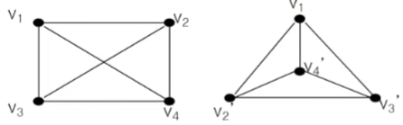
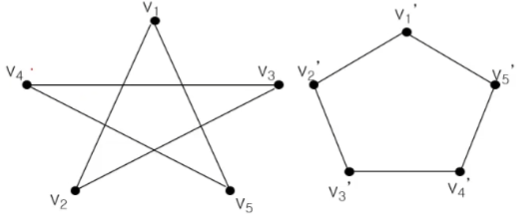

# 알고리즘과 그래프


### 알고리즘

> 문제를 해결하기 위한 절차를 기술한 것

- 정의
  - 순서대로 정의된 절차
    - 분명한 순서가 있어야 한다.
    - 한 동작을 실행하면 다음에 실행할 동작이 무엇인지 분명해야 한다.
  - 명확성
    - 모든 동작은 명확하게 정의되어야 한다.
    - 모든 동작은 실행 가능해야 한다.
  - 반드시 원하는 결과가 나와야 한다.
  - 일정한 시간 안에 실행되어야 한다.


알고리즘의 구조(structure)

1. 순차적 구조 (sequential structure)
2. 분기 구조 (branch)
3. 반복 구조 (repetition)
4. 점프 구조 (jump)


알고리즘 구조를 반영하여 적는다면 이해하기 쉬울 것이다.

알고리즘 기술 방법

- 플로우 차트 (flowchart)
- 프로그램 언어의 코드
  - 문제점 : 특정 프로그램 언어의 문법을 알아야 한다. 또 사실 알고리즘을 기술하는데 코드 수준으로 자세히 적을 필요는 없다.
- Pseudo code
  - 프로그램 언어의 코드 전 단계로 프로그램 언어들이 사용하는 구조를 그대로 이용한다.


알고리즘 : 이진 탐색

```
while (리스트 구간의 크기 > 0)
	구간의 중간값을 구한다.
	if (구간의 중간값 = 키값)
		탐색 종료
    else if (구간의 중간 값 > 키값)
    	오른쪽 구간 선택
    else
    	왼쪽 구간 선택
```


알고리즘 검증 방법:

- 귀납법
  - 몇가지 사례(입력값)에 대해서 옳음을 보임
    - 일반적인 값
    - 특수한 입력 값(boundary condition)


### 오일러 순환과 해밀턴 순환

그래프 

- 그래프 G는 다음의 두 가지 집합으로 구성되며 G = {V, E} 로 표시한다. 여기서 V는 정점(vertex)들의 집합이며, E는 정점들을 연결하는 선(edge)들의 집합이다.


차수 (degree) : deg(u)와 같이 표기함

- 정점 u에 접합된 연결선의 수


오일러 경로 (Eulerian path)

- 그래프 G의 모든 연결선을 한번만 방문하는 경로


오일러 순환 (Eulerian cycle 혹은 Circuit)

- 시작점과 끝점이 동일한 오일러 경로


오일러 그래프 

- 오일러 순환이 존재하는 그래프


오일러 경로를 갖기 위한 필요충분 조건

- 2개 이상의 정점을 갖는 루프가 없는 연결 그래프에서 홀수 차수(odd degree)를 갖는 정점이 하나도 없거나 오직 두 개만(시작점, 끝점) 존재해야 한다. ( 시작점, 끝점 제외하고 모두 짝수차수라면 오일러 경로는 존재함.)
- 특히 모든 정점이 짝수 차수를 가지면 오일러 순환이 존재하며, 이 그래프는 오일러 그래프이다.


해밀톤 경로(hamiltonian path)

- 그래프 G에서 모든 정점을 정확히 한 번만 지나는 경로


해밀톤 순환(Hamiltonian cycle 혹은 circuit)

- 시작점과 끝점이 같은 해밀톤 경로
- 해밀톤 순환을 찾는 알고리즘은 존재하지 않음.
  - 모든 경우의 수를 확인해야함.


해밀톤 순환 알고리즘

- 전수 조사 (Exhaustive Search)
- 탐색해야하는 경로의 수 : 트리의 leaf 수 = 2^n
- 트리의 높이 : n+1
- 알고리즘 복잡도 : O(x^n) (n: 정점의 수)
  - 복잡도 함수는 다항식이 아니라 지수식이다.
  - 즉, 몹시 어려운 문제.
  - 유사한 복잡도 문제
    - 암호 해독
    - 바둑(장기, Chess, 등)
    - Bin packing
    - 등등


방문 판매원 문제 (traveling salesman problem)

- 연결선에는 비용이 주어진다 (weighted edge)
- 일반적으로 완전 그래프 ( 모든 정점이 이어져 있음 )
- 이 그래프에서 비용이 최소가 되는 해밀톤 순환을 찾는 문제
- 알고리즘 1 : 전수 조사
  - 모든 해밀톤 순환을 찾아서 합한 비용이 가장 작은 순환을 선택한다 ( 전수 조사에 의거해야만 찾을 수 있다.)
- 알고리즘 2 : 단순 TSP 알고리즘
  - 순서 :
    1. 하나의 정점을 선택하여 출발점으로 한다.
    2. 이 정점에 연결된 연결선의 비용이 가장 작은 정점을 선택한다.
    3. 이 정점에서부터 아직 선택되지 않은 정점들 중에서 연결선의 비용이 가장 작은 정점을 선택한다.
    4. 모든 정점을 선택할 때까지 2, 3 절차를 반복한다.
  - 이 알고리즘은 항상 최적의 해를 찾을 수 없다. (휴리스틱)


### 기본 용어

그래프 

- 그래프 G는 다음의 두 가지 집합으로 구성되며 G = {V, E} 로 표시한다. 여기서 V는 정점(vertex)들의 집합이며, E는 정점들을 연결하는 선(edge)들의 집합이다.


인접(adjacent)

- 임의의 연결선 e(u, v)에 대해서 정점 u와 v는 서로 인접했다고 한다.


접합(incident)

- 임의의 연결선 e(u, v)에 대해서 e는 정점 u와 정점 v에 접합한다고 한다.


루프(loop)

- 연결선의 두 끝점이 같은 정점이면 이 연결선을 루프라고 한다.


다중 연결선

- 두 정점의 연결선이 두 개 이상일 때 다중 연결선이라고 한다.


단순 그래프(simple graph)

- 루프나 다중 연결선이 없는 그래프


차수 (degree) : deg(u)와 같이 표기함

- 정점 u에 접합된 연결선의 수
- 그래프에서 모든 정점의 차수의 합은 모든 연결선 수의 2배이다.


연결(connected)

- 두 정점 u와 v 사이에 연결선이 존재하면 두 정점은 연결되었다고 한다.
- 연결 그래프 : 모든 정점이 연결되어있는 그래프
- 비연결 그래프 : 모든 정점이 연결되어있지 않은 그래프


길이(length)

- 두 정점의 경로를 구성하는 연결선의 수


거리(distance)

- 두 정점 간의 최단 경로의 길이


닫힌 경로(closed path)

- 만약 경로 {v1, v2, ..., vn}에서 v1 = vn 인 경로 ( 시작점과 끝점이 같은 경로 )


순환 (cycle 혹은 circuit)

- 3개 이상의 연결선을 갖는 경로에서 어떤 연결선도 중복되지 않는 닫힌 경로 (closed path)


부분 그래프 (subgraph)

- 그래프 G={V, E}가 있을 때, V'⊆V 이고 E'⊆E 인 그래프 G'={V', E'}를 G의 부분 그래프라고 한다. ( ⊆ : 부분집합 )


동형 그래프 (isomorphic graph)

- 임의의 두 그래프 G = {V, E}와 G' = {V', E'}에 대하여 다음의 조건을 만족하는 함수가 1:1 관계의 함수이면 두 그래프 G와 G'를 동형 그래프라고 한다.
  - 함수 f : v → v' (v∈V, v'∈V')
  - (x, y) ∈ E ↔ (f(x), f(y)) ∈ E'
- 그리고 이 관계가 성립하는 함수 f를 동형(isomophic)이라고 한다.
- 
- 이 두 도형은 동형이다.
  - 오른쪽의 b와 d를 엇갈리게 하면 같다. 
- 예시)
  - 
  - 


완전 그래프 (complete graph) : K_m으로 표시한다. (m은 정점의 총 수)

- 그래프 G={V, E}가 모든 정점 사이에 연결선이 존재하면 G를 완전 그래프라고 한다.


이분 그래프 (bipartite graph)

- 그래프 G={V, E}의 V가 X∩Y=Ø인 두 부분 집합 X와 Y로 갈라지고, 연결선이 x∈X, y∈Y인 (x, y)의 쌍으로 이루어지면 G는 이분 그래프라고 한다.
- 또한 X의 모든 정점과 Y의 모든 정점 사이에 연결선이 존재하면 G를 완전 이분 그래프(complete bipartite graph)라고 하며 K_(m,n)으로 표시한다. (m은 X의 개수, n은 Y의 개수)
- 즉, 그래프 내의 두 부분집합 내의 원소들끼리 연결선이 존재하지 않는 그래프를 이분 그래프라고 한다.


정규 그래프 (regular graph)

- 그래프 G={V, E}의 모든 정점의 차수가 같으면, G를 정규 그래프라고 한다.


평면 그래프 (planar graph)

- 그래프 G={V,E}의 연결선들이 서로 교차하지 않고 평면상에 그릴 수 있는 그래프G를 평면 그래프라고 한다.


면 (face)

- 연결선에 따라 구분된 영역을 면(face)이라고 한다.


방향 그래프 (directed graph, digraph)

- 그래프 G={V, E}에서 연결선의 두 정점이 순서쌍일 때 G를 방향 그래프라고 한다.


### 그래프 채색


### 최소신장 트리


### 최단경로 알고리즘


