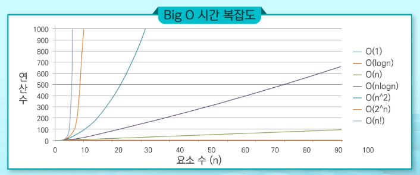

# 알고리즘

## 알고리즘 개요

알고리즘이란?

> 유한한 단계를 통해 문제를 해결하기 위한 절차나 방법
>
> 1. 컴퓨터 용어로 쓰이며, 컴퓨터가 어떤 일을 수행하기 위한 단계적 방법
> 2. 어떠한 문제를 해결하기 위한 절차

슈도코드(pseudo code): 특정 프로그래밍 언어의 문법을 따라 쓰여진 것이 아니라, 일반적인 언어로 코드를 흉내내어 알고리즘을 써놓은 코드. 특정 언어로 프로그램을 작성하기 전에 알고리즘을 대략적으로 모델링하는 데에 쓰임

순서도(흐름도): 프로그램이나 작업의 진행 흐름을 순서에 따라 여러 가지 기호나 문자로 나타낸 도표. 프로그램의 논리적인 흐름, 데이터의 처리 과정을 표현하는데 사용. 프로그램을 작성하기 전에 프로그램의 전체적인 흐름과 과정 파악을 위해 필수적으로 거쳐야 되는 작업

무엇이 좋은 알고리즘인가?

- 정확성: 얼마나 정확하게 동작하는가?
- 작업량: 얼마나 적은 연산으로 원하는 결과를 얻어내는가?
- 메모리 사용량: 얼마나 적은 메모리를 사용하는가?
- 단순성: 얼마나 단순한가?
- 최적성: 더 이상 개선할 여지 없이 최적화되었는가?

알고리즘의 성능 분석 필요: 많은 문제에서 알고리즘의 성능 분석 기준으로 알고리즘의 작업량을 비교

- 실제 걸리는 시간을 측정 (컴퓨터 환경에 따라 달라질 수 있음)

- 실행되는 명령문의 개수를 계산

시간복잡도: 빅-오(O) 표기법

시간  복잡도 함수 중에서 가장 큰 영향력을 주는 n에 대한 항만을 표시.

계수(coefficient)는 생략하여 표시

ex) O(2n+1) = O(2n) = O(n)

O(2n^2 + 10n + 100) = O(n^2)

O(4) = O(1)

요소 수가 증가함에 따라 각기 다른 시간복잡도의 알고리즘은 아래와 같은 연산 수를 보인다.

reference: 

- SWEA python SW문제해결 기본