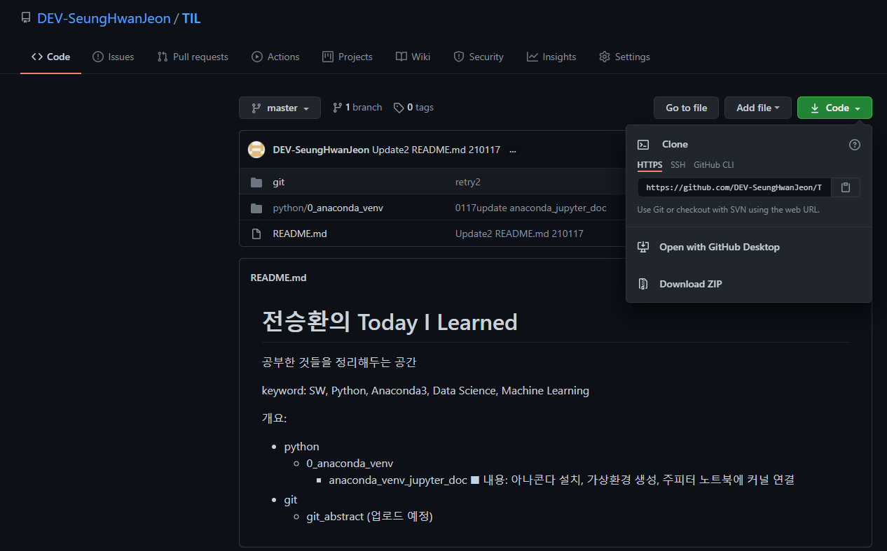

# git basic

### git 명령어:

`cd TIL`: 로컬 컴퓨터에서 TIL 파일 경로로 이동

`git init`: 로컬컴퓨터의 현재 디렉토리를 기준으로 관리하겠다는 뜻

`git config --global --list`: global 설정값을 확인하는 명령어

`git config --global user.email 이메일주소` : 유저 이메일을 설정하는 명령어. git config --global user.email tmd4347@gmail.com

`git config --global user.name 이름` : 유저 이름을 설정하는 명령어. git config --global user.name DEV-SeungHwanJeon

`git status` : 현재 git의 상태를 확인하는 명령어

`git add .` : 바뀐 상황을 커밋할 목록에 add 하는 명령어. add 뒤에 . 을 붙이면 현재 디렉토리 기준으로 바뀐 모든 것을 add 하겠다는 뜻.

`git add <파일이름>` : 해당 파일만 add하겠다는 명령어

`git commit -m 'first commit'` : 모여진 add들에 메세지를 붙여서 commit

`git remote add origin 깃레파지토리주소` :  본인의 레파지토리(github 원격저장소)와 연동하겠다는 뜻. git remote add origin https://github.com/DEV-SeungHwanJeon/TIL.git    깃레파지토리주소는 본인 깃허브 사이트의 레파지토리에 들어가서 초록색 code 버튼을 누르면 나온다.

`git push -u origin master` 모여진 commit들을 master에 push 하겠다는 뜻.