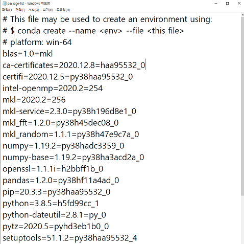

# __Anaconda 가상환경 생성 및 Jupyter Notebook 커널 연결__

> `Anaconda` 란, 여러가지 패키지들을 기본적으로 포함하고 있는 파이썬 배포 툴입니다. 특히 보편적으로 활용되는 데이터 과학 라이브러리들이 다양하게 포함되어 있으므로 데이터 작업을 시작할 수 있습니다. 따라서 python에서 `Machine Learning` 이나, `Data Science`를 시작할 때, Anaconda는 필수적이라고 볼 수 있습니다.

### __Anaconda3 다운로드 및 설치__

Anaconda 다운로드 링크: `https://www.anaconda.com/products/individual`

 

파란색 박스 표시 되어있는 Download를 누르면


운영체제별로 다운 받을 수 있습니다. 윈도우 운영체제는 윈도우키+PAUSE 를 누르면 뜨는 내 컴퓨터 설정 창에서 "시스템 종류"를 보면 64Bit인지 32Bit인지 알 수 있습니다.

`운영체제에 맞는 Anaconda Installer`를 다운받은 후 실행합니다.

 

`I Agree` 를 눌러줍니다.

 

이 설정은 다음 창에 나오는 설치 경로와 관련이 있습니다.

`Just Me`를 선택하면 “C:\Users\tmd43\anaconda3“ 경로가 기본값으로 뜨고, 

`All Users`를 선택하면 “C:\ProgramData\Anaconda3” 경로가 기본값으로 뜨며, 관리자 권한이 필요하게 됩니다.

 

저는 Just Me를 선택하여 `C:\Users\tmd43\anaconda3` 경로로 진행하겠습니다.

경로 중간에 ``tmd43``은 제 윈도우 사용자이름 입니다. 경로를 바꿔도 되지만 바꾼 경로는 기억해두시는 것이 좋습니다.

  

컴퓨터에 python이 설치되어 있지 않은 경우에는 Register 하시는 게 다른 프로그램들(파이썬 에디터들: Visual Studio, Pycharm, 등등)을 활용 시 편합니다.

 

하지만 제 경우에는 기존에 python이 설치되어 있었습니다. 이 경우에 밑에 있는 Register Anaconda as my default를 선택하면 경고창이 하나 뜰 겁니다.

저는 현재(21.01.13) `Anaconda` 최신버전에 포함되어있지 않은 `파이썬 3.8.7 버전`을 따로 활용하기 위하여, 나중에는 여러 Anaconda 가상환경을 활용하기 위하여 Register에 체크하지 않았습니다.

 

설치가 진행 중입니다. 시간이 꽤 걸립니다. 

 

설치 완료!


### __Conda venv(가상환경) 만들기____


##### __1. 가상환경의 목적__

여러 라이브러리들의 관리 및 호환, 충돌 방지를 위하여 프로젝트마다 다른 가상환경을 구축하고, 그 환경을 활용 및 보존한다.

다른 컴퓨터, 다른 환경에서 동일 프로그램을 실행시킬 때, 작업 환경을 고정시켜주어 작업 환경과 버전 문제로 실행되지 않는 문제를 방지합니다.


##### __2. Conda 가상환경 만들기__

시작 - Anaconda Prompt 를 켜줍니다.

Conda 가상환경을 만드는 명령어는

`conda create -n 가상환경이름 <패키지>` 입니다.

 

가상환경 이름은 자유롭게 만들어주시고 뒤에 패키지의 이름을 적으면 해당 패키지를 추가하여 가상환경을 생성하겠다는 뜻이며 안 넣어주셔도 됩니다. 

ex) `conda create -n 가상환경이름 python=3.8.5 numpy pandas`

 

가상환경이 생성된 이후에 `conda env list` 명령어를 사용하여 잘 만들어졌는지 확인합니다. *(별표)가 되어있는 환경(base)이 현재 우리가 있는 환경입니다.

`activate 가상환경이름`명령어를 통하여 가상환경으로 가줍니다.

 

왼쪽의 (base)가 (test_env)로 바뀐 것을 확인할 수 있습니다.

`conda -V` 명령어를 통해 아까 우리가 다운받고 설치한 anaconda의 버전을 확인할 수 있습니다.

`conda info` 명령어를 통해 현재 우리가 위치한 가상환경(test_env)의 정보를 볼 수 있으며 conda 4.9.2버전에서 python 버전을 정하지 않고 가상환경을 생성하면 python 3.8.5 버전으로 생성되는 것을 확인할 수 있습니다.


##### __3. 자주 사용되는 명령어들__

___

<Anaconda 버전 확인 및 업데이트>

__Anaconda 버전__ 확인: `conda --version`  또는 `conda -V`

활용 가능한 __python 버전__ 확인: `conda search python`

__Anaconda 업데이트__ 하기: `conda update --all`

현재 생성되어있는 __가상환경 확인__하기: `conda env list` 또는 `conda info --env`

___

<가상환경 생성, 삭제>

__가상환경 생성__하기: `conda create -n 가상환경이름`

버전 & 패키지 __지정하여 생성__하기: `conda create -n 가상환경이름 python=3.6 `

python 3.7 버전부터는 __파일로 패키지 지정__ 가능: `conda create -n 가상환경이름 python=3.7 requirements.txt  `(단, 현재 위치한 디렉토리에 requirements.txt가 있어야 함)

__가상환경 삭제__: `conda env remove -n 가상환경이름`

___

<가상환경 복제>

기존 __가상환경 복제__하기: `conda create --name 새가상환경이름 --clone 기존가상환경이름`

__현재 가상환경의 모든 조건 txt로 저장__하기: `conda env export > conda_requirements.txt`

__저장된 조건 txt로 환경구축__: `conda env create -f conda_requirements.txt`

   

↑ conda_requirements.txt의 모습

___

<가상환경 들어가기, 나오기>

__가상환경에 들어가기(활성화)__: `conda activate 가상환경이름` 또는 `activate 가상환경이름`

현재 들어와 있는 가상환경의 __정보 확인__하기: `conda info`

__가상환경에서 나오기__: `conda deactivate`

___

> <가상환경 패키지 확인, 설치, 삭제(conda 활용)>

현재 들어와 있는 가상환경에 __설치된 패키지 확인__하기: `conda list`

가상환경에 __패키지 설치__하기: `conda install 패키지이름`

가상환경의 __패키지 삭제__하기: `conda uninstall 패키지이름`

__가상환경 안의 패키지목록 txt로 저장__하기: `conda list --export > package-list.txt`

__패키지목록 txt로 환경 생성__(python 3.7버전 이상만 가능): `conda create -n 가상환경이름 python=3.7 --file package-list.txt` (단, 현재 위치한 디렉토리에 package-list.txt가 있어야 함)

__패키지목록 txt를 활용하여(똑같은 버전과 패키지로) 패키지 설치__ : `conda install --file package-list.txt` (단, 현재 위치한 디렉토리에 package-list.txt가 있어야 함)

  

↑ package-list.txt의 모습

설치된 패키지들은 `아나콘다설치경로/anaconda3/envs/가상환경이름/Lib/site-packages` 안에 존재.

___

<가상환경 패키지 설치, 삭제(pip 활용)>

가상환경에 __패키지 설치__하지: `pip install 패키지이름`

현재 __패키지 목록을 txt파일로__ 추출: `pip freeze > requirements.txt`

__패키지목록 txt를 활용__하여(똑같은 버전과 패키지로) __패키지 설치__: `pip install -r requirements.txt`  (단, 현재 위치한 디렉토리에 requirements.txt가 있어야 함)

설치된 패키지들은 `아나콘다설치경로/anaconda3/envs/가상환경이름/Lib/site-packages` 안에 존재.

___

<Jupyter Notebook과 가상환경 연결>

__Jupyter Notebook__에 가상환경 __커널 연결__하기: `python -m ipykernel install --user --name 가상환경이름 --display-name "표시할이름" ` (jupyter notebook과 ipykernel이 설치되어있어야함.)

___


##### __4. 최종적으로 가상환경 만드는 데 사용한 명령어들__

```
conda create -n DS_JSH python=3.8.5

conda activate DS_JSH

conda install numpy

conda install pandas

conda install jupyter notebook

conda install scikit-learn

python -m ipykernel install --user --name DS_JSH --display-name "DS_JSH"

jupyter notebook
```


우측 상단에 가상환경 DS_JSH가 연결된 것을 확인할 수 있습니다.

DS_JSH를 눌러 새 ipynb 파일을 만들어줍니다.


좌측 상단의 untitled1 (파란색 상자 부분)을 누르면 notebook의 이름을 바꿀 수 있습니다.


아까 DS_JSH 가상환경에 설치한 패키지들을 import 하여 설치가 잘 되었는지 확인해보았습니다. 우측 상단에 가상환경이름(DS_JSH)라고 표시도 되어 있군요.


##### 5. 이 문서에서 다룬 내용 요약

1. anaconda3 설치 및 다운로드
2. anaconda prompt에서 conda 가상환경 생성
3. 생성한 가상환경 jupyter notebook과 연결
4. 노트북(ipynb파일) 만들어서 연결 확인


##### 6. reference

https://docs.anaconda.com/anaconda/user-guide/getting-started/

https://docs.conda.io/projects/conda/en/latest/commands.html

