# Anaconda (#-1)

`Anaconda` 란, 여러가지 패키지들을 기본적으로 포함하고 있는 파이썬 배포 툴입니다.

특히 보편적으로 활용되는 데이터 과학 라이브러리들이 다양하게 포함되어 있으므로 데이터 작업을 시작할 수 있습니다.

따라서 python에서 `Machine Learning` 이나, `Data Science`를 시작할 때, Anaconda는 필수적이라고 볼 수 있습니다.

Anaconda 다운로드 링크: `https://www.anaconda.com/products/individual`

 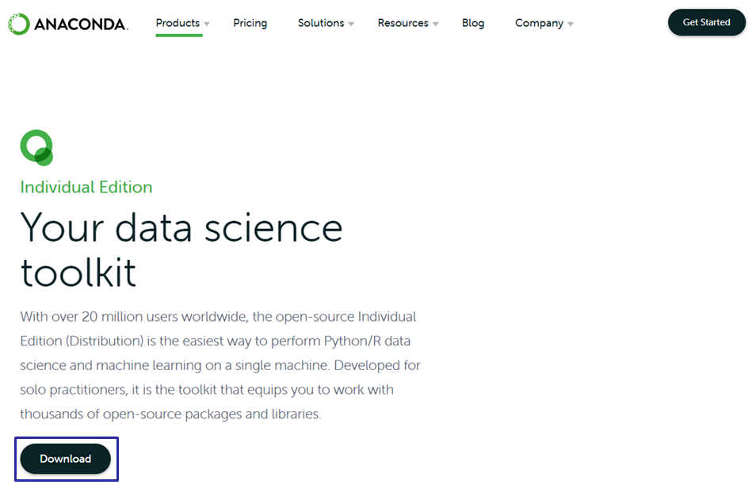

파란색 박스 표시 되어있는 Download를 누르면

  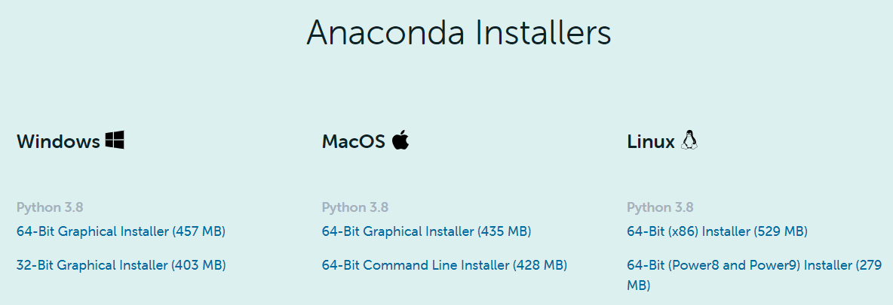

운영체제별로 다운 받을 수 있습니다. 

윈도우 운영체제는 윈도우키+PAUSE 를 누르면 뜨는 내 컴퓨터 설정 창에서 "시스템 종류"를 보면 64Bit인지 32Bit인지 알 수 있습니다.

Anaconda Installer를 다운받은 후 실행시킵니다.

 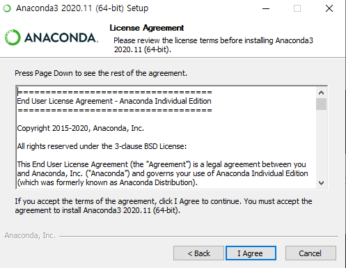

I Agree 를 눌러줍니다.

 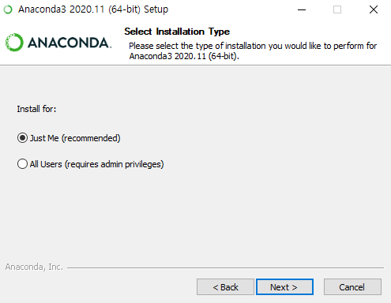

이 설정은 다음 창에 나오는 설치 경로와 관련이 있습니다.

Just Me를 선택하면 “C:\Users\tmd43\anaconda3“ 경로가 기본값으로 뜨고, 

All Users를 선택하면 “C:\ProgramData\Anaconda3” 경로가 기본값으로 뜨며, 관리자 권한이 필요하게 됩니다.

 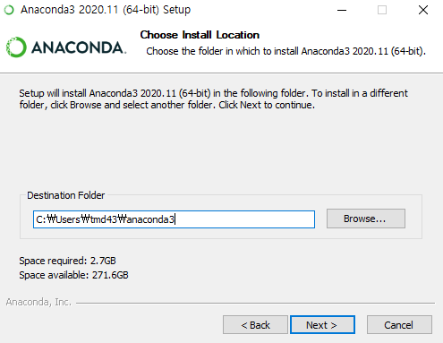

저는 Just Me를 선택하여 `C:\Users\tmd43\anaconda3` 경로로 진행하겠습니다.

경로 중간에 ``tmd43``은 제 윈도우 사용자이름 입니다. 경로를 바꿔도 되지만 바꾼 경로는 기억해두시는 것이 좋습니다.

 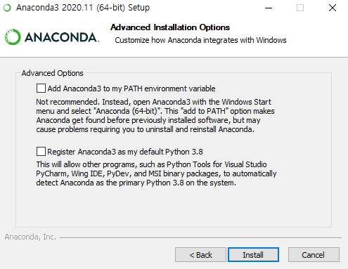 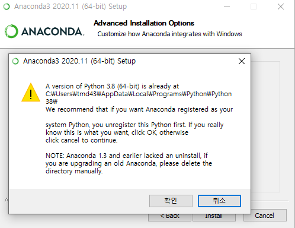

만약 컴퓨터에 파이썬이 따로 깔려있는데 밑에 있는 Register Anaconda as my default를 선택하면 창이 하나 뜰 겁니다.

저는 현재(21.01.13) Anaconda 최신버전에 포함되어있지 않은 파이썬 3.8.7 버전을 따로 활용하며 나중에는 여러 Anaconda 가상환경을 활용하기 위하여 Register에 체크하지 않았습니다.

하지만 컴퓨터에 python이 설치되어 있지 않은 경우에는 Register 하시는 게 좋을 듯 합니다. 다른 프로그램(파이썬 에디터들: Visual Studio, Pycharm, 등등) 활용 시 편합니다.

 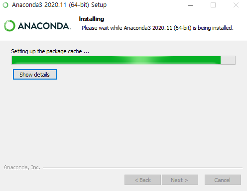

설치가 진행 중입니다. 시간이 꽤 걸립니다. 

 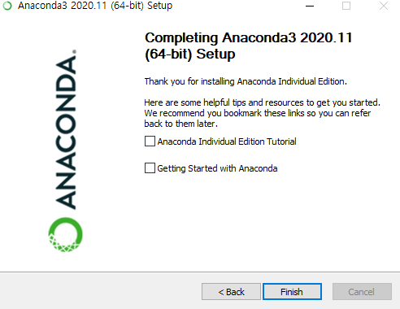

설치 완료!

### Conda venv(가상환경) 만들기 (#-3)

##### 1. 가상환경의 목적 (#-5)

여러 라이브러리들의 관리 및 호환, 충돌 방지를 위하여 프로젝트마다 다른 가상환경을 구축하고, 그 환경을 활용 및 보존한다.

다른 컴퓨터, 다른 환경에서 동일 프로그램을 실행시킬 때, 작업 환경을 고정시켜주어 작업 환경과 버전 문제로 실행되지 않는 문제를 방지합니다.

##### 2. Conda 가상환경 만들기

시작 - Anaconda Prompt 를 켜줍니다.

Conda 가상환경을 만드는 명령어는

"conda create -n 가상환경이름 <패키지>" 입니다

 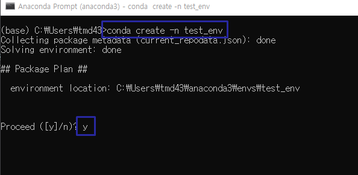

가상환경 이름은 자유롭게 만들어주시고 뒤에 패키지의 이름을 적으면 해당 패키지를 추가하여 가상환경을 생성하겠다는 뜻이며 안 넣어주셔도 됩니다.

ex). "conda create -n 가상환경이름 python=3.8.5 numpy pandas"

 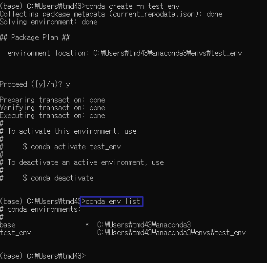

가상환경이 생성된 이후에 "conda env list" 명령어를 사용하여 잘 만들어졌는지 확인합니다. *(별표)가 되어있는 환경(base)이 현재 우리가 있는 환경입니다.

"activate 가상환경이름" 명령어를 통하여 가상환경으로 가줍니다.

 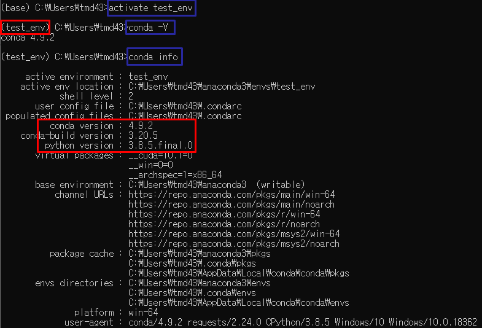

왼쪽의 (base)가 (test_env)로 바뀐 것을 확인할 수 있습니다.

conda -V 명령어를 통해 아까 우리가 다운받고 설치한 anaconda의 버전을 확인할 수 있습니다.

conda info 명령어를 통해 현재 우리가 위치한 가상환경(test_env)의 정보를 볼 수 있으며 conda 4.9.2버전에서 python 버전을 정하지 않고 가상환경을 생성하면 python 3.8.5 버전으로 생성되는 것을 확인할 수 있습니다.

<자주 사용되는 명령어들>

아나콘다의 버전 확인: conda --version  또는 conda -V

아나콘다에서 활용할 수 있는 python의 버전 확인: conda search python

아나콘다 업데이트 하기: conda update --all

현재 생성되어있는 가상환경 확인하기: conda env list 또는 conda info --env

가상환경 생성하기: conda create -n 가상환경이름

​	버전 & 패키지 지정하여 생성하기: conda create -n python=3.6 

​	python 3.7 버전부터는 텍스트파일로 패키지 지정 가능: conda create -n python=3.7 requirements.txt

가상환경에 들어가기: activate 가상환경이름

​	현재 들어가 있는 가상환경의 정보 확인하기: conda info

​	현재 들어가 있는 가상환경에 설치된 패키지 확인하기: conda list

​	가상환경에 패키지 설치하기: conda install 패키지이름

​	(pip을 활용) 가상환경에 패키지 설치하지: pip install 패키지이름

​		pip을 사용하면 anaconda 설치 폴더의 Lib/site-packages 안에 패키지가 저장됨

​	가상환경의 패키지 삭제하기: conda uninstall 패키지이름

​	

​	jupyter notebook에 가상환경 커널 연결하기: python -m ipykernel install --user --	name 가상환경이름 --display-name "표시할이름"

가상환경에서 나오기: conda deactivate (conda deactivate 가상환경이름)

가상환경 지우기: conda env remove -n 가상환경이름

기존 가상환경 복제하기: conda create --name 새가상환경이름 --clone 기존가상환경이름

가상환경 조건 txt로 뽑기: conda env export > conda_requirements.txt

가상환경 패키지들 txt로 뽑기: conda list --export > package-list.txt

가상환경 조건 txt로 환경구축: conda env create -f conda_requirements.txt

(pip활용) 현재 버전과 패키지 목록을 requirements.txt로 추출:
pip freeze > requirements.txt

(pip활용) requirements.txt의 내용대로(똑같은 버전과 패키지로) 설치하려면
pip install -r requirements.txt

