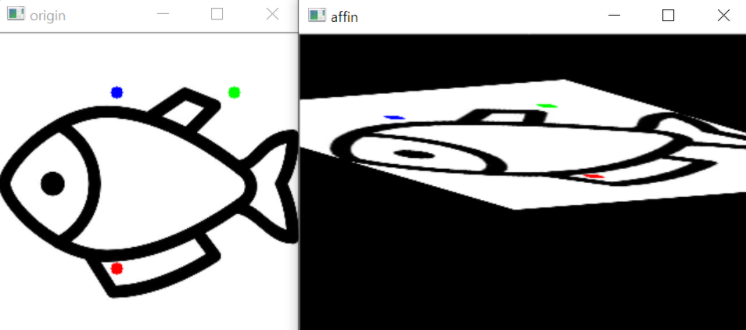

## 파이토치 공부하기


```python
import pandas as pd
import numpy as np

# 데이터 셋 분리를 위한 train_test_split
from sklearn.model_selection import train_test_split


import torch
import torch.nn as nn
import torchvision
from torchvision.transforms import transforms
from torch.utils.data import Dataset, DataLoader, ConcatDataset

from PIL import Image
from typing import cast, Any, Union, Dict, List
import time
import random
import copy 
 
import matplotlib.pyplot as plt


device = torch.device('cuda:0' if torch.cuda.is_available() else 'cpu')
print(device)
```


```python
# 구글 drive에 다운받은 fashion mnist train 파일을 pandas dataframe 형식으로 불러온다.
train_df = 
pd.read_csv('/content/drive/MyDrive/Fashion_MNIST/fashion-mnist_train.csv')

# 맨위에 3행을 확인해본다.
train_df.head(5)

# shape를 확인한다.
train_df.shape # (60000, 785)  # 785 = 28*28+1(label)
```


```python
# train_test_split를 활용해서 train:validation(9:1)을 나눈다.
train, val = train_test_split(train_df, test_size=0.1, 
                              shuffle=True, random_state=9)
#test_size=0.1 gives a good result

print(train.shape, val.shape) # (54000, 785) (6000, 785)
```


```python
# data augmentation
aug1_transformers = transforms.Compose([
    					   # PILImage로 변환
                           transforms.ToPILImage(),
    					   # brightness : 명도, contrast : 대비, saturation : 채도
                           transforms.ColorJitter(brightness=0.2, contrast=0.2, saturation=0.2),
    					   # +-25도 회전
                           transforms.RandomRotation(25),
    					   # 50% 확률로 수평 뒤집기 (default p = 0.5)
                           transforms.RandomHorizontalFlip(),
    					   # 랜덤 아핀 변환 (degress = 각도, 
    					   # translate : shift 비율. [a,b] -> 수평 shift 범위 : -img_width * a < dx < img_width * a, 수직 shift 범위 : -img_height * b < dy < img_height * b)
    					   # scale : 배율
                           transforms.RandomAffine(degrees=15, translate=(0.1,0.1), scale=(0.8,0.8)),
                           transforms.ToTensor(),
    
                           # after calculating the mean and standard deviation.
                           transforms.Normalize((0.2861), (0.3528)) 
])
```


아핀 변환 예시: 

 


```python
aug2_transformers = transforms.Compose([
    					   # PILImage로 변환
                           transforms.ToPILImage(),
        				   # 60%확률로 수직 뒤집기
                           transforms.RandomVerticalFlip(p=0.6),
        				   # +- 40도 회전
                           transforms.RandomRotation(40),
    					   # 100% 확률로 수평 뒤집기
                           transforms.RandomHorizontalFlip(p=1),
    					   # 아핀변환
                           transforms.RandomAffine(degrees=30, translate=(0.1,0.1), scale=(0.8,0.8)),
                           transforms.ToTensor(),
                           #after calculating the mean and standard deviation.
                           transforms.Normalize((0.2861), (0.3528)) 
])
```


```python
aug3_transformers = transforms.Compose([
    					   # PILImage로 변환
                           transforms.ToPILImage(),
    					   # -90 ~ 90도 회전
                           transforms.RandomRotation(degrees=(-90, 90)),
    					   # 60% 확률로 수직 뒤집기
                           transforms.RandomVerticalFlip(p=0.6),
    					   # -40 ~ 40도 회전
                           transforms.RandomRotation(40),
    					   # 50% 확률로 수평 뒤집기
                           transforms.RandomHorizontalFlip(p=0.5),
    					   # 아핀 변환
                           transforms.RandomAffine(degrees=10, translate=(0.1,0.1), scale=(0.8,0.8)),
                           transforms.ToTensor(),
                           #after calculating the mean and standard deviation.
                           transforms.Normalize((0.2861), (0.3528)) 
])
```


```python
train_transformers = transforms.Compose([
                           transforms.ToPILImage(),
                           transforms.ToTensor(),
                           #after calculating the mean and standard deviation.
                           transforms.Normalize((0.2861), (0.3528))    
])
```


```python
val_transformers = transforms.Compose([
    					   # tensor나 numpy.ndarray를 PILImage로 바꾼다.
                           transforms.ToPILImage(),
    					   # numpy.ndarray (H x W x C)를 [0.0, 1.0] 범위의 torch.FloatTensor (C x H x W)로 변환합니다.
                           transforms.ToTensor(),
                           #after calculating the mean and standard deviation.
                           transforms.Normalize((0.2861), (0.3528))
])
```


https://greeksharifa.github.io/pytorch/2018/11/10/pytorch-usage-03-How-to-Use-PyTorch/

### torchvision.transforms : 

1. 이미지 변환 함수들을 포함한다. parameter중 `transforms`는 변환 함수들의 list 또는 tuple 이다.

   - transforms.CenterCrop(size)
     - 이미지 중앙 부분을 크롭하여 [size, size] 크기로 만든다.
   - transforms.Resize(size, interpolation=2) 
     - 이미지를 지정한 크기로 변환한다. 직사각형으로 자를 수 있다.
   - transforms.RandomCrop(size, padding=None, pad_if_needed+False, fill=0, padding_mode='constant') 
     - 이미지의 랜덤한 부분을 [size, size] 크기로 잘라낸다. input 이미지가 output 크기보다 작으면 padding을 추가할 수 있다.
   - transforms.RandomResizeCrop(size, scale=(0.08, 1.0), ratio = (0.75, 3/4), interpolation = 2) 
     - 이미지를 랜덤한 크기 및 비율로 자른다.
   - transforms.RandomRotation(degrees, resample=False, expand=False, center=None)
     - 이미지를 랜덤한 각도로 회전시킨다.
   - transforms.ColorJitter(brightness=0, contrast=0, saturation=0, hue=0)
     - brightness, contrast 등을 변화시킨다

2. 이미지를 torch.Tensor 또는 PILImage로 변환시킬 수 있다. 사용자 정의 변환도 가능하다.

   - transforms.ToPILImage(mode=None)
     - PILImage로 변환시킨다.
   - transforms.ToTensor()
     - torch.Tensor로 변환시킨다.
   - transforms.Lambda(lambd)
     - 사용자 정의 lambda function을 적용시킨다.

3. torch.Tensor에 적용해야 하는 변환 함수들도 있다.

   - transforms.LinearTransformation(transformation_matrix)
     - tensor로 표현된 이미지에 선형 변환을 시킨다.
   - transforms.Normalize(mean, std, inplace=False)
     - tensor의 데이터 수치(또는 범위)를 정규화한다.

4. brightness나 contrast 등을 바꿀 수도 있다.

   - transforms.functional.adjust_contrast(img, contrast_factor) 등

5. 위의 변환 함수들을 랜덤으로 적용할지 말지 결정할 수도 있다.

   - transforms.RandomChoice(transforms)
     - `transforms` 리스트에 포함된 변환 함수 중 랜덤으로 1개 적용한다.
   - transforms.RandomApply(transforms, p=0.5)
     - `transforms` 리스트에 포함된 변환 함수들을 p의 확률로 적용한다.

6. 위의 모든 변환 함수들을 하나로 조합하는 함수는 다음과 같다. 이 함수를 `dataloader`에 넘기면 이미지 변환 작업이 간단하게 완료된다.

   - transforms.Compose(transforms)

     - ```python
       transforms.Compose([
        transforms.CenterCrop(14),
        transforms.ToTensor(),
        transforms.Normalize(mean=(0.5, 0.5, 0.5), std=(0.5, 0.5, 0.5))
       ])
       ```

   - 변환 순서는 보통 resize/crop, toTensor, Normalize 순서를 거친다. Normalize는 tensor에만 사용 가능하므로 이 부분은 순서를 지켜야 한다.


```python
# Сlass for loading and transformation.
class MyDataSet(Dataset):
  def __init__(self, features, labels, Transform):
    self.x = features
    self.y = labels
    self.transform = Transform

  def __len__(self):
    return len(self.x)

  def __getitem__(self, index):
    return self.transform(self.x[index]), self.y[index]
```


```python
# 이 함수는 pandas df을 행렬로 변환하고, 특성 행렬의 모양을 변경하고, 데이터 유형을 변경합니다. 마지막에 함수는 두 행렬을 모두 토치 텐서로 변환하고 클래스에 전달합니다.
def GetDf(df, Transform):
  x_train = df.iloc[:, 1:].values
  y_train = df.label.values
  x_train = x_train.reshape(-1, 1, 28, 28)
  x_train = np.uint8(x_train)
  y_train = torch.from_numpy(y_train).type(torch.LongTensor)
  x_train = torch.from_numpy(x_train)
  return MyDataSet(x_train, y_train, Transform)
```


```python
datasets = {
    'aug1':  GetDf(train_df, aug1_transformers),
    'aug2':  GetDf(train_df, aug2_transformers),
    'aug3':  GetDf(train_df, aug3_transformers),
    'train': GetDf(train, train_transformers),
    'val': GetDf(val, val_transformers)
}

# new_train = ConcatDataset([datasets['train'], datasets['aug1'], datasets['aug2'],datasets['aug3']])
new_train = ConcatDataset([datasets['train'], datasets['aug1']])
loaders = {
    'train': DataLoader(new_train, batch_size=64, shuffle = True, num_workers=4),
    'val': DataLoader(datasets['val'], batch_size=64, shuffle = True, num_workers=4)
}
```

