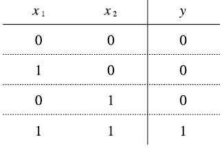
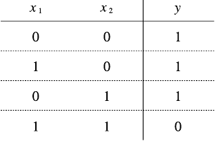
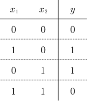

# 밑바닥부터 시작하는 딥러닝 1권

## CHAPTER 2: 퍼셉트론

### 2.1 퍼셉트론이란?

퍼셉트론은 다수의 신호를 입력으로 받아 하나의 신호(0 or 1)를 출력한다.

입력을 받으면 각 입력의 가중치와 곱해진 값들의 총합이 나온다. 이 총합이 정해진 한계(임계값, θ)를 넘어설 때만 1을 출력한다. 

복수의 입력 신호 각각에 고유한 가중치를 부여한다. 가중치는 각 입력이 결과에 주는 영향력을 조절하는 요소로 적용한다. (가중치가 클수록 해당 입력이 중요함을 뜻한다.)

 

### 2.2 단순한 논리 회로

#### 2.2.1 AND 게이트

AND 게이트는 입력이 둘이고 출력은 하나이다. 

- AND 게이트의 진리표

    

AND 게이트를 퍼셉트론으로 표현할 때 가능한 매개변수 조합은 무수히 많다. x1과 x2가 모두 1일 때만 가중 신호의 총합이 주어진 임계값을 넘기 때문이다.

ex) (w1, w2, θ) = (1, 1, 1.5)

#### 2.2.2 NAND 게이트와 OR 게이트

NAND(Not AND) 게이트는 AND 게이트의 출력을 뒤집은 것이다.

- NAND 게이트의 진리표

    

AND 게이트를 구현하는 매개변수의 부호를 모두 반전하면 NAND 게이트가 된다.


OR 게이트는 입력 신호 중 하나 이상이 1이면 출력이 1이 되는 논리 회로이다.

- OR 게이트의 진리표

    

(w1, w2, θ) = (1, 1, 0.5) 으로도 표현이 가능하다.


퍼셉트론의 구조는 AND, NAND, OR 게이트에서 똑같다는 것이 중요하다. 세가지 게이트에서 다른 것은 매개변수(가중치와 임계값) 뿐이다.


### 2.3 퍼셉트론 구현하기

#### 2.3.1 간단한 구현부터

```python
def AND(x1, x2):
    w1, w2, theta = 0.5, 0.5, 0.7  # 매개변수 초기화
    tmp = x1 * w1 + x2 * w2       # 가중치를 곱한 입력의 총합
    if tmp <= theta:          # 임계값과 비교
        return 0
    elif tmp > theta:
        return 1
```

#### 2.3.2 가중치와 편향 도입

식에서 θ를 -b로 치환하여 식을 바꾼다. 여기서 b를 편향(bias)이라 한다.

 

이 식 방식으로 구현

```python
import numpy as np
x = np.array([0,1])   #입력
w = np.array([0.5, 0.5]) #가중치
b = -0.7  #편향
print(w*x)
# 결과: [0.  0.5]

print(np.sum(w*x))   # np.sum: 배열에 담긴 모든 원소의 총합 계산
# 결과: 0.5

print(np.sum(w*x)+b)  # 편향을 더함
# 결과: -0.19999999999999996
```


#### 2.3.3 가중치와 편향 구현하기

- 가중치와 편향을 도입한 AND 게이트 구현

  ```python
  def AND(x1, x2):
      x = np.array([x1, x2])
      w = np.array([0.5, 0.5])
      b = -0.7
      tmp = np.sum(w*x) + b
      if tmp <= 0:
          return 0
      else:
          return 1
      
  print(AND(0,0)) # 0
  print(AND(1,0)) # 0
  print(AND(0,1)) # 0
  print(AND(1,1)) # 1
  ```

- 가중치와 편향을 도입한 NAND 게이트 구현

  ```python
  def NAND(x1, x2):
      x = np.array([x1, x2])
      w = np.array([-0.5, -0.5])
      b = 0.7
      tmp = np.sum(w*x) + b
      if tmp <= 0:
          return 0
      else:
          return 1
      
  print(NAND(0,0)) # 1
  print(NAND(1,0)) # 1
  print(NAND(0,1)) # 1
  print(NAND(1,1)) # 0
  ```

- 가중치와 편향을 도입한 OR 게이트 구현

  ```python
  def OR(x1, x2):
      x = np.array([x1, x2])
      w = np.array([0.5, 0.5])
      b = -0.2
      tmp = np.sum(w*x) + b
      if tmp <= 0:
          return 0
      else:
          return 1
      
  print(OR(0,0)) # 0
  print(OR(1,0)) # 1
  print(OR(0,1)) # 1
  print(OR(1,1)) # 1
  ```

편향의 값은 뉴런이 얼마나 쉽게 활성화 되는지(1을 출력하는지)를 결정합니다.

세 게이트는 같은 구조의 퍼셉트론이며, 차이는 매개변수의 값(가중치, 편향값) 뿐입니다.


### 2.4 퍼셉트론의 한계

#### 2.4.1 도전! XOR 게이트

XOR 게이트는 배타적(자기 외에는 거부한다) 논리합이라는 논리 회로입니다. x1과 x2 중 한쪽이 1일 때만 1을 출력합니다. 

- XOR 게이트의 진리표

    

퍼셉트론으로는 XOR 게이트를 구현할 수 없다. XOR 게이트는 직선 하나로 나눌 수 없기 때문이다.


#### 2.4.2 선형과 비선형

직선 하나로 나누는 것이 아닌 곡선을 활용하면 XOR 게이트를 구현할 수 있다.

즉, 선형이 아닌 비선형으로 해결가능하다.


### 2.5 다층 퍼셉트론이 출동한다면

#### 2.5.1 기존 게이트 조합하기

XOR 게이트를 만드는 방법 중 하나는 AND, NAND, OR 게이트를 조합하는 방법이다. 

입력 신호 x1, x2를 NAND와 OR게이트의 입력으로 쓰고, NAND와 OR 게이트에서 나온 출력을 AND 게이트의 입력으로 쓰면 XOR 게이트를 구현할 수 있다. AND(NAND, OR) 이런 느낌.

- XOR 게이트의 진리표 (s1 = NAND, s2 = OR, y = AND)

    


#### 2.5.2 XOR 게이트 구현하기

```python
# AND 게이트
def AND(x1, x2):
    x = np.array([x1, x2])
    w = np.array([0.5, 0.5])
    b = -0.7
    tmp = np.sum(w*x) + b
    if tmp <= 0:
        return 0
    else:
        return 1

# NAND 게이트
def NAND(x1, x2):
    x = np.array([x1, x2])
    w = np.array([-0.5, -0.5])
    b = 0.7
    tmp = np.sum(w*x) + b
    if tmp <= 0:
        return 0
    else:
        return 1

# OR 게이트    
def OR(x1, x2):
    x = np.array([x1, x2])
    w = np.array([0.5, 0.5])
    b = -0.2
    tmp = np.sum(w*x) + b
    if tmp <= 0:
        return 0
    else:
        return 1

# XOR 게이트
def XOR(x1, x2):
    s1 = NAND(x1, x2)
    s2 = OR(x1, x2)
    y = AND(s1, s2)
    return y

print(XOR(0,0)) # 0
print(XOR(1,0)) # 1
print(XOR(0,1)) # 1
print(XOR(1,1)) # 0
```


이처럼 XOR 게이트는 두가지 순서(층)를 거쳐서 구현하여야 한다. 따라서 XOR 게이트의 구조는 단층 퍼셉트론(AND, OR 게이트)가 아닌, 다층 구조의 네트워크, 즉 다층 퍼셉트론이다. 

단층 퍼셉트론으로는 표현하지 못한 것을 층을 하나 늘려 구현할 수 있었다. 이처럼 퍼셉트론은 층을 쌓아 깊게 하여 더 다양한 것을 표현할 수 있다. (다층 퍼셉트론은 이론상 컴퓨터를 표현할 수 있다.)