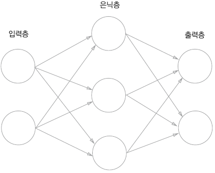
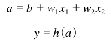
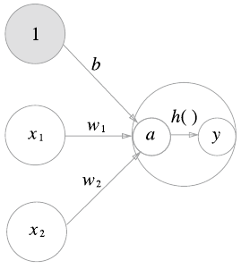

# 밑바닥부터 시작하는 딥러닝 1권

## CHAPTER 3:  신경망

가중치 매개변수의 적절한 값을 데이터로부터 자동으로 학습하는 능력이 이제부터 살펴볼 신경망의 중요한 성질이다. 신경망이 입력 데이터가 무엇인지 식별하는 처리 과정을 자세히 알아보자.

### 3. 1 퍼셉트론이란?

신경망과 퍼셉트론의 다른 점을 중심으로 신경망의 구조를 알아보자.

#### 3. 1. 1 신경망의 예

가장 왼쪽 줄을 입력층, 맨 오른쪽 줄을 출력층, 중간 줄을 은닉층이라고 한다. 

 


#### 3. 1. 3 활성화 함수의 등장

활성화 함수: 입력 신호의 총합을 출력 신호로 변환하는 함수. 입력 신호의 총합이 활성화를 일으키는지를 정하는 역할을 한다.

 

가중치가 곱해진 입력 신호의 총합을 계산하고, 그 합을 활성화 함수에 입력해 결과를 내는 2단계로 처리된다.

 

일반적으로 단순 퍼셉트론은 단층 네트워크에서 계단 함수를 활성화 함수로 사용하고

다층 퍼셉트론은 다층 네트워크에서 시그모이드 함수를 활성화 함수로 사용하는 네트워크를 가르킨다.

### 활성화 함수

#### 3. 2. 2 계단 함수 구현하기

```python
# step function (계단 함수) 구현하기
import numpy as np
def step_function(x):
    return np.array(x > 0, dtype = np.int)
```

#### 3. 2. 4 시그모이드 함수 구현하기

```python
# sigmoid function (시그모이드 함수) 구현하기
def sigmoid(x):
    return 1 / (1 + np.exp(-x))
```

이와 같은 코딩은 numpy의 브로드캐스트 기능에 의해 가능하다. 

브로드 캐스트: 넘파이 배열과 스칼라값의 연산을 넘파이 배열의 원소 각각과 스칼라값의 연산으로 바꿔 수행하는 것이다.

계단함수는 출력 0과 1중 하나의 값만 돌려준다.

시그모이드함수는 0~1 사이의 실수를 돌려준다. 즉, 퍼셉트론에서는 뉴런 사이에 0 혹은 1이 흘렀다면, 신경망에서는 연속적인 실수가 흐른다.

#### 3. 2. 6 비선형 함수

신경망에서 활성화함수에 선형 함수를 사용한다면 층을 깊게 하는 의미가 없어진다. 은닉층이 없는 네트워크와 같은 기능을 하게되어 여러 층으로 구성하는 이점을 살릴 수 없다. 그래서 층을 쌓는 혜택을 얻고 싶다면 반드시 비선형 함수를 사용해야한다.


#### 활성화 함수의 종류: 3. 2. 7 ReLU 함수

계단함수

Sigmoid함수

ReLU 함수: 입력이 0을 넘으면 그대로 출력하고, 0 이하이면 0을 출력한다.

```python
def relu(x):
    return np.maximum(0, x)
```

Leaky ReLU함수: 입력이 0을 넘으면 그대로 출력하고, 0 이하이면 아주 작은 상수를 곱해서 출력한다.

```python
def Lrelu(x):
    return x if x > 0 else 0.01*x
```


### 3. 3 다차원 배열의 계산

#### 3. 3. 1 ~ 2 다차원 배열과 행렬 곱

- 1차원 배열

  ```python
  import numpy as np
  A = np.array([1, 2, 3, 4])
  print(A)
  np.ndim(A)    # 배열의 차원 수를 확인 (튜플)
  A.shape    # 배열의 형상을 확인 (shape는 인스턴스변수)
  ```

- 2차원 배열 (행렬.  대문자로 표기. 가로(`[1, 2]`)가 행, 세로(`[1, 3, 5]`)가 열)

  ```python
  B = np.array([[1, 2], [3, 4], [5, 6]])
  print(B)
  np.ndim(B)    # 배열의 차원 수를 확인 (튜플)
  B.shape    # 배열의 형상을 확인 (shape는 인스턴스변수)
  ```

 - 행렬의 곱

   ```python
   A = np.array([[1, 2], [3, 4]])   # (2, 2)
   B = np.array([[5, 6], [7, 8]])   # (2, 2)
   np.dot(A, B)   # 행렬 곱연산. 입력이 1차원 배열이면 벡터를, 2차원 배열이면 행렬 곱을 계산한다.
   ```

   ​	np.dot(A, B)와 np.dot(B, A)는 다를 수 있다. 또한 행렬의 형상(shape)이 달라도 행렬곱을 할 수 있지만 첫 행렬의 열과 둘째 행렬의 행 수가 같아야 한다. 다르면 ValueError가 발생한다. 

   - np.dot(2차원 행렬, 1차원 배열)도 차원만 맞으면 가능하다. ex) np.dot(3X2, 2) = 3


#### 3. 3. 3 신경망에서의 행렬곱

간단한 신경망 구현 예시: input layer : (2,),  output layer : (3,),  weight : (2, 3)

```python
X = np.array([1, 2])    # (2, )
W = np.array([[1, 3, 5], [2, 4, 6]])    # (2, 3)
Y = np.dot(X, W)    # (3,)
```


### 3. 4 다층(3층) 신경망 구현하기

input layer: 뉴런 2개    hidden1 layer: 뉴런 3개

hidden2 layer: 뉴런 2개    output layer: 뉴런 2개


#### 3. 4. 2 각 층의 신호 전달 구현하기

- 입력층 - 은닉 1층

  ```python
  X = np.array([1.0, 0.5]) # (2, )
  W1 = np.array([[0.1, 0.3, 0.5], [0.2, 0.4, 0.6]]) # (2, 3)
  B1 = np.array([0.1, 0.2, 0.3]) # (3, )
  
  A1 = np.dot(X, W1) + B1
  Z1 = sigmoid(A1) # (3, )
  ```

- 은닉 1층 - 은닉 2층

  ```python
  print(Z1.shape) # (3, )
  W2 = np.array([[0.1, 0.4], [0.2, 0.5], [0.3, 0.6]]) # (3, 2)
  B2 = np.array([0.1, 0.2]) # (2, )
  
  A2 = np.dot(Z1, W2) + B2
  Z2 = sigmoid(A2)
  ```

- 은닉 2층 - 출력층

  ```python
  def identity_function(x):
      return x
  
  print(Z2.shape) # (2, )
  W3 = np.array([[0.1, 0.3], [0.2, 0.4]])
  B3 = np.array([0.1, 0.3])
  
  A3 = np.dot(Z2, W3) + B3
  Y = identity_function(A3) # 혹은 Y = A3
  ```

  출력층의 활성화함수는 은닉층의 활성화함수와는 다르다. 출력층의 활성화 함수는 풀고자 하는 문제의 성질에 맞게 정한다. 일반적으로는 회귀에는 항등 함수를, 이진분류에는 시그모이드 함수를, 다중클래스 분류에는 소프트맥스 함수를 사용한다.


#### 3. 4. 3 구현 정리

```python
# 신경망 구현의 관례에 따라 가중치만 대문자로 쓰고 그 외 편향과 중간 결과 등은 모두 소문자로 씀
def init_network():
    network = {}
    network['W1'] = np.array([[0.1, 0.3, 0.5], [0.2, 0.4, 0.6]])
    network['b1'] = np.array([0.1, 0.2, 0.3])
    network['W2'] = np.array([[0.1, 0.4], [0.2, 0.5], [0.3, 0.6]])
    network['b2'] = np.array([0.1, 0.2])
    network['W3'] = np.array([[0.1, 0.3], [0.2, 0.4]])
    network['b3'] = np.array([0.1, 0.2])
    
    return network

def forward(network, x):
    W1, W2, W3 = network['W1'], network['W2'], network['W3']
    b1, b2, b3 = network['b1'], network['b2'], network['b3']
    
    a1 = np.dot(x, W1) + b1
    z1 = sigmoid(a1)
    a2 = np.dot(z1, W2) + b2
    z2 = sigmoid(a2)
    a3 = np.dot(z2, W3) + b3
    y = identity_function(a3)
    
    return y

network = init_network()
x = np.array([1.0, 0.5])
y = forward(network, x)
```

여기서 init_network() 함수는 신경망의 각 층에 필요한 매개변수(가중치와 편향)를 초기화하고 network 딕셔너리에 저장한다. forward() 함수는 입력 신호를 출력으로 변환하는 처리 과정을 모두 구현한다.


### 3. 5 출력층 설계하기 (90 page)

#### 3. 5. 1 소프트맥스 함수 구현하기

```python
def softmax(a):
    exp_a = np.exp(a)
    sum_exp_a = np.sum(exp_a)
    return exp_a / sum_exp_a
```

#### 3. 5. 2 소프트맥스 함수 구현 시 주의점

컴퓨터로 계산할 때는 오버플로 문제가 생길 수 있다. 지수함수가 쉽게 값이 커지고, 큰 값끼리 나눗셈을 하면 결과 수치가 불안정해진다. 

오버플로 현상: 컴퓨터는 수를 4바이트 or 8바이트와 같이 크기가 유한한 데이터로 다룬다. 즉, 표현할 수 있는 수의 범위가 한정되어 너무 큰 값은 표현할 수가 없다. 이런 오버플로 현상 때문에 수치를 계산할 때 주의해야한다.

구현한 소프트맥스 함수의 입력신호 중 최댓값을 빼줘서 올바르게 계산하도록 바꾼다.

```python
def softmax(a):
    c = np.max(a)
    exp_a = np.exp(a-c)
    sum_exp_a = np.sum(exp_a)
    y = exp_a / sum_exp_a
    return y
```

소프트맥수 함수의 출력값(output)은 0 ~ 1사이의 실수이다. 그리고 소프트맥스 함수 출력의 총합은 1이다. 이 덕분에 출력을 확률로 해석할 수 있다.

소프트맥스 함수를 거치기 전과 후의 각 원소의 대소관계는 변하지 않는다. 지수함수가 단조증가함수이기 때문이다. 결과적으로 신경망으로 분류할 때는 출력층의 소프트맥스 함수를 생략해도 된다. 자원 낭비를 줄일 수 있다.

#### 3. 5. 4 출력층의 뉴런 수 정하기

풀려는 문제의 분류하고 싶은 클래스의 수로 설정하는 것이 일반적이다. 추론 시에 가장 큰 값이 출력되는 뉴런에 해당하는 클래스로 판단한다.


### 3. 6 손글씨 숫자 인식(MNIST)

0 ~ 9의 손글씨를 분류. train 이미지 60000장, test 이미지 10000장

28 X 28 크기의 회색조 이미지(1채널), 각 픽셀은 0 ~ 255까지의 값을 취한다. 또한 각 이미지의 레이블로 실제 의미하는 숫자가 붙어있다.

```python
import sys, os
sys.path.append(os, pardir)
from dataset.mnist import load_mnist

(x_train, t_train), (x_test, t_test) = load_mnist(flatten=True, normalize=False)

print(x_train.shape)
print(t_train.shape)
print(x_test.shape)
print(t_test.shape)
```


