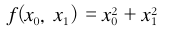

# 밑바닥부터 시작하는 딥러닝 1권

## CHAPTER 4:  신경망 학습

### 4.1 데이터에서 학습한다!

신경망의 특징은 데이터를 보고 학습할 수 있다는 점이다.

학습: 훈련 데이터로부터 가중치 매개변수의 최적값을 자동으로 획득하는 것.


#### 4.1.1 데이터 주도학습

데이터가 이끄는 접근 방식 덕에 사람 중심 접근에서 벗어날 수 있었다. 사람이라면 어렵지 않게 인식할 수 있는 문제들이지만, 그 안에 숨은 규칙성을 명확한 로직으로 풀기가 쉽지 않고 시간도 오래 걸린다.

주어진 이미지에서 특징(feature. 입력 데이터에서 변환된 중요한 데이터)을 추출하는 방법이 있다. (컴퓨터 비전 분야: SIFT, SURF, HOG 등) 이런 특징을 사용하여 이미지 데이터를 벡터로 변환하고, 변환된 벡터로 지도학습으로 학습할 수 있다.

신경망은 입력 이미지를 있는 그대로 학습하며, 이미지에 포함된 중요한 특징까지도 기계가 스스로 학습한다.

- 사람이 생각한 알고리즘 ㅡ> 결과
- 사람이 생각한 특징(SIFT, HOG, 등)을 통한 기계학습 ㅡ> 결과
- 신경망(딥러닝) ㅡ> 결과


#### 4.1.2 훈련 데이터와 시험 데이터

훈련 데이터 (training data) : 학습용. 최적 매개변수 탐색용

시험 데이터 (test data) : 학습된(훈련된) 모델의 평가용

- `범용 능력`: 아직 보지 못한 데이터에도 좋은 성능을 보이는 것

오버피팅(overfitting, 과적합) : 학습한 데이터셋에만 최적화된 상태. 범용 능력이 떨어진다.


___

### 4.2 손실 함수

신경망에서 지표(ex. 손실 함수(비용 함수) )를 가장 좋게 만들어주는 가중치 매개변수의 값을 탐색해야한다.

일반적으로 오차제곱합과 교차 엔트로피 오차를 사용한다.


#### 4.2.1 오차제곱합

 

k : 데이터의 차원 수

y_k : 신경망의 출력(예측값)

t_k : 정답


one-hot encoding : 정답 후보 레이블들의 값을 펼쳐서 인덱스로 한 리스트로 만든다. 정답인 원소만 1로 하고 그 외는 0으로 나타내는 표기법

ex: 

정답 레이블 : 딥러닝

정답 후보 레이블들: 밑바닥, 시작, 딥러닝

one-hot encoding을 거친 정답 레이블: 0 0 1


오차제곱합 코드:

```python
t = [0, 0, 1, 0, 0, 0, 0, 0, 0, 0]
def sum_squares_error(y, t):
    return 0.5 * np.sum((y-t)**2)

# 2로 예측
y = [0.1, 0.05, 0.6, 0.0, 0.05, 0.1, 0.0, 0.1, 0.0, 0.0]
sum_squares_error(np.array(y), np.array(t))
# 결과: 0.09750000

# 7로 예측
y = [0.1, 0.05, 0.1, 0.0, 0.05, 0.1, 0.0, 0.6, 0.0, 0.0]
sum_squares_error(np.array(y), np.array(t))
# 결과: 0.59750000
```

손실 함수가 작은 예측이 정답 레이블과의 오차도 작다.

2로 예측한 것이 정답일 가능성이 높다고 판단하였다.


#### 4.2.2 교차 엔트로피 오차

 

log : 밑이 e인 자연로그(log_e)이다.

k : 데이터의 차원 수

y_k : 신경망의 출력

t_k : 정답 레이블 (one-hot encoding)


정답이 아닌 나머지 모두는 t_k가 0이므로 log y_k와 곱해도 0이 되어 결과에 영향을 주지 않는다. 그래서 결과적으로 정답일 때의 추정(tk 가 1일 때의 yk)의 자연로그를 계산하는 식이 된다.

교차 엔트로피 오차는 정답일 때의 출력(확률)이 손실 함수의 전체 값을 정하게 된다.

```python
t = [0, 0, 1, 0, 0, 0, 0, 0, 0, 0]
def cross_entropy_error(y, t):
    delta = 1e-7
    return -np.sum( t * np.log(y + delta))

# 2로 예측
y = [0.1, 0.05, 0.6, 0.0, 0.05, 0.1, 0.0, 0.1, 0.0, 0.0]
cross_entropy_error(np.array(y), np.array(t))
# 결과: 0.51082545709933802

# 7로 예측
y = [0.1, 0.05, 0.1, 0.0, 0.05, 0.1, 0.0, 0.6, 0.0, 0.0]
cross_entropy_error(np.array(y), np.array(t))
# 결과: 2.3025840929945458
```

delta를 더하는 이유 : np.log() 함수에 0을 입력하면 마이너스 무한대(-inf) 가 되어 더 이상 계산을 진행할 수 없기 때문에 아주 작은 값(delta)을 더해서 0 이 되지 않도록 한다.

예측, 손실 함수 관련해서는 아까 진행한 오차제곱합의 판단과 일치하다.


#### 4.2.3 미니배치 학습

데이터 1개에 대한 손실함수 계산이 아닌 훈련 데이터 모두에 대한 손실 함수를 구해보자.

 

N: 데이터의 갯수    n : 몇번째 데이터인지

k : 데이터의 차원 수

y_nk : 신경망의 출력

t_nk : 정답 레이블


식을 N개의 데이터로 확장하였고, 마지막에 N으로 나누어 정규화하여 "평균 손실 함수"를 구한다. ( 평균을 구함으로써 데이터의 갯수와 관계없이 언제든 통일된 지표 획득 가능 )


미니배치 학습: 전체 훈련 데이터 중에서 임의의 갯수를 무작위로 뽑아 그만큼만 사용하여 학습하는 것.

```python
# 0~1 정규화, 원-핫 인코딩 적용
(x_train, t_train) , (x_text, t_text) = load_mnist(normalize=True, one_hot_label=True)

# 무작위로 임의 갯수를 뽑아내기
train_size = x_train.shape[0]
batch_size = 10
# np.random.choice( p1, p2 ) : 0이상 p1미만의 수 중에서 무작위로 p2개를 골라낸다.
batch_mask = np.random.choice(train_size, batch_size)
x_batch = x_train[batch_mask]
t_batch = t_train[batch_mask]
```

뽑은 인덱스를 사용해 미니배치를 뽑아내기만 하면 된다.


#### 4.2.4 (배치용) 교차 엔트로피 오차 구현하기

데이터가 하나인 경우와 데이터가 배치로 묶여 입력될 경우 모두를 처리할 수 있도록 구현한다.

```python
def cross_entropy_error(y, t):
    if y.ndim == 1:
        t = t.reshape(1, t.size)
        y = y.reshape(1, y.size)
        
    batch_size = y.shape[0]
    return -np.sum(t * np.log(y + 1e-7)) / batch_size
```


만약 정답 레이블이 one-hot encoding이 안된 상태로 주어졌을 때의 교차 엔트로피 오차는 다음과 같이 구현한다.

```python
def cross_entropy_error(y, t):
    if y.ndim == 1:
        t = t.reshape(1, t.size)
        y = y.reshape(1, y.size)
        
    batch_size = y.shape[0]
    return -np.sum(np.log(y[np.arange(batch_size),t] + 1e-7)) / batch_size
```

one-hot encoding시 t * np.log(y) 였던 부분을 레이블 표현일 때는 np.log( y [ np.arange(batch_size) , t] ) 로 구현한다. np.arange(batch_size)는 0부터 batch_size - 1 까지의 배열을 생성한다. t에는 레이블이 [2, 7, 0, 9, 4] 처럼 저장되어 있으므로 y[np.arange(batch_size), t] 는 각 데이터의 정답 레이블에 해당하는 신경망의 출력을 추출한다.


#### 4.2.5 왜 손실 함수를 설정하는가?

신경망 학습에서는 최적의 매개변수 (가중치와 편향)를 탐색할 때 손실함수의 값을 최대한 작게 하는 매개변수 값을 찾는다. 이때 매개변수의 미분을 계산하고, 그 미분값을 단서로 매개변수의 값을 서서히 갱신하는 과정을 반복한다. (gradient descent / back propagation)

정확도를 지표로 잡으면 안된다. 미분 값이 대부분의 장소에서 0이 되어 매개변수를 갱신할 수 없기 때문이다.

- 매개변수를 조금만 조정해서는 정확도가 개선되지 않고 일정하게 유지된다. 또한 정확도가 변화한다고 해도 띄엄띄엄한 값이 변화한다. (연속이 아닌 이산)
- 계단 함수(step function)를 활성화 함수로 사용하지 않는 이유도 이와 같다. 매개변수의 작은 변화가 주는 파장을 계단 함수가 없애버려서 손실 함수의 값에는 아무런 변화가 나타나지 않게 된다.
  - 시그모이드 함수(sigmoid function)는 출력이 연속적으로 변하고 곡선의 기울기도 연속적으로 변한다. (시그모이드 함수의 미분은 0이 되지 않는다.)


### 4.3 수치 미분

#### 4.3.1 미분

미분은 특정 순간의 변화량을 뜻한다. 즉 x의 "작은 변화"(시간 h는 0에 수렴하여 작은 변화)가 함수 f(x)를 얼마나 변화시키느냐를 의미한다.

 


미분 구현

```python
def numerical_diff(f, x):
    h = 1e-4 # 0.0001. 너무 작으면 반올림 오차 문제
    return (f(x+h) - f(x-h)) / (2*h) # 수치 미분 오차 완화
```

- 너무 작은 h값(소수점 8자리 이하)은 반올림오차 문제를 일으킨다. 10^(-4) 정도의 값을 사용하면 좋은 결과를 얻는다고 알려져 있다.

- x 위치의 함수의 기울기를 계산할 수 없다. 코딩에서는 h를 무한히 0으로 좁히는 것이 불가능하기 때문이다. 이 오차를 줄이기 위해 (x+h)와 (x-h)일 때의 차분을 활용하여 기울기를 계산한다.

  - 해석적 미분(수식을 전개해서 미분)은 오차를 포함하지 않는 진정한 미분 값을 구해준다.

    

#### 4.3.2 수치 미분의 예

간단한 2차 함수를 미분해보자. y = 0.01x^2 + 0.1x

```python
def function_1(x):
    return 0.01*x**2 + 0.1*x


x = np.arange(0.0, 20.0, 0.1)  # 0에서 20까지 간격 0.1인 배열 x를 만든다.
y = function_1(x)
plt.xlabel("x")
plt.ylabel("f(x)")
plt.plot(x, y)
plt.show()
```

 

```python
# x = 5, 10일때 미분
print(numerical_diff(function_1, 5))
# 결과: 0.200000000000089
print(numerical_diff(function_1, 10))  
# 결과: 0.29999999999996696
```

해석적 미분으로 구하는 방법: 해석적 해는 0.02x + 0.1 이다. 즉, 5와 10일 때의 진정한 미분은 0.2, 0.3이다. 결과를 비교하면 거의 같은 값이라고 해도 될만큼의 작은 오차이다.


#### 4.3.3 편미분

변수가 여럿인 함수에 대한 미분을 편미분이라고 한다.

인수들의 제곱 합을 계산하는 식을 미분해보자. (변수 2개)

 

```python
def function_2(x):
    return x[0]**2 + x[1]**2
    # 넘파이로 구현: return np.sum(x**2)
```

- x0 = 3, x1 = 4일 때, x0에 대한 편미분을 구하라.

  ```python
  def numerical_diff(f, x):
      h = 1e-4 # 0.0001. 너무 작으면 반올림 오차 문제
      return (f(x+h) - f(x-h)) / (2*h) # 수치 미분 오차 완화
  
  def function_tmp1(x0):
      return x0*x0 + 4.0**2.0
  
  numerical_diff(function_tmp1, 3.0)
  ```

- x0 = 3, x1 = 4일 때, x1에 대한 편미분을 구하라.

  ```python
  def function_tmp2(x1):
      return 3.0**2.0 + x1*x1
  
  numerical_diff(function_tmp2, 4.0)
  ```

이 문제들은 변수가 하나인 함수를 정의하고, 그 함수를 미분하는 형태로 구현해서 풀었다.

이처럼 편미분은 여러 변수 중 목표 변수 하나에 초점을 맞추고 다른 변수는 값을 고정하고 특정 장소의 기울기를 구한다. 


### 4.4 기울기

기울기: 모든 변수의 편미분을 벡터로 정리한(묶은) 것.

x0과 x1의 편미분을 동시에 계산하고 싶다. 

```python
def numerical_gradient(f, x):
    h = 1e-4
    grad = np.zeros_like(x) # x와 형상이 같은 배열 생성

    for idx in range(x.size):
        tmp_val = x[idx]
        # f(x+h) 계산
        x[idx] = tmp_val + h
        fxh1 = f(x)

        # f(x-h) 계산
        x[idx] = tmp_val - h
        fxh2 = f(x)

        grad[idx] = (fxh1 - fxh2) / (2 * h)
        x[idx] = tmp_val  # 값 복원

    return grad
```

x0^2 + x1^2 를 미분해보자.

```python
def function_2(x):
    return x[0]**2 + x[1]**2
    # 넘파이로 구현: return np.sum(x**2)
    
print(numerical_gradient(function_2, np.array([3.0, 4.0])))  
# 결과: [ 6.  8.]
print(numerical_gradient(function_2, np.array([0.0, 2.0])))  
# 결과: [ 0.  4.]
print(numerical_gradient(function_2, np.array([3.0, 0.0])))  
# 결과: [ 6.  0.]
```

기울기의 결과에 마이너스를 붙인 벡터를 그려보면 `각 장소에서 함수의 출력값을 가장 크게 줄이는 방향`을 가리킨다. 또 최솟값에서 멀어질수록 화살표의 크기가 커진다.


#### 4.4.1 경사법(경사 하강법)

일반적인 문제의 손실 함수는 매우 복잡하다. 매개변수 공간이 광대하여 어디가 최솟값이 되는 곳인지를 짐작할 수 없다. 이런 상황에서 기울기를 잘 사용해 함수의 최솟값을 찾으려는 것이 경사 하강법이다.

경사 하강법은 기울기가 0인 장소를 찾지만 반드시 최솟값이라고 할 수 없다. 전역최적해가 아닌 지역최적해(극솟값이나 안장점일 가능성이 있다.)에서 학습이 진행되지 않는 정체기에 빠질 수 있다.


경사 하강법은 현 위치에서 기울어진 방향으로 일정 거리만큼 이동하고, 이동한 곳에서도 마찬가지로 기울기를 구하고, 또 그 기울어진 방향으로 나아가기를 반복한다. 결과적으로 함수의 값을 점차 줄이며 기계학습을 최적화 하는데 흔히 사용한다.

 

에타 기호는 갱신하는 양(학습률)을 나타낸다. 한 번의 학습으로 매개변수 값을 얼마나 갱신하느냐를 정한다.

학습률이 너무 작거나 크면 좋은 장소를 찾아갈 수 없다. 학습률 값을 변경하면서 학습해봐야한다. 

- 학습률이 너무 작으면 학습이 느리다. 너무 크면 큰 값으로 발산해버린다.
- 학습률 같은 매개변수를 하이퍼파라미터 라고 한다. 하이퍼파라미터는 사람이 직접 설정해야하는 매개변수이다.


경사 하강법 구현

```python
def gradient_descent(f, init_x, lr=0.01, step_num=100):
    x = init_x

    for i in range(step_num):
        grad = numerical_gradient(f, x) # 함수의 기울기
        x -= lr * grad

    return x
```

f : 최적화하려는 함수
init_x : 초깃값
lr : 학습률
step_num : 반복횟수

- 경사하강법으로 x0^2 + x1^2의 최솟값을 구하라

  ```python
  def function_2(x):
      return x[0]**2 + x[1]**2
      # 넘파이로 구현: return np.sum(x**2)
      
      
  init_x = np.array([-3.0, 4.0])
  gradient_descent(function_2, init_x=init_x, lr=0.1, step_num=100)
  
  # 결과: array([-6.11110793e-10, 8.14814391e-10])
  ```

  

#### 4.4.2 신경망에서의 기울기

신경망에서도 가중치 매개변수에 대한 손실함수의 기울기를 구해야한다.

형상이 2x3 , 가중치가 W, 손실 함수가 L인 신경망

```python
# softmax와 cross_entropy_error, numerical_gradient 메서드를 이용
from common.functions import softmax, cross_entropy_error
from common.gradient import numerical_gradient

# 4.4.2 신경망에서의 기울기
class simpleNet:
    def __init__(self):
        self.W = np.random.randn(2, 3)  # 정규분포로 초기화된 가중치 (인스턴스 변수)

    def predict(self, x): # 예측
        return np.dot(x, self.W)

    def loss(self, x, t): # 손실 함수의 값 구하기
        z = self.predict(x)
        y = softmax(z)
        loss = cross_entropy_error(y, t)

        return loss
```

simpleNet을 사용해보자

```python
net = simpleNet()
print(net.W)
# 결과: 가중치 매개변수(랜덤, 2x3)

x = np.array([0.6, 0.9])
p = net.predict(x)
print(p) # 예측

print(np.argmax(p))  # 최댓값의 인덱스

t = np.array([0, 0, 1])  # 정답 레이블
print(net.loss(x, t)) # 손실 함수 계산
```

이어서 기울기를 구해보자. numerical_graident(f, x)를 써서 구하면 된다.

```python
def f(W):
    return net.loss(x, t)

dW = numerical_gradient(f, net.W)
print(dW)
# 결과: [[ 0.09009135  0.35284294 -0.44293429]
#        [ 0.13513702  0.52926441 -0.66440143]]
```

numerical_gradient(f, x)의 인수 f는 함수, x는 함수 f의 인수이다. 그래서 new.W를 인수로 받아 손실 함수를 계산하는 새로운 함수 f를 정의했다.

dW는 2x3 의 2차원 배열이다.

w11을 h만큼 늘리면 손실함수의 값은 0.09h만큼 증가한다는 의미이다.

그래서 손실 함수를 줄인다는 관점에서는 반대부호로 적용해야한다.


___


### 4.5 학습 알고리즘 구현하기

신경망의 학습 절차

- 전제: 신경망에는 적응 가능한 가중치와 편향이 있고 이 가중치와 편향을 훈련 데이터에 적응하도록 조정하는 과정을 학습이라 한다.

1. 미니배치: 
   - 훈련 데이터 중 일부를 무작위로 가져온다. 이렇게 선별한 데이터를 미니배치라 하며, 그 미니배치의 손실 함수 값을 줄이는 것이 목표이다.
2. 기울기 산출:
   - 미니배치의 손실 함수 값을 줄이기 위해 각 가중치 매개변수의 기울기를 구한다. 기울기는 손실 함수의 값을 가장 작게 하는 방향을 제시한다.
3. 매개변수 갱신
   - 가중치 매개변수를 기울기 방향으로 아주 조금(학습률) 갱신한다.
4. 반복
   - 1~3 단계를 반복한다.


손글씨 숫자를 학습하는 신경망을 구현해보자. (MNIST 데이터 셋)

#### 4.5.1 2층 신경망 클래스 구현하기

2층 신경망을 하나의 클래스로 구현해보자.

```python
# coding: utf-8
import sys, os
import numpy as np
sys.path.append('C:\\Users\\tmd43\\ssafy5\\TIL\\python\\underDL_Study\\underDL_1\\deeplearning_from_scratch-master')
from common.functions import *
from common.gradient import numerical_gradient


class TwoLayerNet:

    def __init__(self, input_size, hidden_size, output_size, weight_init_std=0.01):
        # 가중치 초기화
        self.params = {}
        self.params['W1'] = weight_init_std * np.random.randn(input_size, hidden_size)
        self.params['b1'] = np.zeros(hidden_size)
        self.params['W2'] = weight_init_std * np.random.randn(hidden_size, output_size)
        self.params['b2'] = np.zeros(output_size)

    def predict(self, x):
        W1, W2 = self.params['W1'], self.params['W2']
        b1, b2 = self.params['b1'], self.params['b2']
    
        a1 = np.dot(x, W1) + b1
        z1 = sigmoid(a1)
        a2 = np.dot(z1, W2) + b2
        y = softmax(a2)
        
        return y
        
    # x : 입력 데이터, t : 정답 레이블
    def loss(self, x, t):
        y = self.predict(x)

        return cross_entropy_error(y, t)

    def accuracy(self, x, t):
        y = self.predict(x)
        y = np.argmax(y, axis=1)
        t = np.argmax(t, axis=1)

        accuracy = np.sum(y == t) / float(x.shape[0])
        return accuracy

    # x : 입력 데이터, t : 정답 레이블
    def numerical_gradient(self, x, t):
        loss_W = lambda W: self.loss(x, t)

        grads = {}
        grads['W1'] = numerical_gradient(loss_W, self.params['W1'])
        grads['b1'] = numerical_gradient(loss_W, self.params['b1'])
        grads['W2'] = numerical_gradient(loss_W, self.params['W2'])
        grads['b2'] = numerical_gradient(loss_W, self.params['b2'])

        return grads
```

- 변수
  - params (인스턴스 변수)
    - 신경망의 매개변수를 보관하는 딕셔너리 변수. value값들이 넘파이 배열이다. 예측(순방향 처리)에서 사용된다.
      - params['W1']은 1번째 층의 가중치, params['b1']은 1번째 층의 편향
  - grads (numerical_gradient() 메서드의 반환 값)
    - 기울기를 보관하는 딕셔너리 변수. value값들이 넘파이 배열이다.
      - grad['W1']은 1번째 층의 가중치의 기울기, grads['b1']은 1번째 층의 편향의 기울기


- 클래스의 메서드
  - `__init__(self, input_size, hidden_size, output_size)` : 클래스 초기화 수행. 입력층의 뉴런 수(데이터 차원), 은닉층의 뉴런 수(적당한 값), 출력층의 뉴런 수(출력 차원)
  - predict(self, x) : 예측을 수행한다. x는 이미지 데이터
  - loss(self, x, t) : 손실 함수(교차 엔트로피 오차)의 값을 구한다. x는 이미지데이터, t는 정답 레이블
  - accuracy(self, x, t) : 정확도 계산
  - numerical_gradient(self, x, t) : 각 매개변수의 손실 함수에 대한 기울기를 구한다.


#### 4.5.2 미니배치 학습 구현하기

신경망 학습 구현에는 미니배치 학습을 활용한다.

```python
(x_train, t_train), (x_test, t_test) = load_mnist(normalize=True, one_hot_label=False)
    
train_loss_list = []

# 하이퍼 파라메터
iters_num = 1000  # 반복횟수
train_size = x_train.shape[0]
batch_size = 100  # 미니배치 크기
learning_rate = 0.1

network = TwoLayerNet(input_size=784, hidden_size=50, output_size=10)

for i in range(iters_num):
    print(i)
    # 미니배치 획득
    batch_mask = np.random.choice(train_size, batch_size)
    x_batch = x_train[batch_mask]
    t_batch = t_train[batch_mask]

    # 기울기 계산
    grad = network.numerical_gradient(x_batch, t_batch)

    # 매개변수 갱신
    for key in ('W1', 'b1', 'W2', 'b2'):
        network.params[key] -= learning_rate * grad[key]

    # 학습 경과 기록
    loss = network.loss(x_batch, t_batch)
    train_loss_list.append(loss)
```

크기가 100인 미니배치를 대상으로 확률적 경사 하강법을 수행해 매개변수를 갱신한다. 경사 하강법에 의한 갱신 반복 횟수는 1000번이며, 갱신할 때마다 훈련 데이터에 대한 손실함수를 계산하고 그 값을 배열에 추가한다. (train_loss_list.append(loss))

데이터를 반복해서 학습함으로써 최적 가중치 매개변수로 간다.


#### 4.5.3 시험 데이터로 평가하기

신경망 학습에서는 훈련 데이터 외의 데이터를 올바르게 인식하는지를 확인해야한다. (오버피팅 확인)

학습 도중 정기적으로(1 epoch) 훈련 데이터와 시험 데이터를 대상으로 정확도를 기록한다. 

- epoch: 학습에서 훈련 데이터를 모두 소진하는 횟수

```python
train_acc_list = []
test_acc_list = []

# 1 epoch 당 반복 수
iter_per_epoch = max(train_size / batch_size, 1)
train_size = 10000
batch_size = 120
iter_per_epoch = 83.33333   # 10000/120.    120 * 83 = 9960


for i in range(iters_num):
    print(i)
    # 코딩들 생략...
    print(f'{i} 번째 미니배치의 loss: {loss}')
    
    cur_epoch = 0
    if i % iter_per_epoch == 0 : # 1epoch 마다
        cur_epoch += 1
        train_acc = network.accuracy(x_train, t_train)
        test_acc = network.accuracy(x_text, t_text)
        train_acc_list.append(train_acc)
        test_acc_list.append(test_acc)
        print(f'epoch: {cur_epoch}, train_acc : {train_acc}, test_acc : {test_acc}')
```

위의 구현에서는 미니배치당 손실 함수값과 epoch당 정확도를 print해준다. 정확도를 1 epoch 마다 계산하는 이유는 매번 계산하기에는 시간이 오래걸리고, 자주 기록할 필요가 없으며, 더 큰 관점에서 그 추이를 알 수 있으면 충분해서이다.

훈련 데이터와 시험 데이터에 대한 정확도 추이가 비슷하다면 오버피팅이 일어나지 않고 잘 학습된 것이다. 

- 오버피팅 예방법:
  - early stopping ( train - validation을 활용하여 stopping. test에서 모델의 성능 확인)
  - drop out ( 신경망에서 일정 비율의 노드를 update 하지 않는다.)
  - 등등


### 4.6 정리

- 기계 학습에서 사용하는 데이터 셋은 훈련 / 시험 데이터로 나눠 사용한다. (훈련 데이터로 학습. 시험 데이터로 모델의 범용 능력을 평가)

- 신경망 학습은 손실 함수를 지표로, 손실 함수의 값이 작아지는 방향으로 가중치 매개변수를 갱신한다.

- 가중치 매개변수를 갱신할 때는 가중치 매개변수의 기울기를 이용하고, 기울어진 방향으로 가중치의 값을 갱신하는 작업을 반복한다.

- 아주 작은 값을 주었을 때의 차분으로 미분하는 것을 수치 미분이라고 한다. 이 수치 미분을 이용해 가중치 매개변수의 기울기를 구할 수 있다.

  

