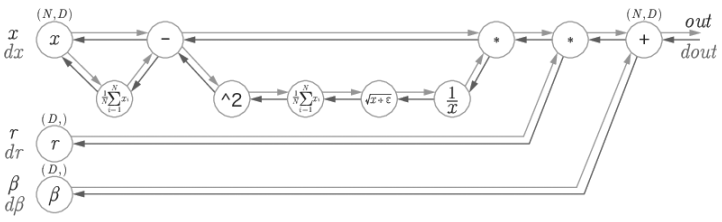
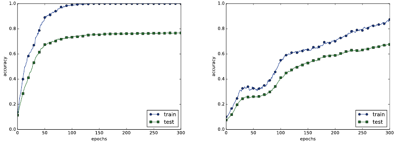

# 6. 학습 관련 기술들

`#weight최적값참색`, `#weight초기화`, `#하이퍼파라미터설정`, `#오버피팅예방`

## 6.1 매개변수 갱신

최적화: 손실 함수의 값을 가능한 낮추는 매개변수 즉, 매개변수의 최적값을 찾는 것

지금까지는 최적의 매개변수 값을 찾는 데에 매개변수의 기울기(미분)을 구하여 기울어진 방향(-)으로 매개변수 값을 갱신하는 방법을 사용했다. (확률적 경사 하강법(SGD))

Optimizer: 최적화를 실행하는 방식 ( ex. SGD, RMSProp, Adam)

### 6.1.2 확률적 경사 하강법(SGD)

 

- "W에 대한 손실 함수의 기울기 * 학습률" 값을 빼서 W를 갱신

- 기울어진 방향으로 일정 거리만 가겠다.

  ```python
  class SGD:
      def __init__(self, lr=0.01):
          self.lr = lr
          
      def update(self, params, grads):
          for key in params.keys():
              params[key] -= self.lr * grads[key]
              
  # params.keys() = ['W1', 'W2','b1','b2']
  # self.params['W1'] = weight_init_std * np.random.randn(input_size, hidden_size)
  # self.params['b1'] = np.zeros(hidden_size)
  
  # grads.keys() = ['W1', 'W2','b1','b2']
  # grads['W1'] = numerical_gradient(loss_W, self.params['W1'])
  # grads['b1'] = numerical_gradient(loss_W, self.params['b1'])
  ```


### 6.1.3 SGD의 단점:

- 함수의 기울기의 크기가 축마다 다른데, 완만한 기울기는 업데이트가 잘 되지 않는다. 따라서 최적 위치에 도달하기 힘들다.

- 방향에 따라 기울기가 달라지는 함수(비등방성 함수)에서는 탐색 경로가 비효율적이다.

- 무작정 기울어진 방향으로 진행하는 방식의 한계. 

- 기울어진 방향이 본래의 최솟값과 다른 방향을 가리키는 문제도 존재. 

  


SGD에 의한 최적화 갱신 경로


### 6.1.4 모멘텀 (Momentum)

`#SGD에 관성 추가`

 

v : 물리에서 말하는 속도에 해당하는 변수

```python
class Momentum:
    def __init__(self, lr=0.01, momentum=0.9):
        self.lr = lr
        self.momentum = momentum
        self.v = None
        
    def update(self, params, grads):
        if self.v is None:
            self.v = {}
            for key, val in params.items():
                self.v[key] = mp.zeros_like(val)
                
        for key in params.keys():
            self.v[key] = self.momentum*self.v[key] - self.lr*grads[key]
            params[key] += self.v[key]
```


SGD와 비교하면 지그재그의 정도가 덜하다.

x축의 힘이 작지만 방향이 같기 때문에 한 방향으로 일정하게 가속하기 때문이다.

반면 y축의 힘이 커서 위아래로 반갈아가며 요동치기 때문에 y축 방향의 속도는 안정적이지 못하다.

전체적으로는 SGD보다 x축 방향으로 빠르게 다가가 지그재그 움직임이 줄어들었다.


### 6.1.5 AdaGrad

각각의 매개변수에 대한 맞춤형 학습률을 만들며 학습을 진행한다.

 

h : 기존 기울기 값을 제곱하여 더해준 값.

매개변수를 갱신할 때 1 / (루트 h) 를 곱하여 학습률을 조정한다.

매개변수가 움직인 정도(원소마다)가 크면 학습률이 낮아진다.

또한 과거의 기울기를 제곱하여 계속 더해가므로 학습을 진행할수록 갱신되는 정도가 약해진다. 

```python
class AdaGrad:
    def __init__(self, lr=0.01):
        self.lr = lr
        self.h = None
        
    def update(self, params, grads):
        if self.h is None:
            self.h = {}
            for key, val in params.items():
                self.h[key] = np.zeros_like(val)
            
        for key in params.keys():
            self.h[key] += grads[key] * grads[key]
            params[key] -= self.lr * grads[key] / (np.sqrt(self.h[key]) + 1e-7) # self.h[key]에 0이 담겨있다해도 0으로 나누는 사태를 막아줌
```


y축 방향은 기울기가 커서 처음에 크게 움직이지만 큰 움직임에 비례해 갱신 정도도 큰 폭으로 작아지도록 조정된다.

그래서 y축 방향으로 갱신 강도가 빠르게 약해지고, 지그재그 움직임이 줄어든다


RMSProp은 과거의 모든 기울기를 균일하게 더하는 것이 아닌, 먼 과거의 기울기는 서서히 잊고 가까운 과거의 기울기 정보를 크게 반영한다. (지수이동평균Exponential Moving Average)

```python
class RMSprop:
    def __init__(self, lr=0.01, decay_rate = 0.99):
        self.lr = lr
        self.decay_rate = decay_rate
        self.h = None
        
    def update(self, params, grads):
        if self.h is None:
            self.h = {}
            for key, val in params.items():
                self.h[key] = np.zeros_like(val)
            
        for key in params.keys():
            self.h[key] *= self.decay_rate
            self.h[key] += (1 - self.decay_rate) * grads[key] * grads[key] 
            # ( 0.99*전시점h + 0.01*현시점기울기제곱 )
            
            params[key] -= self.lr * grads[key] / (np.sqrt(self.h[key]) + 1e-7) 
            # weight = weight - ( 학습률 * 기울기 / 루트( 0.99*전시점h + 0.01*현시점기울기제곱 ) )
            
            # 현 시점 기울기는 0.01만큼 적용 (0.01)
            # 1전시점 기울기는 0.0099만큼 적용 (0.01 * 0.99) 
            # 2전시점 기울기는 0.009801만큼 적용 (0.01 * 0.99 * 0.99)
            # 3전시점 기울기는 0.00970299만큼 적용 (0.01 * 0.99 * 0.99 * 0.99)
            # decay_rate가 작을수록 최신 기울기가 더 많이 반영된다. 
            # ( 1 - decay_rate ) * decay_rate
            # decay_rate가 0.5라면
            # 0.5
            # 0.25 (루트2배)    <->   # (루트100/99배)
            # 0.125 (2배) ...   <->   # (100/99배)
```


### 6.1.6 Adam

Momentum 과 AdaGrad를 융합한 형태이다.

또한 하이퍼파라미터의 '편향 보정'이 진행된다.

```python
class Adam:
    def __init__(self, lr=0.001, beta1=0.9, beta2=0.999):
        self.lr = lr
        self.beta1 = beta1
        self.beta2 = beta2
        self.iter = 0
        self.m = None
        self.v = None
        
    def update(self, params, grads):
        if self.m is None:
            self.m, self.v = {}, {}
            for key, val in params.items():
                self.m[key] = np.zeros_like(val)
                self.v[key] = np.zeros_like(val)
        
        self.iter += 1
        lr_t  = self.lr * np.sqrt(1.0 - self.beta2**self.iter) / (1.0 - self.beta1**self.iter)         
        
        for key in params.keys():
            #self.m[key] = self.beta1*self.m[key] + (1-self.beta1)*grads[key]
            #self.v[key] = self.beta2*self.v[key] + (1-self.beta2)*(grads[key]**2)
            self.m[key] += (1 - self.beta1) * (grads[key] - self.m[key])
            self.v[key] += (1 - self.beta2) * (grads[key]**2 - self.v[key])
            
            params[key] -= lr_t * self.m[key] / (np.sqrt(self.v[key]) + 1e-7)
            
            #unbias_m += (1 - self.beta1) * (grads[key] - self.m[key]) # correct bias
            #unbisa_b += (1 - self.beta2) * (grads[key]*grads[key] - self.v[key]) # correct bias
            #params[key] += self.lr * unbias_m / (np.sqrt(unbisa_b) + 1e-7)
```


Adam은 모멘텀의 v와 AdaGrad의 h가 각각 최초 0으로 설정되어 학습 초반에 편향되는 문제를 해결하기 위해 고안한 방법이다.

1차 모멘텀 m과 2차 모멘텀 v를 이용하여 최적화한다.

m: 1차 모멘텀, beta1 : 일차 모멘텀 계수

v: 2차 모멘텀, beta2 : 이차 모멘텀 계수

g: 기울기

 

결론적으로 m1(1시점1차모멘텀) = g1(1시점기울기) 가 됨으로써 기존에 m0(0시점1차모멘텀) = 0으로 인해서, m1 = 0.1 * g1 = beta1이 되어 0에 편향됨이 해결되었다.

두번째 항부터는 뒤로 갈 수록 가장 최신 기울기가 전체 평균에 10% 정도 영향을 주니 가중이동평균 목적에 부합한다. (0.9)

 

알고리즘의 마지막 계산 순서인 위 부분도, v를 m으로 나누지 않았다. 그 이유는 m은 매번 구해지는 기울기에 따라 늘었다 줄었다 하는 값이지만 v는 제곱이 더해지므로 무조건 커지는 값이기 때문에 학습할 때 step이 너무 크지 않도록 적당히 작은 값을 움직이도록 하기 위해서 m < v 인 조건을 이용한 것으로 이해된다.


## 6.2 가중치의 초깃값

### 6.2.1 초깃값을 0으로 하면?

오버피팅을 억제하기 위한 가중치 감소 기법(weight를 작아지도록 학습하는 방법) 

지금까지 가중치 초깃값은 0.01 * np.random.randn(10,100) 처럼 정규분포에서 생성되는 값을 0.01배 한 값 (표준편차가 0.01인 정규분포)를 사용했다.

가중치 초깃값을 모두 0으로 하면 오차역전파시에 모든 가중치의 값이 똑같이 갱신되기 때문에 안 좋은 방법이다.


### 6.2.2 은닉층 활성화값 분포

은닉층의 활성화값(활성화 함수의 출력 데이터)의 분포를 관찰하면 중요한 정보를 얻을 수 있다.

표준편차를 바꿔가며 활성화 값들의 분포가 어떻게 변화하는지를 관찰해보았다.

층 5개, 각 층 뉴런 100개, 입력 데이터 1000개(정규분포 무작위 생성), 활성화 함수는 시그모이드 함수 이용.

- 표준편차가 1일 때

  

  활성화 값들이 0과 1에 치우쳐 분포한다.

  시그모이드 함수의 출력이 0이나 1에 가까워지면 미분이 0에 수렴하여 역전파의 기울기 값이 점점 작아지다가 사라진다 (기울기 소실 문제. gradient vanishing)

- 표준편차가 0.01일 때

  

- 0과 1에 치우치진 않았으나 다수의 뉴런이 거의 같은 값을 출력하고 있으니 뉴런을 여러 개 둔 의미가 없어졌다. (표현력 제한 문제)


각 층의 활성화 값은 적당히 고루 분포되어야 한다. 층과 층 사이에 적당하게 다양한 데이터가 흐르게 해야 학습이 효율적으로 이뤄지기 때문이다.

- Xavier 초깃값을 사용하였을 때 (표준편차 = 1 / 루트( 앞 계층의 노드 갯수) 인 정규분포)

  앞 층에 노드가 많을 수록 가중치의 분포 범위가 좁아진다.

  

- 오른쪽으로 갈수록 약간씩 일그러지나 이 일그러짐은 시그모이드 대신 tanh 함수를 이용하면 개선된다. 활성화 함수용으로는 원점에서 대칭인 함수가 바람직하다고 알려져 있다.


### 6.2.3 ReLU를 사용할 때의 가중치 초깃값

Xavier 초깃값은 활성화 함수가 선형인 것을 전제로 만들었다. sigmoid와 tanh는 좌우 대칭이라 중앙 부근이 선형인 함수로 볼 수 있어서 Xavier 초깃값이 적당했다.

ReLU에는 He 초깃값을 활용한다.

- He 초깃값을 사용하였을 때 (표준편차 = 루트 (2 / 앞 계층의 노드 갯수) 인 정규분포)

- ReLU는 음의 영역이 0이라서 더 넓게 분포시키기 위해 2배의 계수가 필요하다고 해석된다.

  

- 표준편차가 0.01일 때의 활성화 값들은 아주 작은 값들이어서 학습이 거의 이뤄지지 않을 것이다.

- Xavier 결과는 층이 깊어짐에 따라 치우침이 커진다. 이는 '기울기 소실' 문제를 일으킨다.

- He 결과는 모든 층에서 균일하게 분포되어있다.


결론: sigmoid는 Xavier, ReLU는 He


## 6.3 배치 정규화

각 층이 활성화를 적당히 퍼트리도록 강제로 만들어보자.

### 6.3.1 배치 정규화 알고리즘

배치 정규화의 장점:

- 학습을 빨리 진행할 수 있다 (학습 속도 개선)
- 초깃값에 크게 의존하지 않는다 (초깃값 선택 장애 해결)
- 오버피팅을 억제한다 (드롭아웃 등의 다른 오버피팅 예방 기법의 필요성 감소)


배치 정규화(Batch Norm) 계층:

학습 시 미니배치를 단위로 데이터 분포를 평균 0, 분산이 1이 되도록 정규화한다.

배치 정규화 계층을 활성화 함수의 앞 또는 뒤에 삽입함으로써 데이터 분포가 덜 치우치게 할 수 있다.

또한 각 배치 정규화 계층마다 이 정규화된 데이터에 고유한 확대(scale)와 이동(shift) 변환을 수행한다.

확대와 이동의 정도도 학습을 통하여 적합한 값으로 조정해간다.

- 배치정규화의 계산 그래프

  

### 6.3.2 배치 정규화의 효과

거의 모든 경우에서 배치 정규화를 사용할 때의 학습 진도가 빠르다.

또한 가중치 초깃값이 잘 분포되어 있지 않은 경우 배치 정규화를 쓰지 않는다면 학습이 전혀 진행되지 않을 수도 있다.


## 6.4 바른 학습을 위해

### 6.4.1 오버피팅

- 매개변수가 많고 표현력이 높은 모델
- 훈련 데이터가 적음
  - 훈련 데이터에만 적응하고 처음 본 데이터에는 제대로 대응하지 못함.


### 6.4.2 가중치 감소

학습 과정에서 큰 가중치에 대해서는 규제를 하여 오버피팅을 억제하는 방법.

원래 오버피팅은 가중치 매개변수의 값이 커서 발생하는 경우가 많기 때문이다.


손실 함수를 줄여야 하지만 손실함수에 가중치의 제곱 노름(L2 노름)을 손실함수에 더한 값을 손실함수로 사용한다면 가중치의 값이 커지는 것을 억제할 수 있다.

하이퍼파라미터 '람다'가 클수록 정규화의 규제가 커진다.

L2 노름 : √(w1² + w2² + ... wn²)

L1 노름 : |w1| + |w2| + ... + |wn|

L∞ 노름 : 각 원소의 절댓값 중 가장 큰 것


규제 X:


훈련 정확도가 거의 100%이다.


람다 = 0.1 의 L2 규제(가중치 감소) 적용 :


훈련 정확도가 100%가 아니며, 훈련 정확도와 시험 정확도의 차이가 줄었다.


## 6.4.3 드롭아웃

신경망 모델이 복잡해짐에 따라서 가중치 감소만으로는 대응하기 어려워졌다.

드롭아웃은 뉴런을 임의로 삭제하면서 학습하는 방법이다.

훈련 때는 데이터를 넣을 때마다 무작위 뉴런을 삭제한다.

시험 때는 모든 뉴런에 신호를 전달하지만 각 뉴런의 출력에 훈련 때 삭제 안 한 비율을 곱하여 출력한다.

```python
class Dropout:
    def __init__(self, dropout_ratio=0.5):
        self.dropout_ratio = dropout_ratio
        self.mask = None
    def forward(self, x, train_flg = True):
        if train_flg:
            self.mask = np.random.rand(*x.shape) > self.dropout_ratio # 훈련 시 삭제할 뉴런을 False로 표시
            return x * self.mask
        else:
            return x * (1.0 - self.dropout_ratio)
        
    def backward(self, dout):
        return dout * self.mask
    # 순전파 때 통과시키지 않은 뉴런은 역전파 때도 신호를 차단한다.
```

드롭아웃 X     VS     드롭아웃 O (dropout_ratio = 0.15)

 

훈련 데이터와 시험 데이터에 대한 정확도 차이가 줄었으며, 훈련 데이터 정확도가 100%에 도달하지 않았다.

드롭아웃을 이용하면 표현력을 높이면서도 오버피팅을 억제할 수 있다.

앙상블 학습과의 관계

- 드롭아웃이 학습 때 뉴런을 무작위로 삭제하는 행위를 매번 다른 모델을 학습시키는 것으로 해석할 수 있다.

  또한 추론 때 뉴런의 출력에 삭제한 비율을 곱합으로써 앙상블 학습에서 여러 모델의 평균을 내는 것과 같은 효과를 얻는다.

  즉, 드롭아웃은 앙상블 학습과 같은 효과를 대략 하나의 네트워크로 구현했다고 생각할 수 있다.


## 6.5 적절한 하이퍼파라미터 값 찾기

각 층의 뉴런 수, 배치 크기, 학습률, 가중치 감소(규제), 등의 값을 최대한 효율적으로 탐색하는 방법을 알아보자.


## 6.5.1 검증 데이터

하이퍼파라미터의 성능을 평가할 때는 시험 데이터를 사용해서는 안된다.

하이퍼파라미터의 값이 시험 데이터에만 적합하도록 조정되어 버리고, 그렇게 된다면 다른 데이터에는 적응하지 못해 범용 성능이 떨어지는 모델이 될지도 모른다.

훈련 데이터: 매개변수 학습

검증 데이터: 하이퍼파라미터 성능 평가

시험 데이터 신경망의 범용 성능 평가

```python
def shuffle_dataset(x, t):
    # permutation과 shuffle의 차이: permutation은 array를 복사하여 셔플하고
    # shuffle은 해당 array를 셔플된 array로 대체한다.
    permutation = np.random.permutation(x.shape[0]) #0 ~ x.shape[0] 의 정수가 섞여있는 ndarray 반환
    x = x[permutation, :] if x.ndim == 2 else x[permutation, :, :, :]
    t = t[permutation]
    return x, t

(x_train, t_train), (x_test, t_test) = 
load_mnist()

# 훈련 데이터 섞기
x_train, t_train = shuffle_dataset(x_train, t_train)

# 8:2 검증 분할
validation_rate = 0.2
validation_num = int(x_train.shape[0] * validation_rate)

x_val = x_train[:validation_num]
t_val = t_train[:validation_num]
x_train = x_train[validation_num:]
t_train = t_train[validation_num:]
```


## 6.5.2 하이퍼파라미터 최적화

핵심은 하이퍼파라미터 최적 값이 존재하는 범위를 줄여간다는 것이다.

대략적인 범위를 설정하고 그 범위에서 하이퍼파라미터 값을 랜덤샘플링 하여 그 값으로 정확도를 평가한다. 이 작업을 여러 번 반복하며 하이퍼파라미터의 최적 값의 범위를 좁혀간다.

그리드 서치같은 규칙적인 탐색보다는 랜덤 서치가 좋은 결과를 낸다고 알려져있다. 최종 정확도에 미치는 영향력이 하이퍼파라미터마다 다르기 때문이다.

하이퍼파라미터의 범위는 0.001~1000사이 와 같이 10의 거듭제곱 단위로 범위를 지정한다(로그스케일)

하이퍼파라미터 최적화에는 오랜 시간이 걸리므로 나쁠 듯한 값은 일찍 포기하는게 좋다. 그래서 epoch를 작게 하여, 1회 평가에 걸리는 시간을 단축하는 것이 효과적이다.

하이퍼파라미터 범위 설정 -> 랜덤샘플링 및 여러 회 평가 -> 하이퍼파라미터의 범위를 좁힌다. 을 반복하여 범위가 어느정도 좁아지면 그 범위에서 값을 하나 골라낸다.


### 6.5.3 하이퍼파라미터 최적화 구현하기

학습률과 가중치 감소 계수를 탐색하는 문제를 풀어보자.

0.001 ~ 1000 사이의 범위에서 무작위로 추출해 수행한다. ( 10 ** np.random.uniform(-3,3) )

이 예에서는 가중치 감소 계수를 10^(-8)~10^(-4), 학습률을 10(-6)~10(-2)범위부터 시작한다.

```python
weight_decay = 10 ** np.random.uniform(-8,-4)
lr = 10 ** np.random.uniform(-6, -2)
```


검증 데이터의 정확도가 높은 순서대로 나열하였다.

Best-5까지의 값을 살펴보자


학습률은 0.001~0.01, 가중치 감소 계수는 10^(-8)~10^(-6) 정도이다. 이렇게 범위를 좁혀가다가 특정 단계에서 최종 하이퍼파라미터 값을 하나 선택한다.


## 6.6 정리

- 매개변수 갱신 방법에는 SGD 외에도 모멘텀, AdaGrad, Adam 등이 있다.
- 가중치 초깃값을 정하는 방법은 올바른 학습을 하는 데 매우 중요하다.
- 가중치의 초깃값으로는 Xavier 초깃값과 He 초깃값이 효과적이다.
- 배치 정규화를 이용하면 학습을 빠르게 진행할 수 있으며, 초깃값에 영향을 덜 받게 된다.
- 오버피팅을 억제하는 정규화 기술로는 가중치 감소와 드롭아웃이 있다.
- 하이퍼파라미터 값 탐색은 최적 값이 존재할 법한 범위를 점차 좁히면서 하는 것이 효과적이다.