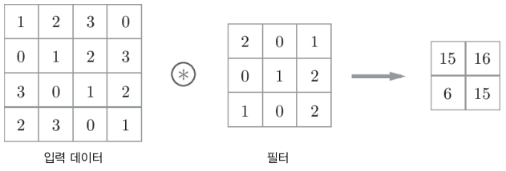
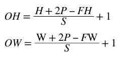
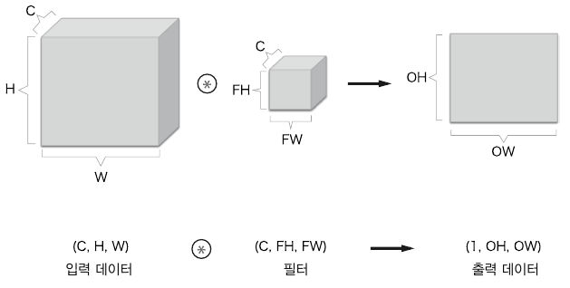
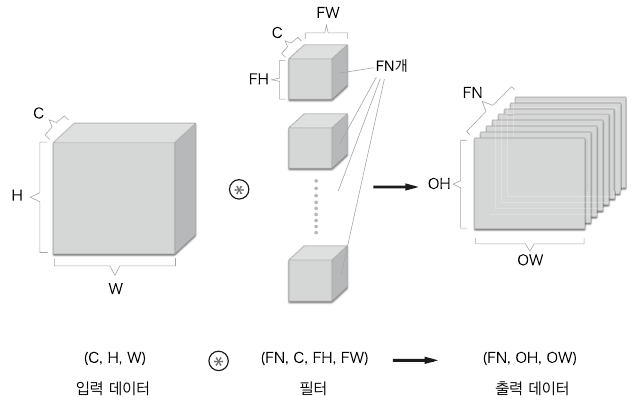
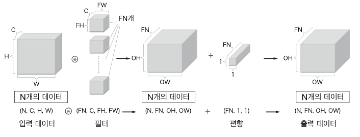

# 7. 합성곱 신경망(CNN)

이미지 인식과 음성 인식 등 다양한 분야에 사용.

## 7.1 전체 구조

지금까지 본 신경망은 인접하는 계층의 모든 뉴런과 결합되어 있었다. 이를 완전연결(fully-connected)이라고 하며 완전히 연결된 계층을 Affine 계층이라는 이름으로 구현했다.

- 기존의 완전연결 계층:
  - Affine - ReLU
- CNN의 계층:
  - Conv - ReLU - (Pooling)

CNN에서의 새로운 계층:

- 합성곱 계층 (Conv)
- 풀링 계층 (Pooling)

CNN에서 출력에 가까운 층에는 Affine-ReLU 구성을 사용할 수 있다. 또한 마지막 출력 계층에는 Affine-Softmax 조합을 그대로 사용한다.

## 7.2 합성곱 계층

### 7.2.1 완전연결 계층의 문제점

- 데이터의 형상이 무시됨
  - 입력 데이터가 3차원인 경우, 1차원 데이터로 평탄화(flatten)해줘야 하므로 형상을 무시하고 모든 입력 데이터를 동등한 뉴런(같은 차원의 뉴런)으로 취급하여 형상에 담긴 정보를 살릴 수 없다.
  - 이미지는 3차원 형상이며, 공간적 정보, 3차원 속에서 의미를 갖는 본질적인 패턴이 담겨있다.
    - 공간적으로 가까운 픽셀은 값이 비슷하거나
    - RGB의 각 채널은 서로 밀접하게 관련되어 있거나
    - 거리가 먼 픽셀끼리는 별 연관이 없는 등
  - 합성곱 계층은 3차원 형상을 유지하여 다음 계층에 전달한다.

- 특징 맵: 
  - 합성곱 계층의 입출력 데이터 ( 입력 특징 맵, 출력 특징 맵)

### 7.2.2 합성곱 연산

합성곱 연산( 필터 연산 )

합성곱 연산은 입력 데이터에 필터를 적용합니다. 이 예에서 입력 데이터, 필터는 2차원 형상을 가졌습니다. (높이height, 너비width)로 표기합니다. 

필터를 커널이라 칭하기도 합니다.

- 합성곱 연산의 순서
  - 필터의 윈도우를 일정 간격으로 이동해가며 입력 데이터에 적용하여 대응하는 원소끼리 곱한 후(단일 곱샘-누산(FMA) ) 그 총합을 출력의 해당 장소에 저장한다.
  - 이 과정을 모든 장소에서 수행하면 합성곱 연산의 출력이 완성됨.

CNN에서는 필터의 매개변수가 그동안의 "가중치" 역할을 한다. 

편향(1x1)은 필터를 적용한 후의 데이터에 고정값(편향)을 더하는 것이다.

### 7.2.3 패딩

합성곱 연산 수행 전에 입력 데이터 주변을 특정 값으로 채운다.

패딩은 주로 출력 크기를 조정할 목적으로 사용한다.

### 7.2.4 스트라이드

필터를 적용하는 위치의 간격.

스트라이드가 2면 필터를 적용하는 윈도우가 두 칸씩 이동한다.

- 출력 크기 계산법

  - 입력 크기: ( H, W )

  - 필터 크기: ( FH, FW )

  - 출력 크기: ( OH, OW )

  - 패딩 : P

  - 스트라이드 : S

  - 출력 크기:

    

    단, 정수로 나눠떨어지는 값이어야 한다.

    출력 크기가 정수가 아니면 에러를 내는 등의 대응을 하던가, 가장 가까운 정수로 반올림을 하는 등, 에러를 내지않고 진행하도록 구현해야한다.

### 7.2.5 합성곱 연산( 3차원 데이터 )

길이 방향 (채널 방향)으로 특징 맵이 늘어난다.

채널 쪽으로 특징 맵이 여러 개 있다면 입력 데이터와 필터의 합성곱 연산을 채널마다 수행하고, 그 결과를 모두 더해서 하나의 출력을 얻는다.

- 3차원의 합성곱 연산에서 주의할 점
  - 입력 데이터의 채널 수와 필터의 채널 수가 같아야 한다.
  - 필터 자체의 크기는 원하는 값으로 설정이 가능하나 모든 채널의 필터가 같은 크기여야 한다.

### 7.2.6 블록으로 생각하기

3차원 합성곱 연산은 데이터와 필터를 직육면체 블록이라고 생각하면 쉽다.

3차원 데이터를 다차원 배열로 나타낼 때는 (채널C, 높이H, 너비W) 순서로 쓴다. 

필터는 (채널C, 필터높이FH, 필터너비FW) 순서로 쓴다.

출력 데이터는 한 장의 특징 맵(채널이 1개인 특징 맵)이다. 

만약 합성곱 연산의 출력으로 다수의 채널을 내보내고 싶다면 필터(가중치)를 여러 개 사용하면 된다.

- 여러 필터를 사용한 합성곱 연산

  

출력은 (FN, OH, OW)인 블록이다. 이 완성된 블록을 다음 계층으로 넘긴다.

필터의 가중치 데이터는 4차원 데이터( 출력 채널 수, 입력 채널 수, 높이 , 너비)이다.

편향은 (FN, 1, 1)으로 채널 하나에 값 하나씩으로 구성된다.

### 7.2.7 배치 처리

합성곱 연산에서 배치 처리를 하기 위해서는 각 계층을 흐르는 데이터의 차원을 하나 늘려 4차원 데이터(데이터 수, 채널 수, 높이, 너비)로 저장해야한다. 

- 합성곱 연산의 처리 흐름(배치 처리)

  

  N회 분의 처리를 한번에 수행한다.

## 7.3 풀링 계층

풀링은 세로 x 가로 방향의 공간을 줄이는 연산이다. ex) 2 X 2 영역을 원소 하나로 바꿔 공간 크기를 줄인다.

최대 풀링 ( max pooling )과 평균 풀링 (average pooling ) 등등이 있다.

대체로 풀링의 윈도우 크기와 스트라이드는 같은 값으로 설정한다.

### 7.3.1 풀링 계층의 특징

- 학습해야 할 매개변수가 없다.
- 채널 수가 변하지 않는다. ( 가로 세로만 변경 )
- 입력의 변화에 영향을 적게 받는다(강건하다. robust하다.)
  - 입력 데이터가 조금 변해도 풀링의 결과는 잘 변하지 않는다. 그 변화를 풀링이 흡수할 수 있기 때문.

## 7.4 합성곱/풀링 계층 구현하기

합성곱 계층과 풀링 계층은 복잡해 보이지만, 사실 '트릭'을 사용하면 쉽게 구현할 수 있다.

### 7.4.1 4차원 배열

