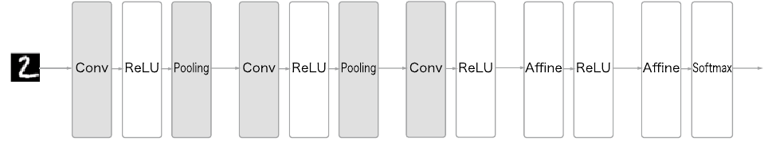

# 7. 합성곱 신경망(CNN)

이미지 인식과 음성 인식 등 다양한 분야에 사용.

## 7.1 전체 구조

지금까지 본 신경망은 인접하는 계층의 모든 뉴런과 결합되어 있었다. 이를 완전연결(fully-connected)이라고 하며 완전히 연결된 계층을 Affine 계층이라는 이름으로 구현했다.

- 기존의 완전연결 계층:
  - Affine - ReLU
- CNN의 계층:
  - Conv - ReLU - (Pooling)

CNN에서의 새로운 계층:

- 합성곱 계층
  - 
- 풀링 계층
  - 

CNN에서 출력에 가까운 층에는 Affine-ReLU 구성을 사용할 수 있다. 또한 마지막 출력 계층에는 Affine-Softmax 조합을 그대로 사용한다.

## 7.2 합성곱 계층

### 7.2.1 완전연결 계층의 문제점

- 데이터의 형상이 무시됨
  - 입력 데이터가 이미지(세로, 가로, 채널 3차원)인 경우, 완전연결계층에 입력할 때는 1차원 데이터로 평탄화(flatten)해줘야 한다. 따라서 형상을 무시하고 모든 입력 데이터를 동등한 뉴런(같은 차원의 뉴런)으로 취급하여 형상에 담긴 정보를 살릴 수 없다.
  - 이미지는 3차원 형상이며, 소중한 공간적 정보, 3차원 속에서 의미를 갖는 본질적인 패턴이 담겨있다.
    - 공간적으로 가까운 픽셀은 값이 비슷하거나
    - RGB의 각 채널은 서로 밀접하게 관련되어 있거나
    - 거리가 먼 픽셀끼리는 별 연관이 없는 등
  - 합성곱 계층은 3차원 형상을 유지하여 다음 계층에 전달한다.

- 특징 맵: 
  - 합성곱 계층의 입출력 데이터 ( 입력 특징 맵, 출력 특징 맵)

### 7.2.2 합성곱 연산

합성곱 연산( 필터 연산 )

