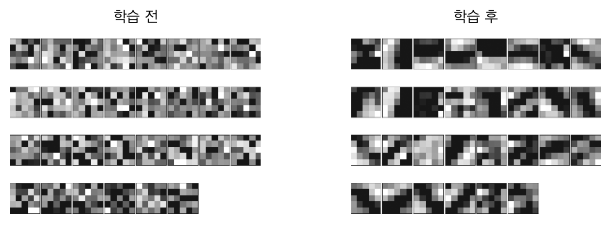
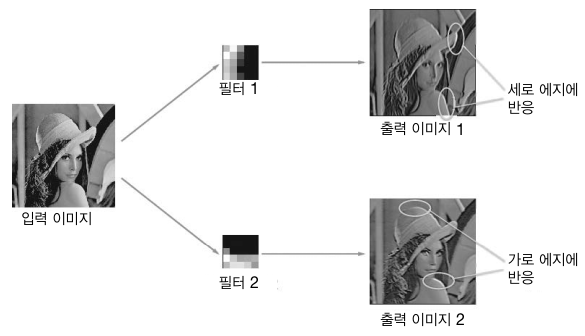
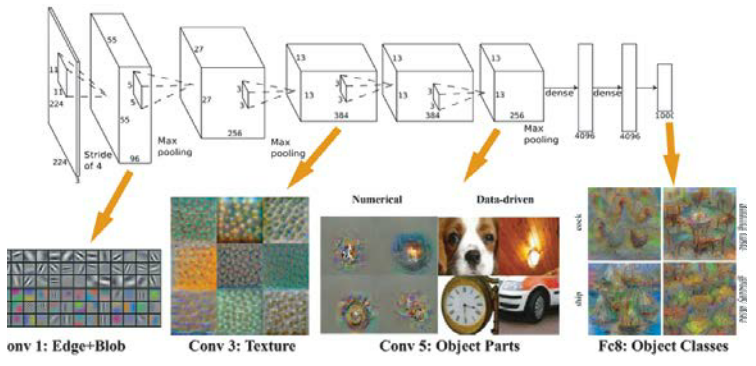
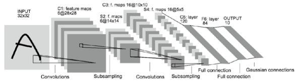
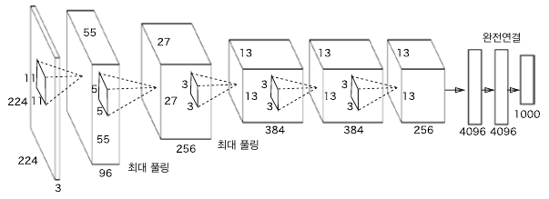

# 7. 합성곱 신경망(CNN)

이미지 인식과 음성 인식 등 다양한 분야에 사용.

## 7.1 전체 구조

지금까지 본 신경망은 인접하는 계층의 모든 뉴런과 결합되어 있었다. 이를 완전연결(fully-connected)이라고 하며 완전히 연결된 계층을 Affine 계층이라는 이름으로 구현했다.

- 기존의 완전연결 계층:
  - Affine - ReLU
- CNN의 계층:
  - Conv - ReLU - (Pooling)

CNN에서의 새로운 계층:

- 합성곱 계층 (Conv)
- 풀링 계층 (Pooling)


CNN에서 출력에 가까운 층에는 Affine-ReLU 구성을 사용할 수 있다. 또한 마지막 출력 계층에는 Affine-Softmax 조합을 그대로 사용한다.


## 7.2 합성곱 계층

### 7.2.1 완전연결 계층의 문제점

- 데이터의 형상이 무시됨
  - 입력 데이터가 3차원인 경우, 1차원 데이터로 평탄화(flatten)해줘야 하므로 형상을 무시하고 모든 입력 데이터를 동등한 뉴런(같은 차원의 뉴런)으로 취급하여 형상에 담긴 정보를 살릴 수 없다.
  - 이미지는 3차원 형상이며, 공간적 정보, 3차원 속에서 의미를 갖는 본질적인 패턴이 담겨있다.
    - 공간적으로 가까운 픽셀은 값이 비슷하거나
    - RGB의 각 채널은 서로 밀접하게 관련되어 있거나
    - 거리가 먼 픽셀끼리는 별 연관이 없는 등
  - 합성곱 계층은 3차원 형상을 유지하여 다음 계층에 전달한다.

- 특징 맵: 
  - 합성곱 계층의 입출력 데이터 ( 입력 특징 맵, 출력 특징 맵)


### 7.2.2 합성곱 연산

합성곱 연산( 필터 연산 )


합성곱 연산은 입력 데이터에 필터를 적용합니다. 이 예에서 입력 데이터, 필터는 2차원 형상을 가졌습니다. (높이height, 너비width)로 표기합니다. 

필터를 커널이라 칭하기도 합니다.

- 합성곱 연산의 순서
  - 필터의 윈도우를 일정 간격으로 이동해가며 입력 데이터에 적용하여 대응하는 원소끼리 곱한 후(단일 곱샘-누산(FMA) ) 그 총합을 출력의 해당 장소에 저장한다.
  - 이 과정을 모든 장소에서 수행하면 합성곱 연산의 출력이 완성됨.


CNN에서는 필터의 매개변수가 그동안의 "가중치" 역할을 한다. 

편향(1x1)은 필터를 적용한 후의 데이터에 고정값(편향)을 더하는 것이다.


### 7.2.3 패딩

합성곱 연산 수행 전에 입력 데이터 주변을 특정 값으로 채운다.

패딩은 주로 출력 크기를 조정할 목적으로 사용한다.


### 7.2.4 스트라이드

필터를 적용하는 위치의 간격.

스트라이드가 2면 필터를 적용하는 윈도우가 두 칸씩 이동한다.

- 출력 크기 계산법

  - 입력 크기: ( H, W )

  - 필터 크기: ( FH, FW )

  - 출력 크기: ( OH, OW )

  - 패딩 : P

  - 스트라이드 : S

  - 출력 크기:

    

    단, 정수로 나눠떨어지는 값이어야 한다.

    출력 크기가 정수가 아니면 에러를 내는 등의 대응을 하던가, 가장 가까운 정수로 반올림을 하는 등, 에러를 내지않고 진행하도록 구현해야한다.


### 7.2.5 합성곱 연산( 3차원 데이터 )

길이 방향 (채널 방향)으로 특징 맵이 늘어난다.

채널 쪽으로 특징 맵이 여러 개 있다면 입력 데이터와 필터의 합성곱 연산을 채널마다 수행하고, 그 결과를 모두 더해서 하나의 출력을 얻는다.

- 3차원의 합성곱 연산에서 주의할 점
  - 입력 데이터의 채널 수와 필터의 채널 수가 같아야 한다.
  - 필터 자체의 크기는 원하는 값으로 설정이 가능하나 모든 채널의 필터가 같은 크기여야 한다.


### 7.2.6 블록으로 생각하기

3차원 합성곱 연산은 데이터와 필터를 직육면체 블록이라고 생각하면 쉽다.

3차원 데이터를 다차원 배열로 나타낼 때는 (채널C, 높이H, 너비W) 순서로 쓴다. 

필터는 (채널C, 필터높이FH, 필터너비FW) 순서로 쓴다.


출력 데이터는 한 장의 특징 맵(채널이 1개인 특징 맵)이다. 

만약 합성곱 연산의 출력으로 다수의 채널을 내보내고 싶다면 필터(가중치)를 여러 개 사용하면 된다.

- 여러 필터를 사용한 합성곱 연산

  

출력은 (FN, OH, OW)인 블록이다. 이 완성된 블록을 다음 계층으로 넘긴다.

필터의 가중치 데이터는 4차원 데이터( 출력 채널 수, 입력 채널 수, 높이 , 너비)이다.

편향은 (FN, 1, 1)으로 채널 하나에 값 하나씩으로 구성된다.


### 7.2.7 배치 처리

합성곱 연산에서 배치 처리를 하기 위해서는 각 계층을 흐르는 데이터의 차원을 하나 늘려 4차원 데이터(데이터 수, 채널 수, 높이, 너비)로 저장해야한다. 

- 합성곱 연산의 처리 흐름(배치 처리)

  

  N회 분의 처리를 한번에 수행한다.


## 7.3 풀링 계층

풀링은 세로 x 가로 방향의 공간을 줄이는 연산이다. ex) 2 X 2 영역을 원소 하나로 바꿔 공간 크기를 줄인다.

최대 풀링 ( max pooling )과 평균 풀링 (average pooling ) 등등이 있다.

대체로 풀링의 윈도우 크기와 스트라이드는 같은 값으로 설정한다.


### 7.3.1 풀링 계층의 특징

- 학습해야 할 매개변수가 없다.
- 채널 수가 변하지 않는다. ( 가로 세로만 변경 )
- 입력의 변화에 영향을 적게 받는다(강건하다. robust하다.)
  - 입력 데이터가 조금 변해도 풀링의 결과는 잘 변하지 않는다. 그 변화를 풀링이 흡수할 수 있기 때문.


## 7.4 합성곱/풀링 계층 구현하기

합성곱 계층과 풀링 계층은 복잡해 보이지만, 사실 '트릭'을 사용하면 쉽게 구현할 수 있다.


### 7.4.1 4차원 배열

```python
# 생성
x = np.random.rand(10, 1, 28, 28)
x.shape  
# (10, 1, 28, 28)
# 데이터 수, 채널 수, 높이, 너비
```


### 7.4.2 im2col로 데이터 전개하기

im2col이라는 '트릭'을 사용하면 합성곱 연산의 구현은 단순해진다.

im2col은 입력 데이터를 필터링(가중치 계산)하기 좋게 전개하는 함수이다.

입력 데이터에 im2col을 적용하면 2차원 행렬로 바뀐다. (배치 안의 데이터 수까지 포함한 4차원 데이터를 2차원으로 변환한다.)


위 그림에서는 보기 좋도록 스트라이드를 크게 잡아 필터의 적용 영역이 겹치지 않도록 했다.

필터 적용 영역이 겹치는 경우, im2col로 전개한 후의 원소 수가 원래 블록의 원소 수보다 많아진다. 그래서 im2col을 사용해 구현하면 메모리를 더 많이 소비하는 단점이 있다.

하지만 문제를 행렬 계산으로 만들면 선형 대수 라이브러리를 활용하여 계산 속도와 효율을 높일 수 있다.

im2col로 입력 데이터를 전개한 다음에는 합성곱 계층의 필터(가중치)를 1열로 전개하고, 두 행렬의 곱을 계산하면 된다.


### 7.4.3 합성곱 계층 구현하기

```python
def im2col(input_data, filter_h, filter_w, stride=1, pad=0):
    """다수의 이미지를 입력받아 2차원 배열로 변환한다(평탄화).
"""
    N, C, H, W = input_data.shape
    # 출력 차원 계산
    out_h = (H + 2*pad - filter_h)//stride + 1
    out_w = (W + 2*pad - filter_w)//stride + 1
    # np.pad(array, pad_width, mode)
    img = np.pad(input_data, [(0,0), (0,0), (pad, pad), (pad, pad)], 'constant')
    col = np.zeros((N, C, filter_h, filter_w, out_h, out_w))

    for y in range(filter_h):
        y_max = y + stride*out_h
        for x in range(filter_w):
            x_max = x + stride*out_w
            col[:, :, y, x, :, :] = img[:, :, y:y_max:stride, x:x_max:stride]

    col = col.transpose(0, 4, 5, 1, 2, 3).reshape(N*out_h*out_w, -1)
    return col
```

im2col은 필터 크기, 스트라이드, 패딩을 고려하여 입력 데이터를 2차원 배열로 전개한다.

```python
from common.util import im2col

x1 = np.arandom.rand(1, 3, 7, 7) # ( 데이터 수, 채널 수, 높이, 너비)
col1 = im2col(x1, 5, 5, stride=1, pad=0)
print(col1.shape) # (9, 75)

x2 = np.random.rand(10, 3, 7, 7) # 데이터 10개
col2 = im2col(x2, 5, 5, stride=1, pad=0)
print(col2.shape) # (90, 75)
```

배치 크기가 1, 10이라는 차이가 있지만 두 경우 모두 2번째 차원의 원소는 75개이다. 이 값은 필터의 원소 수와 같다(채널 3개, 5 x 5 데이터)


합성곱 계층 Convolution 클래스 구현

```python
class Convolution:
    def __init__(self, W, b, stride=1, pad=0):
        self.W = W
        self.b = b
        self.stride = stride
        self.pad = pad
        
    def forward(self, x):
        FN, C, FH, FW = self.W.shape
        N, C, H, W = x.shape
        out_h = int(1 + (H + 2 * self.pad - FH) / self.stride)
        out_w = int(1 + (W + 2 * self.pad - FW) / self.stride)
        
        col = im2col(x, FH, FW, self.stride, self.pad) # 입력 데이터 im2col 전개
        col_W = self.W.reshape(FN, -1).T # 필터 전개
        out = np.dot(col, col_W) + self.b
        
        out = out.reshape(N, out_h, out_w, -1).transpose(0, 3, 1, 2)
        
        return out
```

합성곱 계층은 필터(가중치), 편향, 스트라이드, 패딩을 인수로 받아 초기화한다.

필터의 형상은 (FN필터 개수, C채널, FH필터 높이, FW필터 너비) .

forward 구현의 마지막에서는 출력 데이터를 적절한 형상으로 바꿔준다. numpy의 transpose함수는 다차원 배열의 축 순서를 바꿔주는 함수이다.

합성곱 계층의 역전파에서는 im2col을 역으로 처리해야한다.


### 7.4.4 풀링 계층 구현하기

풀링 적용 영역을 채널마다 독립적으로 전개한다.

Maxpooling의 모습:


풀링 계층의 forward 처리 흐름:

```python
class pooling:
    def __init__(self, pool_h, pool_w, stride=1, pad=0):
        self.pool_h = pool_h
        self.pool_w = pool_w
        self.stride = stride
        self.pad = pad
        
    def forward(self, x):
        N, C, H, W = x.shape
        out_h = int(1 + (H - self.pool_h) / self.stride)
        out_w = int(1 + (W - self.pool_w) / self.stride)
        
	# 전개 (1)
    col = im2col(x, self.pool_h, self.pool_w, self.stride, self.pad)
    col = col.reshape(-1, self.pool_h*self.pool_w)
    
    # 최댓값 (2)
    out = np.max(col, axis=1)
    
    # 성형 (3)
    out = out.reshape(N, out_h, out_w, C).transpose(0, 3, 1, 2)
    
    return out
```

np.max 함수는 인수로 축(axis)을 지정하면 지정 축마다 최댓값을 구할 수 있다. 

axis=1이면 입력 x의 1번째 차원의 축마다 최댓값을 구한다.


## 7.5 CNN 구현하기

Convolution-ReLU-Pooling-Affine-ReLU-Affine-Softmax 순서의 CNN 네트워크 구현.

- 초기화 때 받는 인수
  - input_dim : 입력 데이터(채널 수, 높이, 너비)의 차원
  - conv_param : 합성곱 계층의 하이퍼파라미터(딕셔너리)
    - filter_num : 필터 수
    - filter_size : 필터 크기
    - stride : 스트라이드
    - pad : 패딩
    - hidden_size : 은닉층(완전연결)의 뉴런 수
    - output_size : 출력층(완전연결)의 뉴런 수
    - weight_init_std : 초기화 때의 가중치 표준편차

```python
class SimpleConvNet:
    def __init__(self, input_dim=(1, 28, 28), conv_param={'filter_num': 30, 'filter_size': 5, 'pad': 0, 'stride': 1}, hidden_size=100, output_size=10, weight_init_std=0.01):
        # 나중에 쓰기 쉽도록 초기화 인수로 주어진 하이퍼파라미터를 딕셔너리에서 꺼낸다.
        # 합성곱 계층의 출력 크기를 계산한다.
        filter_num = conv_param['filter_num']
        filter_size = conv_param['filter_size']
        filter_pad = conv_param['pad']
        filter_stride = conv_param['stride']
        input_size = input_dim[1]
        conv_output_size = (input_size - filter_size + 2*filter_pad) / filter_stride + 1
        pool_output_size = int(filter_num * (conv_output_size/2) * (conv_output_size/2))
        
        # 가중치 매개변수 초기화
        self.params = {}
        self.params['W1'] = weight_init_std * \
            np.random.randn(filter_num, input_dim[0], filter_size, filter_size)
        self.params['b1'] = np.zeros(filter_num)
        self.params['W2'] = weight_init_std * \
            np.random.randn(pool_output_size, hidden_size)
        self.params['b2'] = np.zeros(hidden_size)
        self.params['W3'] = weight_init_std * \
            np.random.randn(hidden_size, output_size)
        self.params['b3'] = np.zeros(output_size)
        
        # CNN을 구성하는 계층들을 생성
        self.layers = OrderedDict()
        self.layers['Conv1'] = Convolution(self.params['W1'],
                                           self.params['b1'],
                                           conv_param['stride'],
                                           conv_param['pad'])
        self.layers['Relu1'] = Relu()
        self.layers['Pool1'] = Pooling(pool_h=2, pool_w=2, stride=2)
        self.layers['Affine1'] = Affine(self.params['W2'], self.params['b2'])
        self.layers['Relu2'] = Relu()
        self.layers['Affine2'] = Affine(self.params['W3'], self.params['b3'])
        self.last_layer = SoftmaxWithLoss()
```

추론(예측)을 수행하는 predict 메서드, 손실 함수의 값을 구하는 loss 메서드 구현

```python
    # 추론(예측)
    def predict(self, x):
        # layers에 추가한 계층을 맨 앞에서부터 차례로 forward 메서드 호출하여 그 결과를 다음 계층에 전달 ( x = func(x) )
        for layer in self.layers.values():
            x = layer.forward(x)
        return x
	
    # 손실 함수 계산
    def loss(self, x, t): # x: 입력 데이터, t: 정답 레이블
        y = self.predict(x) # y: 추론(예측) 레이블
        return self.last_layer.forward(y, t) # 추론과 정답으로 손실 계산
```

오차역전파법으로 기울기 구하기 구현

```python
    def gradient(self, x, t):
        # 순전파
        self.loss(x, t)

        # 역전파
        dout = 1
        dout = self.last_layer.backward(dout)

        layers = list(self.layers.values())
        layers.reverse()
        for layer in layers:
            dout = layer.backward(dout)

        # 각 가중치 매개변수의 기울기를 저장
        grads = {}
        grads['W1'] = self.layers['Conv1'].dW
        grads['b1'] = self.layers['Conv1'].db
        grads['W2'] = self.layers['Affine1'].dW
        grads['b2'] = self.layers['Affine1'].db
        grads['W3'] = self.layers['Affine2'].dW
        grads['b3'] = self.layers['Affine2'].db

        return grads
    
    # 정확도 계산
    def accuracy(self, x, t, batch_size=100):
        if t.ndim != 1:
            t = np.argmax(t, axis=1)

        acc = 0.0

        for i in range(int(x.shape[0] / batch_size)):
            tx = x[i*batch_size:(i+1)*batch_size]
            tt = t[i*batch_size:(i+1)*batch_size]
            y = self.predict(tx)
            y = np.argmax(y, axis=1)
            acc += np.sum(y == tt)

        return acc / x.shape[0]
```


MNIST 데이터셋 학습 예제: train_convnet.py

```python
# 데이터 읽기
(x_train, t_train), (x_test, t_test) = load_mnist(flatten=False)
max_epochs = 20

# CNN 네트워크 정의
network = SimpleConvNet(input_dim=(1,28,28), 
                        conv_param = {'filter_num': 30, 'filter_size': 5, 'pad': 0, 'stride': 1},
                        hidden_size=100, output_size=10, weight_init_std=0.01)

# Trainer: 신경망 훈련을 대신 해주는 클래스
trainer = Trainer(network, x_train, t_train, x_test, t_test,
                  epochs=max_epochs, mini_batch_size=100,
                  optimizer='Adam', optimizer_param={'lr': 0.001},
                  evaluate_sample_num_per_epoch=1000)
# 학습 (verbose 값이 True(defaulf)면 train loss와 epoch별 train, test 정확도, 최종 test 정확도가 출력된다. )
trainer.train()

# 매개변수 보존 (pickle파일)
network.save_params("params.pkl")
print("Saved Network Parameters!")

# 그래프 그리기
markers = {'train': 'o', 'test': 's'}
x = np.arange(max_epochs) # array([0~19]) 생성
plt.plot(x, trainer.train_acc_list, marker='o', label='train', markevery=2)
plt.plot(x, trainer.test_acc_list, marker='s', label='test', markevery=2)
plt.xlabel("epochs")
plt.ylabel("accuracy")
plt.ylim(0, 1.0)
plt.legend(loc='lower right')
plt.show()
```


## 7.6 CNN 시각화하기

합성곱 계층을 시각화하여 CNN이 보고 있는 것이 무엇인지 알아보도록 하자.


### 7.6.1 1번째 층의 가중치 시각화하기

MNIST CNN 실습의 1번째 층의 합성곱 계층의 가중치는 (30필터, 1채널, 5높이, 5너비)의 형상이었다. 이때, 이 필터를 1채널의 회색조 이미지로 시각화할 수 있다.

```python
# coding: utf-8

def filter_show(filters, nx=8, margin=3, scale=10):
    FN, C, FH, FW = filters.shape
    # np.ceil : 각 원소 값보다 크거나 같은 가장 작은 정수 값 (천장 값)으로 올림
    ny = int(np.ceil(FN / nx))
	
    fig = plt.figure()
    fig.subplots_adjust(left=0, right=1, bottom=0, top=1, hspace=0.05, wspace=0.05)

    # 각 필터마다 시각화
    for i in range(FN):
        ax = fig.add_subplot(ny, nx, i+1, xticks=[], yticks=[])
        ax.imshow(filters[i, 0], cmap=plt.cm.gray_r, interpolation='nearest')
    plt.show()


network = SimpleConvNet()
# 무작위(랜덤) 초기화 후의 가중치
filter_show(network.params['W1'])

# 학습된 가중치
network.load_params("params.pkl")
filter_show(network.params['W1'])
```

1번째 층의 합성곱 계층의 가중치 ( 가중치의 원소는 실수이지만, 이미지에서는 가장 작은 값(0)은 검은색, 가장 큰 값(255)은 흰색으로 정규화하여 표시함)



학습 전 필터는 무작위로 초기화되고 있어 흑백의 정도에 규칙성이 없다. 학습을 마친 필터는 규칙성이 있는 이미지가 되었다.

이 규칙성 있는 필터는 에지(색상이 바뀐 경계선)와 블롭(국소적으로 덩어진 영역) 등을 보고 있다. 

예를 들어, 왼쪽 절반이 흰색이고 오른쪽 절반이 검은색인 필터는 세로 방향의 에지에 반응하는 필터이다.



이러한 합성곱 계층의 필터는 에지나 블롭 등의 원시적인 정보를 추출할 수 있다.


### 7.6.2 층 깊이에 따른 추출 정보 변화

1번째 층은 에지나 블롭 등의 저수준 정보가 추출됐다.

계층이 깊어질수록 추출되는 정보(정확히는 강하게 반응하는 뉴런)는 더 추상화된다.

8층 구조의 AlexNet:



뉴런이 반응하는 것:

​	1번째 층: 에지와 블롭

​	3번째 층: 텍스처

​	5번째 층: 사물의 일부

​	마지막 완전연결계층: 사물의 클래스


즉, 층이 깊어지면서 뉴런이 반응하는 대상이 단순한 모양에서 '고급' 정보로 변화해간다. 사물의 '의미'를 이해하도록 변화하는 것이다.


## 7.7 대표적인 CNN


### 7.7.1 LeNet

손글씨 숫자를 인식하는 네트워크

합성곱 계층과 풀링 계층(단순히 원소를 줄이기만 하는 서브샘플링 계층)을 반복하고, 마지막으로 완전연결 계층을 거치면서 결과를 출력



현재의 CNN과 LeNet의 차이점:

- 활성화 함수
  - LeNet: 시그모이드
  - 현재: ReLU
- 풀링 (중간 데이터의 크기 줄이기)
  - LeNet: 서브샘플링
  - 현재: 최대 풀링(Max Pooling)


### 7.7.2 AlexNet



합성곱 계층과 풀링 계층을 거듭하며 마지막으로 완전연결 계층을 거쳐 결과를 출력한다.

LeNet과 AlexNet의 차이점:

- 활성화 함수
  - LeNet: 시그모이드
  - AlexNet: ReLU
- AlexNet은 LRN(Local Response Normalization)이라는 국소적 정규화를 실시하는 계층을 이용한다.
- dropout을 사용한다.


## 7.8 정리

- CNN은 지금까지의 완전연결 계층 네트워크에 '합성곱 계층'과 '풀링 계층'을 새로 추가한다.
- 합성곱 계층과 풀링 계층은 im2col (이미지를 행렬로 전개하는 함수)을 이용하면 간단하고 효율적으로 구현할 수 있다.
- CNN을 시각화해보면 계층이 깊어질수록 고급 정보가 추출되는 모습을 확인할 수 있다.

