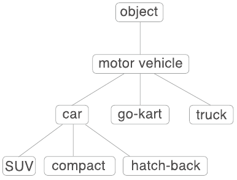
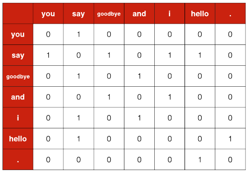
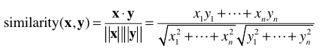
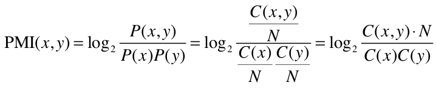
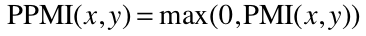
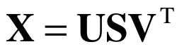
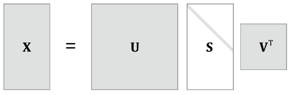
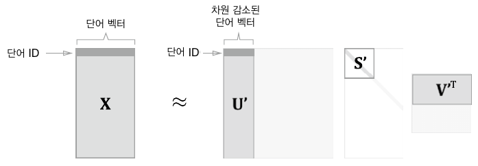
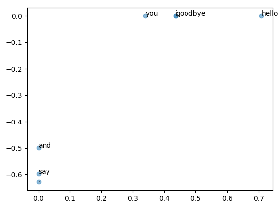

# 2. 자연어와 단어의 분산 표현

컴퓨터에게 말을 이해시켜보자.

## 2.1 자연어 처리란

Natural Language Processing : 자연어를 처리하는 분야. 우리의 말을 컴퓨터에게 이해시키기 위한 기술(분야)

컴퓨터에게 자연어를 이해시켜서 처리하는 기술 예시

- 검색 엔진
- 기계 번역
- 질의응답 시스템
- IME (입력기 전환)
- 문장 자동요약
- 감정 분석
- 등등


### 2.1.1 단어의 의미

말 ⊃ 문자 ⊃ 단어

단어는 의미의 최소 단위이다.

단어의 의미를 잘 파악할 수 있는 표현 방법을 알아보자.

- 시소러스(유의어 사전)를 활용한 기법
- 통계 기반 기법
- 추론 기반 기법(word2vec)


## 2.2 시소러스

시소러스: 유의어 사전으로, '뜻이 같은 단어(동의어)'나 '뜻이 비슷한 단어(유의어)'가 한 그룹으로 분류되어 있다. 

또한 자연어 처리에 이용되는 시소러스에서는 단어 사이의 '상위와 하위' 혹은 '전체와 부분' 등, 더 세세한 관계까지 정의해둔 경우가 있다.



각 단어의 관계를 그래프 구조로 정의하여  상/하위 관계를 표현하였다. 모든 단어에 대한 유의어 집합을 만든 다음, 단어들의 관계를 그래프로 표현하여 단어 사이의 연결을 정의할 수 있다.

이러한 '단어 네트워크'를 이용하여 컴퓨터에게 단어 사이의 관계를 가르치고 단어의 의미를 간접적으로 이해시킨다.


### 2.2.1 WordNet

WordNet은 가장 유명한 시소러스이다.

WordNet을 사용하면 유의어를 얻거나 '단어 네트워크'를 이용할 수 있다. 또한 단어 네트워크를 사용해 단어 사이의 유사도를 구할 수도 있다. ( 단어의 유사도를 정확하게 구사하는 것이 '단어의 의미'를 이해하는 첫 걸음이다. )


### 2.2.2 시소러스의 문제점

- 시대 변화에 대응하기 어렵다.
  - 새로운 단어가 생겨나고 옛말은 언젠가 잊혀진다.
  - 시대에 따라 언어의 의미가 변한다.
  - 사람이 수작업으로 끊임없이 갱신해야 한다.
- 사람을 쓰는 비용이 크다.
  - 방대한 단어들 모두에 대해 단어 사이의 관계를 정의해줘야 한다.
- 단어의 미묘한 차이를 표현할 수 없다.
  - 시소러스에서는 뜻이 비슷한 단어들을 묶어서 미묘한 차이를 표현할 수 없다.


## 2.3 통계 기반 기법

말뭉치(corpus): 대량의 텍스트 데이터. 

통계 기반 기법은 사람의 지식이 가득한 말뭉치에서 자동으로 ,그리고 효율적으로 그 핵심을 추출하는 것.


### 2.3.1 파이썬으로 말뭉치 전처리하기

텍스트 데이터를 단어로 분할하고 그 분할된 단어들을 단어 ID 목록으로 변환한다.

```python
text = 'You say goodbye and I say hello.'
text = text.lower().replace('.', ' .') # 전부 소문자로 변환 및 . 앞에 공백을 붙여서 나중에 split 시에 '.'이 들어가게 함
words = text.split(' ')

# 단어에 ID를 부여하고, ID의 리스트로 이용하기 위해 딕셔너리를 이용하여 단어 ID와 단어를 짝지어주는 대응표를 작성한다.
word_to_id = {} # 단어에서 단어ID로의 변환 {단어:단어ID}
id_to_word = {} # 단어ID에서 단어로의 변환 {단어ID:단어}

for word in words:
    if word not in word_to_id:
        # 추가시점의 딕셔너리 길이가 새로운 단어의 ID로 설정됨
        new_id = len(word_to_id)
        word_to_id[word] = new_id
        id_to_word[new_id] = word
      
# '단어 목록'을 '단어 ID 목록'으로 변경해보자
import numpy as np
corpus = [word_to_id[w] for w in words]
corpus = np.array(corpus) # array([0, 1, 2, 3, 4, 1, 5, 6])

# 지금까지의 과정을 preprocess 함수로 구현
def preprocess(text):
    text = text.lower()
    text = text.replace('.', ' .')
    words = text.split(' ')
    word_to_id = {}
    id_to_word = {}
    for word in words:
	    if word not in word_to_id:
    	    new_id = len(word_to_id)
        	word_to_id[word] = new_id
        	id_to_word[new_id] = word
    
    corpus = np.array([word_to_id[w] for w in words])
    
    return corpus, word_to_id, id_to_word
```

preprocess 함수를 사용하면 말뭉치 전처리를 간편하게 할 수 있다.

```python
text = 'You say goodbye and I say hello.'
corpus, word_to_id, id_to_word = preprocess(text)
```


### 2.3.2 단어의 분산 표현

- 단어의 분산 표현: '단어의 의미'를 정확하게 파악할 수 있는 벡터 표현. 단어의 고정 길이의 밀집벡터(dense vector)로 표현한다.
  -  밀집벡터: 대부분의 원소가 0이 아닌 실수인 벡터를 말한다.


### 2.3.3 분포 가설

분포 가설: '단어의 의미는 주변 단어에 의해 형성된다'. 단어 자체에는 의미가 없고, 그 단어가 사용된 '맥락(문맥, 흐름)'이 의미를 형성한다는 것이다.

이번 장에서의 "맥락"의 의미 : 주목하는 단어 주변에 놓인 단어

윈도우 크기 : 맥락의 크기 (주변 단어를 몇 개나 포함할지) 를 뜻함


### 2.3.4 동시발생 행렬

통계 기반 기법: 어떤 단어에 주목했을 때, 그 주변에 어떤 단어가 몇 번이나 등장하는지를 세어 집계해보자.

각 단어의 맥락에 해당하는 단어의 빈도를 세어보자. (윈도우 크기 1)



동시발생 행렬: 모든 단어에 대해 동시발생하는 단어를 행렬의 형태로 정리한 것. 각 행은  해당 단어를 표현한 벡터가 된다.

```python
C = np.array([
    [0, 1, 0, 0, 0, 0, 0],
    [1, 0, 1, 0, 1, 1, 0],
    [0, 1, 0, 1, 0, 0, 0],
    [0, 0, 1, 0, 1, 0, 0],
    [0, 1, 0, 1, 0, 0, 0],
    [0, 1, 0, 0, 0, 0, 1],
    [0, 0, 0, 0, 0, 1, 0],
], dtype=np.int32)

# 각 단어의 벡터 : C[id], C[word_to_id['goodbye']]
```


동시발생 행렬을 만들어주는 함수 구현

```python
def create_co_matrix(corpus, vocab_size, window_size = 1):
    corpus_size = len(corpus)
    # co_matrix를 0으로 채워진 2차원 배열로 초기화
    co_matrix = np.zeros((vocab_size, vocab_size), dtype = np.int32)
    
    # 말뭉치의 모든 단어 각각에 대하여
    for idx, word_id in enumerate(corpus):
        # 윈도우에 포함된 주변 단어를 센다
        for i in range(1, window_size + 1):
            left_idx = idx - i
            right_idx = idx + i
            
            # 왼쪽이 안 벗어났다면
            if left_idx >= 0:
                left_word_id = corpus[left_idx]
                # 행렬에 추가
                co_matrix[word_id, left_word_id] += 1
            # 오른쪽이 안 벗어났다면
            if right_idx < corpus_size:
                right_word_id = corpus[right_idx]
                # 행렬에 추가
                co_matrix[word_id, right_word_id] += 1
                
    return co_matrix
```


### 2.3.5 벡터 간 유사도


- 코사인 유사도

  - 

  - 코사인 유사도의 핵심은 벡터를 정규화하고 내적을 구하는 것이다.

  - 직관적으로는 '두 벡터가 가리키는 방향이 얼마나 비슷한가'이다.

  - ```python
    # x, y는 넘파이 배열, eps : 입실론(0으로 나누기 에러 방지)
    def cos_similarity(x, y, eps=1e-8):
        nx = x / np.sqrt(np.sum(x**2) + eps) # x의 정규화
        ny = y / np.sqrt(np.sum(y**2) + eps) # y의 정규화
        return np.dot(nx, ny)
    ```

  - 'you'와 'i'의 유사도 구하기

    - ```python
      # preprocess, create_co_matrix, cos_similarity 함수 사용
      
      text = 'You say goodbye and I say hello.'
      corpus, word_to_id, id_to_word = preprocess(text)
      vocab_size = len(word_to_id)
      C = create_co_matrix(corpus, vocab_size)
      
      c0 = C[word_to_id['you']]
      c1 = C[word_to_id['i']]
      print(cos_similarity(c0, c1)) # 0.7071
      ```

  - 코사인 유사도의 범위는 -1 ~ 1이다.


### 2.3.6 유사 단어의 랭킹 표시

어떤 단어가 검색어로 주어지면, 그 검색어와 비슷한 단어를 유사도 순으로 출력하는 함수를 만들어보자

순서

1. 검색어의 단어 벡터를 꺼낸다.
2. 검색어의 단어 벡터와 다른 모든 단어 벡터와의 코사인 유사도를 각각 구한다.
3. 계산한 코사인 유사도 결과를 기준으로 값이 높은 순서대로 출력한다.

```python
def most_similar(query, word_to_id, id_to_word, word_matrix, top=5):
    # 1. 검색어를 꺼낸다. query: 검색어(단어)
    if query not in word_to_id:
        print('%s(을)를 찾을 수 없습니다.' % query)
        return
    print('\n[query] ' + query)
    query_id = word_to_id[query]
    # word_matrix : 단어 벡터들을 한데 모은 행렬. 각 행에는 대응하는 단어의 벡터가 저장되어있다고 가정한다.
    query_vec = word_matrix[query_id]
    
    # 2. 코사인 유사도 계산
    vocab_size = len(id_to_word)
    similarity = np.zeros(vocab_size)
    for i in range(vocab_size):
        similarity[i] = cos_similairty(word_matrix[i], query_vec)
        
    # 3. 코사인 유사도 기준 내림차순 출력
    count = 0
    for i in (-1 * sumilarity).argsort(): 
    # argsort()의 반환 값은 배열의 원소를 오름차순으로 정렬한 index이다.
    # 오름차순이므로 넘파이 배열의 각 원소에 마이너스를 곱한 후 argsort를 호출하면 내림차순 결과를 얻을 수 있다.
    # 즉, 단어의 유사도가 높은 순서대로 출력한다.
        if id_to_word[i] == query:
            continue
        print(' %s: %s' % (id_to_word[i], similarity[i]))
        
        count += 1
        # top : 상위 몇 개까지 출력할지 설정
        if count >= top:
            return
```


## 2.4 통계 기반 기법 개선하기

동시발생 행렬을 개선하고, 더 실용적인 말뭉치를 사용하여 '진짜' 단어의 분산 표현을 얻어보자.


### 2.4.1 상호정보량

발생 횟수를 사용할 때 고빈도 단어 때문에 문제가 생긴다. (관련이 적은 단어지만 동시발생 빈도가 높아서 관련성 있는 단어보다 더 관련이 크다고 볼 수도 있다.)

- 점별 상호정보량(PMI)
  - 
    -  N: 말뭉치에 포함된 단어 수
    -  P(x)는 x가 일어날 확률(단어 x가 말뭉치에 등장할 확률), P(y)는 y가 일어날 확률, P(x, y)는 x와 y가 동시에 일어날 확률
    -  C는 동시다발 행렬. C(x, y)는 단어 x, y가 동시발생하는 횟수.
  - PMI 값이 높을수록 관련성이 높다는 의미이다. ( 동시발생횟수에 비해 단어가 단독으로 출현하는 횟수가 고려된다. )
  - 문제점: 두 단어의 동시발생 횟수가 0이면 log₂0 = -∞ 가 된다.
    - 문제를 해결하기 위해 실제 구현 시에는 양의 상호정보량 (PPMI)를 사용한다.
  
- PPMI ( Positive PMI )

  - 양의 상호정보량

  - 

  - 문제점: 말뭉치의 어휘 수가 증가하면 각 단어 벡터의 차원 수도 증가한다. ( 차원 수가 너무 높다 )

  - 단어 벡터가 원소 대부분이 0이다. (희소 행렬)

    - 벡터 원소 대부분이 중요하지 않다.
    - 각 원소의 '중요도'가 낮다.
    - 노이즈에 약하고 견고하지 못하다.

  - 코드: 동시발생 행렬을 PPMI행렬로 변환

    ```python
    def ppmi(C, verbose = False, eps = 1e-8):
        # C: 동시발생 행렬
        M = np.zeros_like(C, dtype=np.float32)
        N = np.sum(C)
        S = np.sum(C, axis=0)
        total = C.shape[0] * C.shape[1]
        cnt = 0
        
        for i in range(C.shape[0]):
            for j in range(C.shape[1]):
                pmi = np.log2(C[i,j] * N / (S[j]*S[i]) + eps)
                M[i,j] = max(0, pmi)
                
                # 진행상황 출력
                if verbose:
                    cnt += 1
                    if cnt%(total//100) == 0:
                        print('%.1f%% 완료' % (100*cnt/total))
        return M
    ```

    

### 2.4.2 차원 감소

중요한 정보는 최대로 유지하면서 벡터의 차원을 줄인다. 데이터의 분포를 고려해 중요한 축을 찾는 일을 수행한다.

새로운 축을 찾을 때는

- 데이터가 넓게 분포되도록 고려해야 한다.
- 1차원 값만으로도 데이터의 본질적인 차이를 구별할 수 있어야 한다.

차원 감소의 결과로 희소벡터가 밀집벡터( 원소 대부분이 0이 아닌 값으로 구성된 벡터 )로 바뀐다.


#### 특잇값 분해 ( SVD, Singular Value Decomposition )

임의의 행렬을 세 행렬의 곱으로 분해한다.

-  
- U는 직교행렬이다. 어떠한 공간의 축(기저)을 형성한다. (= 단어 공간)
- V는 직교행렬이고, 그 열벡터는 서로 직교한다.
- S 는 대각행렬 ( 대각성분 외에는 모두 0인 행렬 )이다. 대각성분에는 '특잇값'이 큰 순서로 나열되어 있다. 
  - 특잇값: '해당 축'의 중요도
-  ( S의 흰 부분은 원소가 0임을 뜻한다. )
- 중요도가 낮은 원소(특잇값이 작은 원소) 를 깎아내는 방법을 활용하여 차원을 감소시킨다.
  -  
  - 행렬 S의 특잇값이 작다면 중요도가 낮다는 뜻이므로, 행렬 U에서 여분의 열벡터를 깎아내어 원래의 행렬을 근사할 수 있다.
  - 단어 문제로 표현하면
    - 행렬 X의 각 행에는 해당 단어 ID의 단어 벡터가 저장되어 있다. 그 단어 벡터가 행렬 U'라는 차원 감소된 벡터로 표현되는 것이다.

- 차원 감소의 결과로 희소벡터가 밀집벡터로 바뀐다.


### 2.4.3 SVD에 의한 차원 감소

SVD는 numpy의 linalg(linear algebra: 선형대수) 모듈이 제공하는 svd 메서드로 실행할 수 있다. 

```python
# preprocess, create_co_matrix, ppmi
text = 'You say goodbye and I say hello.'
corpus, word_to_id, id_to_word = preprocess(text)
vocab_size = len(id_to_word)
C = create_co_matrix(corpus, vocab_size, window_size=1)
W = ppmi(C)

# SVD
U, S, V = np.linalg.svd(W)
# U = 7x7 행렬
# S = 1x7 행렬
# V = 7x7 행렬
```

이 코드에서 SVD에 의해 변환된 밀집벡터 표현은 변수 U에 저장된다.

```python
print(C[0]) # 동시발생 행렬: [0 1 0 0 0 0 0]
print(W[0]) # PPMI 행렬: [0.    1.807 0.    0.    0.    0.    0.   ]
print(U[0]) # SVD: [ 3.409e-01 -1.110e-16 -4.441e-16 -1.205e-01  0.000e+00 -9.323e-01 -1.086e-16]
```

희소벡터(W)가 밀집벡터(U)로 변했다. 그리고 이 밀집벡터(U)에서 단순히 처음부터 원소들을 꺼내면 차원이 감소된다.




### PTB 데이터셋

PTB(펜 트리뱅크) : 텍스트 파일로 제공되며 원래의 PTB 문장에 몇가지 전처리를 해둔 데이터셋이다. ( 희소한 단어를 unk로 치환, 구체적인 숫자를 "N"으로 대체, 각 문장 끝에 'eos'라는 특수문자 삽입)

```python
# corpus: 단어 ID 목록, id_to_word: 단어ID에서 단어로 변환되는 딕셔너리, id_to_word: 단어에서 단어ID로 변환되는 딕셔너리
corpus, word_to_id, id_to_word = ptb.load_data('train')

print('말뭉치 크기:', len(corpus)) # 말뭉치 크기: 929589
print('corpus[:30]:', corpus[:30]) # corpus[:30]: [ 0  1  2  3  4  5  6  7  8  9 10 11 12 13 14 15 16 17 18 19 20 21 22 23 24 25 26 27 28 29]
print()
print('id_to_word[0]:', id_to_word[0]) # id_to_word[0]: aer
print('id_to_word[1]:', id_to_word[1]) # id_to_word[1]: banknote
print('id_to_word[2]:', id_to_word[2]) # id_to_word[2]: berlitz
print()
print("word_to_id['car']:", word_to_id['car']) # word_to_id['car']: 3856
print("word_to_id['happy']:", word_to_id['happy']) # word_to_id['happy']: 4428
print("word_to_id['lexus']:", word_to_id['lexus']) # word_to_id['lexus']: 7426
```


### 2.4.5 PTB 데이터셋 평가

큰 행렬에 SVD를 적용해야 하므로 고속 SVD ( sklearn.utils.extmath의 randomized_svd)를 사용

```python
import numpy as np
from common.util import most_similar, create_co_matrix, ppmi
from dataset import ptb

window_size = 2
wordvec_size = 100

corpus, word_to_id, id_to_word = ptb.load_data('train')
vocab_size = len(word_to_id)
print('동시발생 수 계산 ...')
C = create_co_matrix(corpus, vocab_size, window_size)
print('PPMI 계산 ...')
W = ppmi(C, verbose=True)

print('calculating SVD ...')
try:
    # truncated SVD (빠르다!)
    from sklearn.utils.extmath import randomized_svd
    U, S, V = randomized_svd(W, n_components=wordvec_size, n_iter=5,
                             random_state=None)
except ImportError:
    # SVD (느리다)
    U, S, V = np.linalg.svd(W)

word_vecs = U[:, :wordvec_size]

querys = ['you', 'year', 'car', 'toyota']
for query in querys:
    most_similar(query, word_to_id, id_to_word, word_vecs, top=5)
```

randomized_svd는 무작위 수를 사용한 Truncated SVD로, 특잇값이 큰 것들만 계산하여 기본적인 SVD보다 훨씬 빠르다. ( 무작위 수를 사용하므로 결과가 매번 다르다 )

결과로는 단어의 의미 혹은 문법적인 관점에서 비슷한 단어들이 가까운 벡터로 나타난다.


"단어의 의미"를 벡터로 인코딩

- 말뭉치를 사용해 맥락에 속한 단어의 등장 횟수를 센다.
- PPMI 행렬로 변환한다.
- 이후 SVD를 이용해 차원을 감소시켜 더 좋은 단어 벡터를 얻는다.
- 이것은 단어의 분산 표현이며, 각 당너는 고정 길이의 밀집벡터로 표현된다.


## 2.5 정리

- WordNet 등의 시소러스를 이용하면 유의어를 얻거나 단어 사이의 유사도를 측정하는 등 유용한 작업을 할 수 있다.
- 시소러스 기반 기법은 시소러스를 작성하는데 엄청난 인적 자원이 든다거나 새로운 단어에 대응하기 어렵다는 문제가 있다.
- 현재는 말뭉치를 이용해 단어를 벡터화하는 방식이 주로 쓰인다.
- 최근의 단어 벡터화 기법들은 대부분 '단어의 의미는 주변 단어에 의해 형성된다'는 분포 가설에 기초한다.
- 통계 기반 기법은 말뭉치 안의 각 단어에 대해서 그 단어의 주변 단어의 빈도를 집계한다(동시발생 행렬)
- 동시발생 행렬을 PPMI 행렬로 변환하고 다시 차원을 감소시킴으로써, 거대한 '희소벡터'를 작은 '밀집벡터'로 변환할 수 있다.
- 의미가 가까운 단어는 단어의 벡터 공간에서 거리가 가까울 것으로 기대된다.


