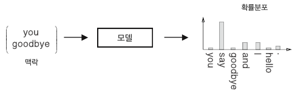
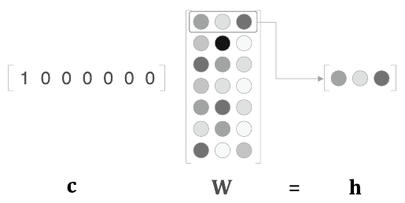

# Chapter3 : WORD2VEC

추론 기반 기법을 알아보자.


## 3.1 추론 기반 기법과 신경망

word2vec의 전처리를 위해 신경망으로 '단어'를 처리하는 예를 알아보자.


### 3.1.1 통계 기반 기법의 문제점

통계 기반 기법에서는 주변 단어의 빈도를 기초로 단어를 표현했다. 그러나 이 방식은 대규모 말뭉치를 다룰 때 문제가 발생한다.

통계 기반 기법은 말뭉치 전체의 통계(동시발생 행렬과 PPMI 등)를 이용해 단 1회의 처리(SVD 등) 만에 단어의 분산 표현을 얻는다.

추론 기반 기법 중, 신경망을 이용하는 경우에는 미니배치로 학습하는 것이 일반적이다. 미니배치 학습에서는 신경망이 한번에 소량의 학습 샘플씩 반복해서 학습하며 가중치를 갱신해간다.

ㅡ> 데이터를 작게 나눠 학습하기 때문에 말뭉치의 어휘 수가 많아 SVD 등 계산량이 큰 작업을 처리하기 어려운 경우에도 신경망을 학습시킬 수 있다는 뜻이다.


### 3.1.2 추론 기반 기법 개요

추론이란 주변 단어(맥락)가 주어졌을 때 해당 자리에 무슨 단어가 들어가는지를 추측하는 작업입니다.

 

추론 문제를 풀고 학습하는 것이 '추론 기반 기법'이 다루는 문제이다. 이러한 추론 문제를 반복해서 풀면서 단어의 출현 패턴을 학습하는 것이다.

'모델 관점'에서 보면 맥락을 입력하면 모델은 각 단어의 출현 확률을 출력한다.

 

학습의 결과로 단어의 분산 표현을 얻는 것이 추론 기반 기법이다.


### 3.1.3 신경망에서의 단어 처리

단어를 처리할 때는 "고정 길이의 벡터"로 변환해야 하므로 one-hot 벡터로 변환한다.

단어를 고정 길이 벡터로 변환하면 신경망의 입력층은 뉴런의 수를 고정할 수 있다.


원핫 표현으로 된 단어 하나를 완전연결계층을 통해 변환하는 모습

          

신경망은 완전연결계층이므로 각각의 노드가 이웃 층의 모든 노드와 화살표로 연결되어 있다. 

```python
import numpy as np

c = np.array([[1, 0, 0, 0, 0, 0, 0]]) # 입력
W = np.random.randn(7,3) # 가중치
h = np.matmul(c,W) # 중간 노드
print(h)
```

이 코드는 단어 ID가 0인 단어를 원핫 표현으로 표현한 다음 완전연결계층을 통과시켜 변환하는 모습을 보여준다.

하지만 c는 원핫표현이므로 c와 W의 행렬 곱은 결국 가중치의 행 벡터 하나를 뽑아낸 것과 같다.

 

```python
# MatMul 계층을 import 하고 MatMul 계층에 가중치 W를 설정하고 forward() 메서드를 호출해 순전파를 수행한다.
import numpy as np
from common.layers import MatMul

c = np.array([[1, 0, 0, 0, 0, 0, 0]])
W = np.random.randn(7, 3)
layer = MatMul(W)
h = layer.forward(c)
print(h)
```


## 3.2 단순한 word2vec

word2vec에서 제안하는 CBOW (continuous bag-of-words) 모델을 알아보자.


### 3.2.1 CBOW 모델의 추론 처리

CBOW 모델은 맥락으로부터 target을 추측하는 용도의 신경망이다.

input은 원핫 표현으로 변환된 맥락(주변 단어들)이다.  

 

맥락으로 고려할 단어가 2개이기 때문에 입력층이 2개이다.

은닉층의 뉴런은 입력층의 완전연결계층에 의해 변환된 값이 되는데, 입력층이 여러 개이면 전체를 '평균'한다.

출력층의 뉴런은 각 단어의 '점수'를 뜻하며, 값이 높을수록 단어의 출현 '확률'도 높아진다. 점수에 소프트맥스 함수를 적용하여 '확률'을 얻는다.

입력층과 은닉층 사이의 가중치 W_in 이 바로 단어의 분산 표현이다.

학습을 진행할수록 맥락에서 출현하는 단어를 잘 추측하는 방향으로 이 분산 표현들이 갱신될 것이다. 이렇게 해서 얻은 벡터에는 '단어의 의미'도 잘 녹아들어 있다.


은닉층의 뉴런 수를 입력층의 뉴런 수보다 적게하는 것도 중요한 핵심이다. 이렇게 해야 은닉층에는 단어 예측에 필요한 정보를 '간결하게' 담게 되며, 결과적으로 밀집벡터 표현을 얻을 수 있다.

 

CBOW 모델의 추론 처리를 구현해보자

```python
import numpy as np
from common.layers import MatMul

# 샘플 맥락 데이터
c0 = np.array([[1, 0, 0, 0, 0, 0, 0]])
c1 = np.array([[0, 0, 1, 0, 0, 0, 0]])

# 가중치 초기화
W_in = np.random.randn(7, 3)
W_out = np.random.randn(3, 7)

# 입력층을 처리하는 MatMul 계층 생성 (맥락 수만큼 생성, W_in 공유)
in_layer0 = MatMul(W_in)
in_layer1 = MatMul(W_in)
# 출력층을 처리하는 MatMul 계층 생성 (1개 생성)
out_layer = MatMul(W_out)

# 순전파
h0 = in_layer0.forward(c0)
h1 = in_layer1.forward(c1)
h = 0.5 * (h0 + h1)
s = out_layer.forward(h) # 점수를 구한다.
print(s) 
```


### 3.2.2 CBOW 모델의 학습

출력층에서 나오는 각 단어의 점수에 소프트맥스 함수를 적용하면 '확률'을 얻을 수 있다. '확률'은 맥락이 주어졌을 때 그 중앙에 어떤 단어가 출현하는지를 나타낸다.

CBOW 모델의 학습에서는 올바른 예측을 할 수 있도록 가중치를 조정하는 일을 하며, 그 결과로 가중치들에 단어의 출현 패턴을 파악한 벡터가 학습된다.

 


### 3.2.3 word2vec의 가중치와 분산 표현

가중치 W_in 의 각 행이 각 단어의 분산 표현에 해당한다.

가중치 W_out에는 단어의 의미가 인코딩된 벡터가 저장되고 있다. 다만 W_out은 각 단어의 분산 표현이 열 방향(수직 방향)으로 저장된다.

 

단어의 분산 표현으로 어느 쪽 가중치를 선택하면 좋을까?

1. 입력 측의 가중치만 이용한다.
2. 출력 측의 가중치만 이용한다.
3. 양쪽 가중치를 모두 이용한다.


word2vec 에서는 "1. 입력 측의 가중치만 이용한다." 가 가장 대중적인 선택이다. 


## 3.3 학습 데이터 준비

"You say goodbye and I say hello." 라는 한 문장짜리 말뭉치를 이용하여 word2vec 학습에 쓰일 학습 데이터를 준비해보자


### 3.3.1 맥락과 타깃

말뭉치로부터 목표로 하는 단어를 '타깃'으로, 그 주변 단어를 '맥락'으로 뽑아낸다.

 

맥락이 input 이고, 타깃이 output이 된다.


말뭉치로부터 맥락과 타깃을 만드는 함수를 구현하려면 우선 말뭉치 텍스트를 단어 ID로 변환해야 한다. 2장에서 구현한 preprocess() 함수를 사용한다.

```python
from common.util import preprocess
text = "You say goodbye and I say hello."
corpus, word_to_id, id_to_word = preprocess(text)
print(corpus) # [0, 1, 2, 3, 4, 1, 5, 6]
print(id_to_word) # { 0: 'you', 1: 'say', 2: 'goodbye', 3: 'and', 4: 'i', 5: 'hello', 6: '.'}
```

이제 단어 ID의 배열인 corpus로부터 맥락과 타깃을 만들어낸다.

맥락의 윈도우 크기는 1로 진행했다.

 

```python
# 맥락과 타깃 생성
def create_contexts_target(corpus, window_size=1):
    # corpus: 말뭉치(단어 ID 목록)
    # window_size: 윈도우 크기(윈도우 크기가 1이면 타깃 단어 좌우 한 단어씩이 맥락에 포함)
    target = corpus[window_size:-window_size]
    contexts = []

    for idx in range(window_size, len(corpus)-window_size):
        cs = []
        for t in range(-window_size, window_size + 1):
            if t == 0:
                continue
            cs.append(corpus[idx + t])
        contexts.append(cs)

    return np.array(contexts), np.array(target)

contexts, target = create_contexts_target(corpus, window_size=1)

print(contexts) # [[0, 2], [1, 3], [2, 4], [3, 1], [4, 5], [1, 6]]
print(target) # [1, 2, 3, 4, 1, 5]
```


### 3.3.2 원핫 표현으로 변환

아직 맥락과 타깃의 각 원소가 단어 ID이다. 이를 원핫 표현으로 변환해야 한다.

 

단어 ID를 이용했을 때의 맥락의 형상은 (6 ,2) 인데, 이를 원핫 표현으로 변환하면 ( 6, 2, 7)이 된다.

원핫 표현으로의 변환 : convert_one_hot()

```python
# 원핫 표현으로 변환
def convert_one_hot(corpus, vocab_size):
    # corpus: 단어 ID 목록(1차원 또는 2차원 넘파이 배열)
    # vocab_size: 어휘 수
    N = corpus.shape[0]

    if corpus.ndim == 1:
        one_hot = np.zeros((N, vocab_size), dtype=np.int32)
        for idx, word_id in enumerate(corpus):
            one_hot[idx, word_id] = 1

    elif corpus.ndim == 2:
        C = corpus.shape[1]
        one_hot = np.zeros((N, C, vocab_size), dtype=np.int32)
        for idx_0, word_ids in enumerate(corpus):
            for idx_1, word_id in enumerate(word_ids):
                one_hot[idx_0, idx_1, word_id] = 1

    return one_hot  # 원핫 표현(2차원 또는 3차원 넘파이 배열)
```


지금까지의 학습 데이터 준비 과정

```python
from common.util import preprocess
text = "You say goodbye and I say hello."
corpus, word_to_id, id_to_word = preprocess(text)
print(corpus) # [0, 1, 2, 3, 4, 1, 5, 6]
print(id_to_word) # { 0: 'you', 1: 'say', 2: 'goodbye', 3: 'and', 4: 'i', 5: 'hello', 6: '.'}

contexts, target = create_contexts_target(corpus, window_size=1)
print(contexts) # [[0, 2], [1, 3], [2, 4], [3, 1], [4, 5], [1, 6]]
print(target) # [1, 2, 3, 4, 1, 5]

vocab_size = len(word_to_id)
target = convert_ont_hot(target, vocab_size)
contexts = convert_ont_hot(contexts, vocab_size)
```


## 3.4 CBOW 모델 구현

CBOW 모델의 신경망 구성:

 


SimpleCBOW 클래스의 초기화 메서드

```python
import numpy as np
from common.layers import MatMul, SoftmaxWithLoss

class SimpleCBOW:
    def __init__(self, vocab_size, hidden_size):
        # vocab_size : 어휘 수
        # hidden_size : 은닉층의 뉴런 수
        V, H = vocab_size, hidden_size

        # 가중치 초기화 : 가중치 2개 생성
        W_in = 0.01 * np.random.randn(V, H).astype('f')
        W_out = 0.01 * np.random.randn(H, V).astype('f')

        # 계층 생성
        self.in_layer0 = MatMul(W_in) # 입력: MatMul 계층 2개 ( 맥락에서 사용하는 단어들의 수 (윈도우 크기) 만큼 만들어야 한다.)
        self.in_layer1 = MatMul(W_in) 
        self.out_layer = MatMul(W_out) # 출력: MatMul 계층 1개
        self.loss_layer = SoftmaxWithLoss() # Softmax with Loss 계층 1개

        # 모든 가중치와 기울기를 리스트에 모은다.
        layers = [self.in_layer0, self.in_layer1, self.out_layer]
        self.params, self.grads = [], []
        for layer in layers:
            self.params += layer.params # [W]
            self.grads += layer.grads # [np.zeros_like(W)]

        # 인스턴스 변수에 단어의 분산 표현을 저장한다.
        self.word_vecs = W_in
```


신경망의 순전파인 forward() 메서드

```python
    def forward(self, contexts, target):
        # contexts : 맥락, target : 타깃
        h0 = self.in_layer0.forward(contexts[:, 0])
        h1 = self.in_layer1.forward(contexts[:, 1])
        h = (h0 + h1) * 0.5
        score = self.out_layer.forward(h)
        loss = self.loss_layer.forward(score, target)
        return loss # 손실을 반환
```


신경망의 역전파 backward() 메서드

 

'x'의 역전파는 순전파 시의 입력을 '서로 바꿔' 기울기에 곱한다.

'+'의 역전파는 기울기를 '그대로 통과' 시킨다.

```python
    def backward(self, dout=1):
        ds = self.loss_layer.backward(dout)
        da = self.out_layer.backward(ds)
        da *= 0.5
        self.in_layer1.backward(da)
        self.in_layer0.backward(da)
        return None
```


이미 각 매개변수의 기울기를 인스턴스 변수 grads에 모아뒀기 때문에 forward() 메서드를 호출한 다음 backward() 메서드를 실행하면 grads 리스트의 기울기가 갱신된다.


### 3.4.1 학습 코드 구현

CBOW 모델의 학습은 일반적인 신경망의 학습과 같다.

```python
from common.trainer import Trainer
from common.optimizer import Adam
from simple_cbow import SimpleCBOW
from common.util import preprocess, create_contexts_target, convert_one_hot

window_size = 1
hidden_size = 5
batch_size = 3
max_epoch = 1000

text = 'You say goodbye and I say hello.'
corpus, word_to_id, id_to_word = preprocess(text)

vocab_size = len(word_to_id)
contexts, target = create_contexts_target(corpus, window_size)
target = convert_one_hot(target, vocab_size)
contexts = convert_one_hot(contexts, vocab_size)

model = SimpleCBOW(vocab_size, hidden_size)
optimizer = Adam() # optimizer는 Adam을 선택
trainer = Trainer(model, optimizer)

trainer.fit(contexts, target, max_epoch, batch_size) # 학습 데이터로부터 미니배치를 선택한 다음, 신경망에 입력해 기울기를 구하고, 그 기울기를 Optimizer에 넘겨 매개변수를 갱신하는 일련의 작업을 수행
trainer.plot()

word_vecs = model.word_vecs
for word_id, word in id_to_word.items():
    print(word, word_vecs[word_id])
```


학습이 끝난 후의 입력 측 가중치 매개변수를 살펴보자.

```python
word_vecs = model.word_vecs
for word_id, word in id_to_word.items():
    print(word, word_vecs[word_id])
```

word_vecs 의 각 행에는 대응하는 단어 ID의 분산 표현이 저장돼있다.


드디어 단어를 밀집벡터로 나타낼 수 있게 되었다. 

이 밀집벡터가 바로 단어의 분산 표현이다.

학습이 잘 이뤄졌으니 이 분산 표현은 '단어의 의미를' 잘 파악한 벡터표현으로 되어있을거라 기대할 수 있다.


## 3.5 word2vec

CBOW 모델을 '확률'관점에서 다시 살펴보자.


P(A) : A라는 현상이 일어날 확률

P(A, B) : A와 B가 동시에 일어날 확률

P(A|B) : 사건이 일어난 후의 확률(사후 확률). B(라는 정보)가 주어졌을 때 A가 일어날 확률 이라고도 해석 가능


CBOW 모델을 확률 표기법으로 기술해보자. CBOW 모델이 하는 일은 맥락을 주면 타깃 단어가 출현할 확률을 출력하는 것이다.

말뭉치를 w1, w2, ... w_t 처럼 단어 시퀀스로 표기하고, 윈도우 크기가 1인 맥락을 고려해보자

 

맥락 w_t-1 과 w_t+1 이 주어졌을 때 타깃이 w_t가 될 확률은 사후 확률을 사용한다.

 

식은 " w_t-1 과 w_t+1이 주어졌을 때 w_t가 일어날 확률 " 로 해석할 수 있으며 CBOW는 이 식을 모델링하고 있는 것이다.

이 식을 이용하면 CBOW 모델의 손실 함수도 간결히 표현할 수 있다.

교차 엔트로피 오차의 식은 

 이며, 

y_k : k번째에 해당하는 사건이 일어날 확률

t_k : 정답 레이블 ( 원핫 벡터 )

여기서 문제의 정답은 " w_t가 발생 " 이므로 w_t에 해당하는 원소만 1이고 나머지는 0이 된다. 이 점을 감안하면 다음 식을 유도할 수 있다.

 

CBOW 모델의 손실함수는 단순히 CBOW가 모델링하고 있는 식(확률)에 log를 취한 다음 마이너스를 붙이면 된다. ( 음의 로그 가능도(negative log likelihood) 라고 한다. )

이것은 샘플 데이터 하나짜리의 손실 함수이며, 식을 말뭉치 전체로 확장하면 다음 식이 된다.

 


### 3.5.2 skip-gram 모델

skip-gram은 CBOW에서 다루는 맥락과 타깃을 바꾼 모델이다.

중앙의 단어(타깃)로부터 주변의 여러 단어(맥락)를 추측한다.

 

 

입력층은 하나이며, 출력층은 맥락의 수만큼 존재한다.

각 출력층에서는 개별적으로 손실을 구하고, 이 개별 손실들을 모두 더한 값을 최종 손실로 한다.

skip-gram 모델의 확률표기 :  ㅡ> "w_t가 주어졌을 때 w_t-1 과 w_t+1이 동시에 일어날 확률" 을 뜻한다. 


여기서 skip-gram 모델에서는 맥락의 단어들 사이에 관련성이 없다고 가정하고 다음과 같이 분해한다 ("조건부 독립"이라고 가정한다.)

 

이 식을 교차 엔트로피 오차에 적용하여 skip-gram 모델의 손실 함수를 유도할 수 있다.

 

유도과정에서 알 수 있듯, skip-gram 모델의 손실함수는 맥락별 손실을 구한 다음 모두 더한다.

이것은 샘플 데이터 하나짜리 손실함수이며 말뭉치 전체로 확장하면 다음 식이 된다.

 


skip-gram 모델은 맥락의 수만큼 추측하기 때문에 그 손실 함수는 각 맥락에서 구한 손실의 총합이어야 한다.

CBOW 모델은 타깃 하나의 손실을 구한다.


CBOW 말고 skip-gram을 사용하는 이유:

- 단어 분산 표현의 정밀도 면에서 skip-gram의 결과가 더 좋은 경우가 많다.
  - skip-gram 모델은 하나의 단어로부터 그 주변 단어들을 예측하기 때문에 '더 어려운' 문제에 도전한다고 할 수있다. 그래서 단어의 분산 표현이 더 뛰어날 가능성이 커지는 것이다.
- 말뭉치가 커질수록 저빈도 단어나 유추 문제의 성능 면에서 skip-gram 모델이 더 뛰어난 경향이 있다.
- 하지만 학습 속도 면에서는 CBOW 모델이 더 빠르다. skip-gram 모델은 소닛ㄹ을 맥락의 수만큼 구해야 되기 때문에 계산 비용이 크다.


### 3.5.3 통계 기반 VS 추론 기반

- 통계 기반 기법
  - 말뭉치의 전체 통계로부터 1회 학습하여 단어의 분산 표현을 얻는다.
  - 어휘에 추가할 새 단어가 생겨서 단어의 분산 표현을 갱신해야할 때:
    - 통계 기반 기법은 계산을 처음부터 다시해야한다. ( 동시발생 행렬을 다시 만들고, SVD를 수행하는 일련의 작업)
  - 분산 표현의 성격:
    - 통계 기반 기법에서는 주로 단어의 유사성이 인코딩 된다.
- 추론 기반 기법
  - 말뭉치를 일부분씩 여러 번 보면서 학습한다. (미니배치 학습)
  - 어휘에 추가할 새 단어가 생겨서 단어의 분산 표현을 갱신해야할 때:
    - 추론 기반 기법은 지금까지 학습한 가중치를 이어서 학습하면 된다. ( 기존에 학습한 경험을 해치지 않으면서 단어의 분산 표현을 효율적으로 갱신할 수 있다.)
  - 분산 표현의 성격:
    - 추론 기반 기법에서는 단어의 유사성은 물론, 한층 복잡한 단어 사이의 패턴까지도 파악하여 인코딩 된다.
      - word2vec은 " king - man + woman = queen "과 같은 유추 문제를 풀 수 있다.


실제로 단어의 유사성을 정량 평가해본 결과, 의외로 통계 기반 기법과 추론 기반 기법의 우열을 가릴 수가 없었다. (단어의 유사성 관련 작업의 경우 정확성은 하이퍼파라미터에 크게 의존하며, 두 기법의 우열을 명확히 가릴 수 없다.)


또 추론 기반 기법과 통계 기반 기법은 특정 조건 하에서 서로 관련되어 있다.

- skip-gram과 네거티브 샘플링을 이용한 모델은 모두 말뭉치 전체의 동시발생 행렬에 특수한 행렬 분해를 적용한 것과 같다.


word2vec 이후 추론 기반 기법과 통계 기반 기법을 융합한 GloVe 기법이 등장했다. GloVe의 기본 아이디어는 말뭉치 전체의 통계 정보를 손실 함수에 도입해 미니배치 학습을 하는 것이다. 이로써 두 세계를 명시적으로 융합하는데 성공했다.


## 3.6 정리

- 추론 기반 기법은 추측하는 것이 목적으며, 그 과정에서 단어의 분산 표현을 얻을 수 있다.

- word2vec은 추론 기반 기법이며, 단순한 2층 신경망이다.

- word2vec은 CBOW 모델과 skip-gram 모델이 있다.

  - CBOW모델은 여러 단어(맥락)로부터 하나의 단어(타깃)를 추측한다.
  - skip-gram 모델은 하나의 단어(타깃)로부터 다수의 단어(맥락)를 추측한다.

- word2vec은 가중치를 다시 학습할 수 있으므로, 단어의 분산 표현 갱신이나 새로운 단어 추가를 효율적으로 수행할 수 있다.

  

