# CHAPTER4 : WORD2VEC 속도 개선

CBOW 모델은 단순 2층 신경망이라서 간단하게 구현할 수 있었으나 말뭉치에 포함된 어휘 수가 많아지면 계산량도 커진다는 문제가 있었다.

word2vec의 속도 개선을 알아보자.

첫 번째 개선 : `Embedding 계층`을 도입한다.

두 번째 개선 : `네거티브 샘플링` 손실 함수를 도입한다.


## 4.1 word2vec 개선_1

앞 장의 CBOW 모델은 단어 2개를 맥락으로 사용해, 하나의 단어(타깃)를 추측한다.


입력 측 가중치(W_in)와의 행렬 곱으로 은닉층이 계산되고, 다시 출력 측 가중치(W_out)와의 행렬 곱으로 각 단어의 점수를 구한다. 이 점수에 소프트맥스 함수를 적용해 각 단어의 출현 확률을 얻고, 이 확률을 정답 레이블과 비교(교차 엔트로피 오차를 적용)하여 손실을 구한다.

하지만 어휘가 많을 때는 뉴런의 갯수가 많아져 중간 계산에 많은 시간이 소요되어서 병목 현상이 일어난다. 문제가 되는 계산은 다음과 같다.

- 입력 층의 원핫 표현과 가중치 행렬 W_in의 곱 계산
  - 입력층의 원핫 표현과 관련한 문제이다. 어휘 수가 많아지면 원핫 표현의 벡터 크기도 커지는 것이다. 상당한 메모리를 차지한다. 
- 은닉층과 가중치 행렬 W_out의 곱 및 Softmax 계층의 계산
  - 은닉층 이후의 계산에 관련된 문제이다. 은닉층과 가중치 행렬 W_out의 곱만 해도 계산량이 크다. Softmax 계층에서도 다루는 어휘가 많아짐에 따라 계산량이 증가한다.


### 4.1.1 Embedding 계층

가중치 매개변수로부터 '단어 ID에 해당하는 행(벡터)'을 추출하는 계층(`Embedding 계층`)을 만들어보자. Embedding 계층에 단어 임베딩(분산 표현)을 저장하는 것이다.


### 4.1.2 Embedding 계층 구현

행렬에서 특정 행을 추출하기란 아주 쉽다. 가중치 W가 2차원 넘파이 배열일 때, 이 가중치로부터 특정 행을 추출하려면 그저 W[2]나 W[5]처럼 원하는 행을 명시하면 끝이다.

```python
import numpy as np
W = np.arange(21).reshape(7, 3)
W

W[2] # [6, 7, 8]
W[5] # [15, 16, 17]
```

가중치 W로부터 여러 행을 추출하는 일도 간단하다. 원하는 행번호들을 배열에 명시하면 된다.

```python
idx = np.array([1, 0, 3, 0]) # 인덱스 4개 추출
W[idx]
# array([[3, 4, 5],[0, 1, 2], [9, 10, 11], [0, 1, 2]])
```

인수에 배열을 사용하면 여러 행을 한꺼번에 출력 가능하다.


Embedding 계층의 forward() 메서드 구현

```python
class Embedding:
    def __init__(self, W):
        self.params = [W]
        self.grads = [np.zeros_like(W)]
        self.idex = None
        
    def forward(self, idx):
        W, = self.params
        self.idx = idx
        out = W[idx]
        return out
```

인스턴스 변수 params와 grads를 사용한다. 또한 인스턴스 변수 idx에는 추출하는 행의 인덱스(단어 ID)를 배열로 저장한다.


Embedding 계층의 순전파는 가중치 W의 특정 행을 추출할 뿐이다. 따라서 역전파(backward)에서는 앞 층(출력 측 층)으로부터 전해진 기울기를 다음 층(입력 측 층)으로 그대로 흘려주면 된다. 다만, 앞 층으로부터 전해진 기울기를 가중치 기울기 dW의 특정 행(idx번째 행)에 설정한다. 

```python
def backward(self, dout):
    dW, self.grads
    dW[...] = 0
    dW[self.idx] = dout
    return None
```

가중치 기울기 dW를 꺼낸 다음, dW[...] = 0 코드에서 dW의 원소를 0으로 덮어쓴다. ( dW의 형상을 유지한 채, 그 원소들을 0으로 덮어씀 ). 이후 앞 층에서 전해진 기울기 dout을 idx번째 행에 할당한다.

이 구현에서는 idx의 원소가 중복되면 문제가 생긴다. 먼저 쓰여진 값을 덮어쓰게 되는 경우가 생기므로 **'할당'이 아닌 '더하기'를 해야한다.** 즉 dh의 각 행의 값을 dW의 해당 행에 더해준다.

```python
def backward(self, dout):
    dW, = self.grads
    dW[...] = 0
    for i, word_id in enumerate(self.idx):
        dW[word_id] += dout[i]
    # np.add.at(dW, self.idx, dout) 도 가능하다.
    # np.add.at(A, idx, B)는 B를 A의 idx번째 행에 더해준다.
    return None
```

for문을 사용해 해당 인덱스에 기울기를 더했다. 이것으로 idx에 중복 인덱스가 있더라도 올바르게 처리된다. 

word2vec (CBOW 모델)의 입력 측 MatMul 계층을 Embedding 계층으로 전환하였다. 메모리 사용량을 줄이고 쓸데없는 계산을 생략했다.


## 4.2 word2vec 개선_2

은닉층 이후의 처리 (행렬 곱과 Softmax 계층의 계산)를 네거티브 샘플링(부정적 샘플링) 기법을 사용해서 개선해보자. Softmax 대신 네거티브 샘플링을 이용하면 어휘가 아무리 많아져도 계산량을 낮은 수준에서 일정하게 억제할 수 있다.


### 4.2.1 은닉층 이후 계산의 문제점

어휘가 100만 개, 은닉층 뉴런이 100개일 때의 word2vec (CBOW모델)을 예로 생각해보자. 

ㅡ you 와 goodbye 사이의 say를 예측해보자. ㅡ

입력층과 출력층에 뉴런이 각 100만 개씩 존재한다.

- 은닉층 이후에 계산이 오래걸리는 곳
  - 은닉층의 뉴런과 가중치 행렬(W_out)의 곱
  - Softmax 계층의 계산

둘 다 어휘가 많아지면 행렬이 커져서 계산량이 증가한다.


k번째 원소(단어)를 타깃으로 했을 때의 Softmax 계산식이다. 

분모의 값을 얻으려면 exp 계산을 100만 번 수행해야 한다.

 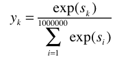


### 4.2.2 다중 분류에서 이진 분류로

네거티브 샘플링 기법: 이 기법의 핵심 아이디어는 '다중분류'를 '이진분류'로 근사하는 것이다.


어떤 단어인지를 분류하는 것이 아닌 "맥락이 you와 goodbye일 때, 타깃 단어는 'say'입니까?라는 질문에 yes/no에 대해 답하는 신경망을 생각해내야 한다.

 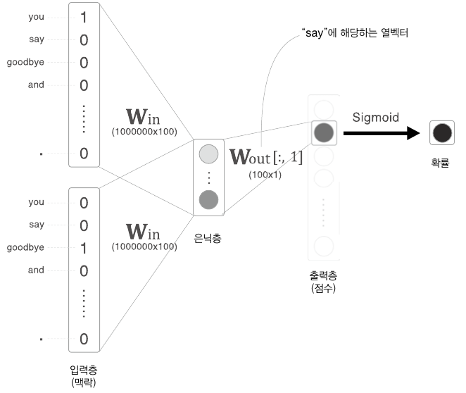

출력층은 뉴런 하나 뿐이다. 따라서 은닉층과 출력 측의 가중치 행렬의 내적은 'say'에 해당하는 열(단어 벡터)만을 추출하고, 그 추출된 벡터와 은닉층 뉴런과의 내적을 계산하면 끝이다.

 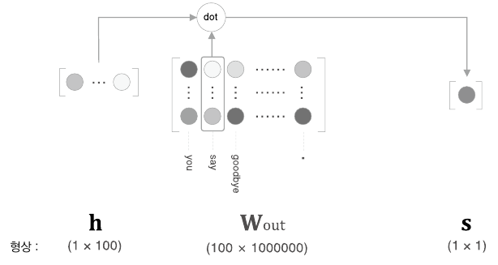

출력 측의 가중치 W_out에서는 각 단어 ID의 단어 벡터가 각각의 열로 저장되어 있다.  "say"에 해당하는 단어 벡터와 은닉층 뉴런과의 내적이 최종 점수이다.


### 4.2.3 시그모이드 함수와 교차 엔트로피 오차

시그모이드 함수를 적용해 확률 y를 얻으면, 이 확률 y로부터 손실을 구한다. 사용되는 손실 함수는 '교차 엔트로피 오차'이다. 

 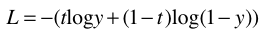

Sigmoid 계층과 Cross Entropy Error 계층의 계산 그래프를 살펴보자.

 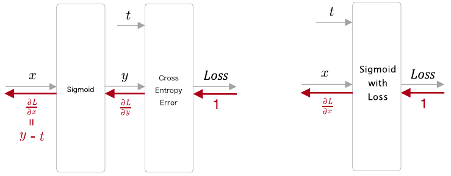

역전파의 값은 y-t 이다.

 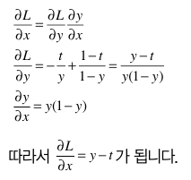


### 4.2.4 다중 분류에서 이진 분류로 (구현)

신경망을 '계층'과 '연산' 중심으로 그려보자.  ( 다중 분류 )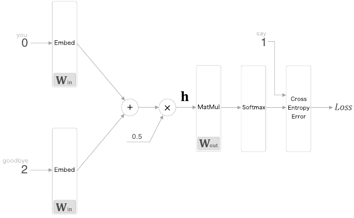

입력층에서는 각각에 대응하는 단어 ID의 분산 표현을 추출하기 위해 Embedding 계층을 사용했다.


이진 분류 신경망으로 변환해보자.

 

은닉층 뉴런 h와, 출력 측의 가중치 W_out에서 단어 "say"에 해당하는 단어 벡터와의 내적을 계산한다. 그리고 그 출력을 Sigmoid with Loss 계층에 입력해 최종 손실을 얻습니다.


후반부 계산을 단순하게 만들기 위해 Embedding Dot 계층을 도입한다

 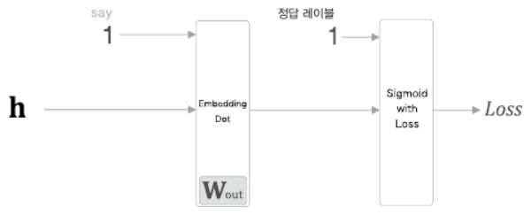

은닉층 뉴런 h는 Embedding Dot 계층을 거쳐 Sigmoid with Loss 계층을 통과한다.

```python
class EmbeddingDot:
    def __init__(self, W):
        self.embed = Embedding(W) # Embedding 계층
        self.params = self.embed.params # 매개변수
        self.grads = self.embed.grads # 기울기
        self.cache = None # 순전파 시의 계산 결과 temp

    def forward(self, h, idx): # h: 은닉층 뉴런, idx: 단어ID의 넘파이 배열(미니배치)
        target_W = self.embed.forward(idx)
        out = np.sum(target_W * h, axis=1) # 내적 계산

        self.cache = (h, target_W)
        return out

    def backward(self, dout):
        h, target_W = self.cache
        dout = dout.reshape(dout.shape[0], 1)

        dtarget_W = dout * h
        self.embed.backward(dtarget_W)
        dh = dout * target_W
        return dh
```


 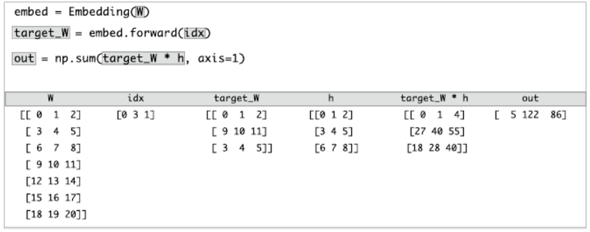

적당한 W, h, idx를 준비한다.  idx = [0,3,1]. 3개의 데이터를 미니배치로 처리. target_W는 0번, 3번, 1번째의 행을 추출한 결과이다. target_W * h는 각 원소의 곱(넘파이배열의 *연산)을 계산한다. 이 결과를 행마다 전부 더해 최종 결과 out을 얻는다.


### 4.2.5 네거티브 샘플링

'다중 분류'를 '이진 분류'로 변환했지만 부정적인 예(오답)를 입력하는 경우 어떠한 지식도 획득하지 못하는 상황이다. 부정적인 예에 대해서는 Sigmoid 계층의 출력을 0에 가깝게 만드는 가중치가 필요하다. 모든 부정적 예를 대상으로 하는 방법은 어휘 수가 늘어나면 감당할 수 없기 때문에 근사적인 해법으로 적은 수의 부정적 예를 샘플링해 사용합니다. (네거티브 샘플링 기법)


네거티브 샘플링 기법 : 긍정적 예를 타깃으로 한 경우의 손실을 구한다. 부정적 예를 몇 개 샘플링하여 그 부정적 예에 대해서도 마찬가지로 손실을 구한다. 그리고 각각의 데이터의 손실을 더한 값을 최종 손실로 한다. 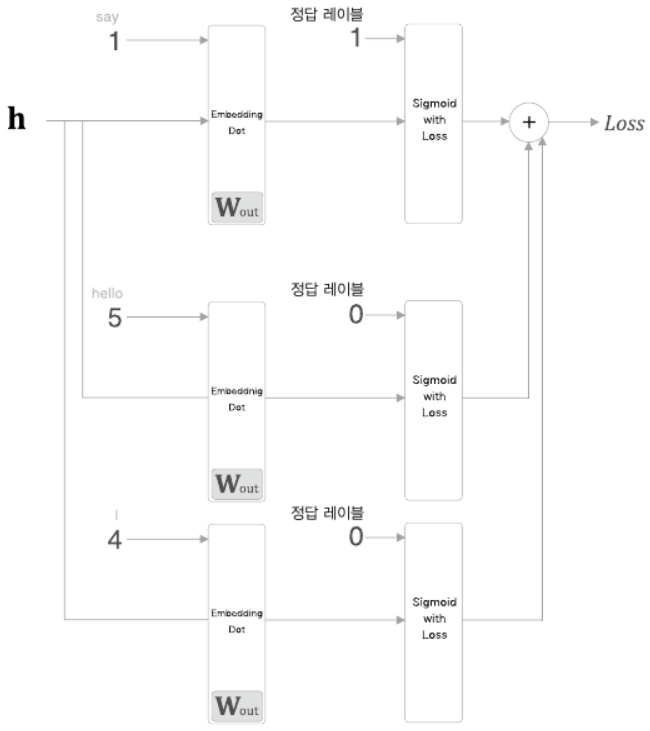

각 데이터의 손실을 모두 더해 최종 손실을 출력한다.


### 4.2.6 네거티브 샘플링의 샘플링 기법

랜덤 샘플링 대신에 말뭉치의 통계 데이터를 기초로 샘플링한다. 말뭉치의 단어 빈도를 기준으로 샘플링 하려면, 먼저 말뭉치에서 각 단어의 출현 횟수를 구해 '확률분포'로 나타내야 한다. 확률분포대로 샘플링하므로 희소한 단어는 선택되기가 어렵다. ( 흔한 단어를 잘 처리하는 편이 좋은 결과로 이어진다. )

```python
import numpy as np
words = ['you', 'say', 'goodbye', 'I', 'hello', '.']
np.random.choice(words) # 한개의 단어가 선택됨
np.random.choice(words, size=5) # 5개 무작위 샘플링(중복 가능)
np.random.choice(words, size=5, replace=False) # 5개 무작위 샘플링(중복 불가)

p = [0.5, 0.1, 0.05, 0.2, 0.05, 0.1]
np.random.choice(words, p=p) # 확률분포에 따라 샘플링
```


word2vec의 네거티브 샘플링에서는 기본 확률분포에 0.75를 제곱하라고 권고한다.

 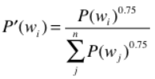

P(w_i)는 i번째 단어의 확률을 뜻한다. 이렇게 0~1의 값만큼 제곱을 해주면 출현 확률이 낮은 단어를 버리지 않게 된다. 원래 확률이 낮은 단어의 확률을 살짝 높이게 된다.

```python
p = [0.7, 0.29, 0.01]
new_p = np.power(p, 0.75)
new_p /= np.sum(new_p)
print(new_p) # [0.64196878 0.33150408 0.02652714]
```


Unigram: 하나의 (연속된) 단어 

UnigramSampler : 한 단어를 대상으로 확률분포를 만든다.

```python
corpus = np.array([0, 1, 2, 3, 4, 1, 2, 3])
power = 0.75
sample_size = 2

sampler = UnigramSampler(corpus, power, sample_size) # 단어ID목록, 제곱할값, 샘플링수행횟수
target = np.array([1, 3, 0])
negative_sample = sampler.get_negative_sample(target) # target인수로 지정한 단어를 긍정적 예로 해석하고 그 외의 단어ID를 샘플링(부정적 예를 골라준다)
print(negative_sample)
# [[0, 3], [1, 2], [2, 3]]
```

[1, 3, 0]의 부정적 샘플 2개는 각각 [0 3], [1 2], [2 3]가 나왔다.


### 4.2.7 네거티브 샘플링 구현

NegativeSamplingLoss라는 클래스로 구현해보자.

```python
class NegativeSamplingLoss: # W: 출력측 가중치, corpus: 말뭉치(단어ID의 리스트), power: 확률분포에 제곱할 값
    def __init__(self, W, corpus, power=0.75, sample_size=5):
        self.sample_size = sample_size # sample_size: 부정적 샘플링 횟수
        self.sampler = UnigramSampler(corpus, power, sample_size)
        # 아래의 두 리스트는 sample_size + 1개의 계층을 생성함. (부정적 예를 다루는 계층의 갯수(sample_size) + 긍정적 예를 다루는 계층(1))
        # 0번째 계층( loss_layers[0], embed_dot_layers[0] )이 긍정적 예를 다루는 계층이다.
        self.loss_layers = [SigmoidWithLoss() for _ in range(sample_size + 1)]
        self.embed_dot_layers = [EmbeddingDot(W) for _ in range(sample_size + 1)]

        self.params, self.grads = [], []
        for layer in self.embed_dot_layers:
            self.params += layer.params
            self.grads += layer.grads
```


순전파의 구현

```python
    def forward(self, h, target): # h: 은닉층 뉴런, target: 긍정적 예의 타깃
        batch_size = target.shape[0]
        negative_sample = self.sampler.get_negative_sample(target) # 부정적 예를 샘플링하여 저장

        # 긍정적 예 순전파
        score = self.embed_dot_layers[0].forward(h, target)
        correct_label = np.ones(batch_size, dtype=np.int32) # 긍정적 예의 정답 레이블: 1
        loss = self.loss_layers[0].forward(score, correct_label)

        # 부정적 예 순전파
        negative_label = np.zeros(batch_size, dtype=np.int32) # 부정적 예의 정답 레이블: 0
        for i in range(self.sample_size):
            negative_target = negative_sample[:, i]
            score = self.embed_dot_layers[1 + i].forward(h, negative_target)
            loss += self.loss_layers[1 + i].forward(score, negative_label)

        return loss

```


역전파의 구현

```python
    def backward(self, dout=1): # 순전파 때의 역순으로 각 계층의 backward()를 호출
        dh = 0
        for l0, l1 in zip(self.loss_layers, self.embed_dot_layers):
            dscore = l0.backward(dout)
            dh += l1.backward(dscore)

        return dh
```


## 4.3 개선판 word2vec 학습


### 4.3.1 CBOW 모델 구현

개선점: Embedding 계층, Sampling Loss 계층 적용, 맥락의 윈도우 크기를 임의 조절 가능

```python
from common.layers import Embedding
from ch04.negative_sampling_layer import NegativeSamplingLoss


class CBOW:
    def __init__(self, vocab_size, hidden_size, window_size, corpus): # vocab_size: 어휘 수, hidden_size: 은닉층 뉴런 수, window_size: 맥락의 크기, corpus: 단어ID목록
        V, H = vocab_size, hidden_size

        # 가중치 초기화
        W_in = 0.01 * np.random.randn(V, H).astype('f')
        W_out = 0.01 * np.random.randn(V, H).astype('f')

        # 계층 생성
        self.in_layers = []
        for i in range(2 * window_size): # 2*window_size개 작성
            layer = Embedding(W_in)  # Embedding 계층 사용
            self.in_layers.append(layer)
        self.ns_loss = NegativeSamplingLoss(W_out, corpus, power=0.75, sample_size=5)

        # 모든 가중치와 기울기를 배열에 모은다.
        layers = self.in_layers + [self.ns_loss]
        self.params, self.grads = [], []
        for layer in layers:
            self.params += layer.params
            self.grads += layer.grads

        # 인스턴스 변수에 단어의 분산 표현을 저장한다.
        self.word_vecs = W_in
	
    # 순전파
    def forward(self, contexts, target): # 맥락과 타깃(단어ID)
        h = 0
        for i, layer in enumerate(self.in_layers):
            h += layer.forward(contexts[:, i])
        h *= 1 / len(self.in_layers)
        loss = self.ns_loss.forward(h, target)
        return loss
	# 역전파
    def backward(self, dout=1):
        dout = self.ns_loss.backward(dout)
        dout *= 1 / len(self.in_layers)
        for layer in self.in_layers:
            layer.backward(dout)
        return None
```

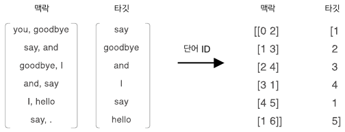

이러한 데이터가 forward(contexts, target)에 입력됨


### 4.3.2 CBOW 모델 학습 코드

```python
# coding: utf-8
import sys
sys.path.append('..')
import numpy as np
from common import config
import pickle
from common.trainer import Trainer
from common.optimizer import Adam
from cbow import CBOW
from skip_gram import SkipGram
from common.util import create_contexts_target, to_cpu, to_gpu
from dataset import ptb


# 하이퍼파라미터 설정
window_size = 5
hidden_size = 100
batch_size = 100
max_epoch = 10

# 데이터 읽기
corpus, word_to_id, id_to_word = ptb.load_data('train')
vocab_size = len(word_to_id)

contexts, target = create_contexts_target(corpus, window_size)
if config.GPU:
    contexts, target = to_gpu(contexts), to_gpu(target)

# 모델 등 생성
model = CBOW(vocab_size, hidden_size, window_size, corpus)
# model = SkipGram(vocab_size, hidden_size, window_size, corpus)
optimizer = Adam()
trainer = Trainer(model, optimizer)

# 학습 시작
trainer.fit(contexts, target, max_epoch, batch_size)
trainer.plot()

# 나중에 사용할 수 있도록 필요한 데이터 저장
word_vecs = model.word_vecs
if config.GPU:
    word_vecs = to_cpu(word_vecs)
params = {}
params['word_vecs'] = word_vecs.astype(np.float16)
params['word_to_id'] = word_to_id
params['id_to_word'] = id_to_word
pkl_file = 'cbow_params.pkl'  # or 'skipgram_params.pkl'
with open(pkl_file, 'wb') as f:
    pickle.dump(params, f, -1)
```

윈도우 크기 5, 은닉층 뉴런 수 100으로 설정하였다. 윈도우 크기는 2~10개, 은닉층의 뉴런 수는 50~500개가 좋은 결과를 가져온다.

학습이 끝나면 가중치를 꺼내서 나중에 이용할 수 있도록 파일에 보관한다. ( 입력 가중치만, 단어와 단어ID변환을 위해 사전도 함께 보관, 피클을 사용)


### 4.3.3 CBOW 모델 평가

```python
import sys
sys.path.append('..')
from common.util import most_similar, analogy
import pickle


pkl_file = 'cbow_params.pkl'
# pkl_file = 'skipgram_params.pkl'

with open(pkl_file, 'rb') as f:
    params = pickle.load(f)
    word_vecs = params['word_vecs']
    word_to_id = params['word_to_id']
    id_to_word = params['id_to_word']

# 가장 비슷한(most similar) 단어 뽑기
querys = ['you', 'year', 'car', 'toyota']
for query in querys:
    most_similar(query, word_to_id, id_to_word, word_vecs, top=5)

# 유추(analogy) 작업
print('-'*50)
analogy('king', 'man', 'queen',  word_to_id, id_to_word, word_vecs)
analogy('take', 'took', 'go',  word_to_id, id_to_word, word_vecs)
analogy('car', 'cars', 'child',  word_to_id, id_to_word, word_vecs)
analogy('good', 'better', 'bad',  word_to_id, id_to_word, word_vecs)
```


결과:

```
[query] you -> 비슷한 인칭 대명사가 나옴
 we: 0.6103515625
 someone: 0.59130859375
 i: 0.55419921875
 something: 0.48974609375
 anyone: 0.47314453125

[query] year
 month: 0.71875
 week: 0.65234375
 spring: 0.62744140625
 summer: 0.6259765625
 decade: 0.603515625

[query] car
 luxury: 0.497314453125
 arabia: 0.47802734375
 auto: 0.47119140625
 disk-drive: 0.450927734375
 travel: 0.4091796875

[query] toyota -> 자동차 메이커가 나옴
 ford: 0.55078125
 instrumentation: 0.509765625
 mazda: 0.49365234375
 bethlehem: 0.47509765625
 nissan: 0.474853515625
--------------------------------------------------

[analogy] king:man = queen:?
 woman: 5.16015625
 veto: 4.9296875
 ounce: 4.69140625
 earthquake: 4.6328125
 successor: 4.609375

[analogy] take:took = go:?
 went: 4.55078125
 points: 4.25
 began: 4.09375
 comes: 3.98046875
 oct.: 3.90625

[analogy] car:cars = child:?
 children: 5.21875
 average: 4.7265625
 yield: 4.20703125
 cattle: 4.1875
 priced: 4.1796875

[analogy] good:better = bad:?
 more: 6.6484375
 less: 6.0625
 rather: 5.21875
 slower: 4.734375
 greater: 4.671875
```


word2vec으로 얻은 단어의 분산 표현은 비슷한 단어를 가까이 모을 뿐만 아니라 더 복잡한 패턴을 파악한다. 대표적인 예가 "king - man + woman = queen"으로 유명한 유추 문제(비유 문제)이다. word2vec의 단어의 분산 표현을 사용하면 유추 문제를 벡터의 덧셈과 뺄셈으로 풀 수 있다.


유추문제를 몇 가지 풀어보면

- king : man = queen : woman
  - 유추 문제를 해결할 수 있다.
- take : took = go : went 
  - 현재형과 과거형 패턴을 파악하고 있다. 시제 정보가 단어의 분산 표현에 인코딩 되고 있다.
- car : cars = child : children
  - 단수형과 복수형을 파악하고 있다.
- good : better = bad : more ( 답은 worse )
  - 오답이지만 제시한 답변들에 "more", "less"가 있는 것으로 보아 비교급이라는 성질도 단어의 분산 표현에 인코딩 되어있음을 알 수 있다.


사실 잘 풀리는 문제들만 선별해서 보여준 것이다. PTB 데이터 셋보다 더 큰 말뭉치로 학습하면 더 정확하고 더 견고한 단어의 분산 표현을 얻어 유추 문제의 정답률(accuracy)를 향상시킬 수 있다.


## 4.4 word2vec 남은 주제


### 4.4.1 word2vec을 사용한 애플리케이션의 예

텍스트 분류, 문서 클러스터링, 품사 태그 달기, 감정 분석, 등 자연어 처리 작업에 활용

- 전이학습: 큰 말뭉치로 학습을 끝낸 분산 표현을 가져다가 각자의 작업에 이용한다. 자연어 문제를 풀 때 word2vec의 단어 분산 표현을 처음부터 학습하는 일은 거의 없다. 
- 학습을 미리 끝낸 단어의 분산 표현을 이용하여 단어를 벡터로 변환한다.
  - 학습된 분산 표현은 자연어 처리 작업 대부분에 훌륭한 결과를 갖다 준다. 
  - 단어의 분산 표현은 단어를 고정 길이 벡터로 변환해준다는 장점도 있다. 
  - 문장(단어의 흐름)도 단어의 분산 표현을 사용하여 고정 길이 벡터로 변환할 수 있다.


고정 길이 벡터로 변환하는 방법:

- bag-or-words : 문장의 각 단어를 분산 표현으로 변환하고 그 합을 구한다(가장 간단한 방법이며 단어의 순서를 고려하지 않는 모델)
- 순환 신경망 활용(RNN)


자연어로 쓰여진 질문을 고정 길이 벡터로 변환할 수 있다면, 그 벡터를 다른 머신러닝 시스템의 입력으로 사용할 수 있다.


ex) 감당하기 어려울 정도의 메일이 매일 쏟아져 들어온다 or SNS에서 관련 이야기가 넘쳐난다. -> 자동으로 분류하는 시스템을 만들 고민을 한다. -> 메일의 내용을 보고 사용자의 감정을 3단계로 분류할 수 있다면 불만을 가진 사용자의 메일부터 순서대로 살펴볼 수 있다. -> 앱의 치명적인 문제를 조기에 발견하고 손을 쓸 수 있으며 자연스레 사용자 만족도도 높아진다.


### 4.4.2 단어 벡터 평가 방법

단어 분산 표현을 평가하는 방법에 대해 알아보자

단어의 분산 표현을 만드는 시스템과 분류하는 시스템의 학습은 따로 수행할 수 있다. 이 경우에, 단어의 분산 표현의 차원 수가 최종 정확도에 어떤 영향을 주는지 조사하려면 우선 단어의 분산 표현을 학습하고, 그 분산 표현을 사용하여 또 하나의 머신러닝 시스템을 학습시켜야 한다. 즉, 두 단계의 학습을 수행한 다음 평가해야 한다. 두 시스템 각각에서 최적의 하이퍼 파라미터를 찾기도 필요하므로 시간이 오래 걸린다.

그래서 단어의 분산 표현의 우수성을 실제 애플리케이션과는 분리해 평가하는 것이 일반적이다. 이 때 자주 사용되는 평가 척도가 단어의 '유사성'이나 '유추 문제'를 활용한 평가이다.


- 단어의 유사성 평가
  - 사람이 단어 사이의 유사한 정도를 규정한 점수와 word2vec에 의한 코사인 유사도 점수를 비교해 그 상관성을 봐서 평가한다.
- 유추 문제를 활용한 평가
  - 유추 문제를 출제하고 그 정답률로 단어의 분산 표현의 우수성을 측정한다.
  - 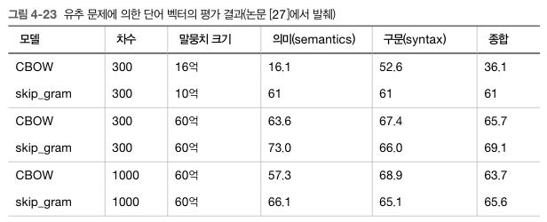
  - 모델에 따라 정확도가 다르다(말뭉치에 따라 적합한 모델 선택)
  - 일반적으로 말뭉치가 클수록 결과가 좋다. (항상 데이터가 많은 게 좋음)
  - 단어 벡터 차원 수는 적당한 크기가 좋다. (너무 커도 정확도 나빠짐)

단어 분산 표현의 우수함이 애플리케이션에 얼마나 기여하는지는 애플리케이션 종류나 말뭉치의 내용 등, 다루는 문제 상황에 따라 다르다. 즉 유추 문제에 의한 평가가 높다고 해서 애플리케이션에서도 반드시 좋은 결과가 나오리라는 보장은 없다.


## 4.5 정리

- Embedding 계층은 단어의 분산 표현을 담고 있으며, 순전파 시 지정한 단어 ID의 벡터를 추출한다.
- word2vec은 어휘 수의 증가에 비례하여 계산량도 증가하므로, 근사치로 계산하는 빠른 기법을 사용하면 좋다.
- 네거티브 샘플링은 부정적 예를 몇 개 샘플링하는 기법으로 ,이를 이용하면 다중 분류를 이진 분류처럼 취급할 수 있다.
- word2vec으로 얻은 단어의 분산 표현에는 단어의 의미가 녹아들어 있으며, 비슷한 맥락에서 사용되는 단어는 단어 벡터 공간에서 가까이 위치한다.
- word2vec의 단어 분산 표현을 이용하면 유추 문제를 벡터의 덧셈과 뺄셈으로 풀 수 있게 된다.
- word2vec은 전이 학습 측면에서 특히 중요하며, 그 단어의 분산 표현은 다양한 자연어 처리 작업에 이용할 수 있다.


