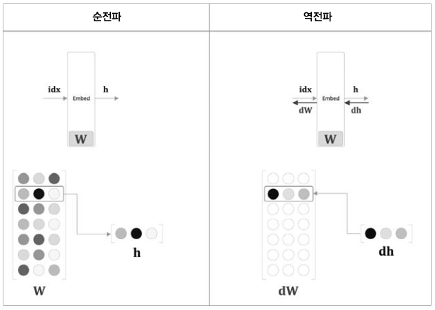
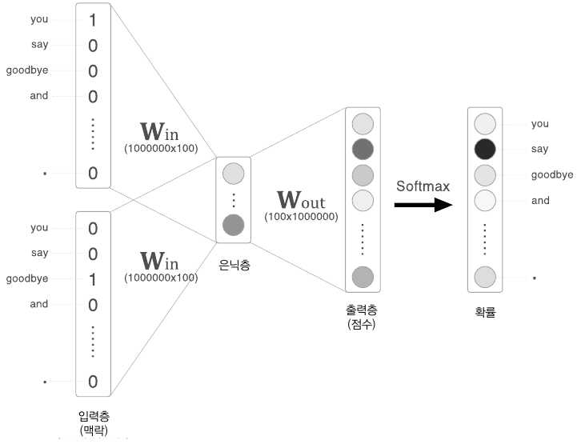

# CHAPTER4 : WORD2VEC 속도 개선

CBOW 모델은 단순 2층 신경망이라서 간단하게 구현할 수 있었으나 말뭉치에 포함된 어휘 수가 많아지면 계산량도 커진다는 문제가 있었다.

word2vec의 속도 개선을 알아보자.

첫 번째 개선 : `Embedding 계층`을 도입한다.

두 번째 개선 : `네거티브 샘플링` 손실 함수를 도입한다.


## 4.1 word2vec 개선_1

앞 장의 CBOW 모델은 단어 2개를 맥락으로 사용해, 하나의 단어(타깃)를 추측한다.


입력 측 가중치(W_in)와의 행렬 곱으로 은닉층이 계산되고, 다시 출력 측 가중치(W_out)와의 행렬 곱으로 각 단어의 점수를 구한다. 이 점수에 소프트맥스 함수를 적용해 각 단어의 출현 확률을 얻고, 이 확률을 정답 레이블과 비교(교차 엔트로피 오차를 적용)하여 손실을 구한다.

하지만 어휘가 많을 때는 뉴런의 갯수가 많아져 중간 계산에 많은 시간이 소요되어서 병목 현상이 일어난다. 문제가 되는 계산은 다음과 같다.

- 입력 층의 원핫 표현과 가중치 행렬 W_in의 곱 계산
  - 입력층의 원핫 표현과 관련한 문제이다. 어휘 수가 많아지면 원핫 표현의 벡터 크기도 커지는 것이다. 상당한 메모리를 차지한다. 
- 은닉층과 가중치 행렬 W_out의 곱 및 Softmax 계층의 계산
  - 은닉층 이후의 계산에 관련된 문제이다. 은닉층과 가중치 행렬 W_out의 곱만 해도 계산량이 크다. Softmax 계층에서도 다루는 어휘가 많아짐에 따라 계산량이 증가한다.


### 4.1.1 Embedding 계층

가중치 매개변수로부터 '단어 ID에 해당하는 행(벡터)'을 추출하는 계층(`Embedding 계층`)을 만들어보자. Embedding 계층에 단어 임베딩(분산 표현)을 저장하는 것이다.


### 4.1.2 Embedding 계층 구현

행렬에서 특정 행을 추출하기란 아주 쉽다. 가중치 W가 2차원 넘파이 배열일 때, 이 가중치로부터 특정 행을 추출하려면 그저 W[2]나 W[5]처럼 원하는 행을 명시하면 끝이다.

```python
import numpy as np
W = np.arange(21).reshape(7, 3)
W

W[2] # [6, 7, 8]
W[5] # [15, 16, 17]
```

가중치 W로부터 여러 행을 추출하는 일도 간단하다. 원하는 행번호들을 배열에 명시하면 된다.

```python
idx = np.array([1, 0, 3, 0]) # 인덱스 4개 추출
W[idx]
# array([[3, 4, 5],[0, 1, 2], [9, 10, 11], [0, 1, 2]])
```

인수에 배열을 사용하면 여러 행을 한꺼번에 출력 가능하다.


Embedding 계층의 forward() 메서드 구현

```python
class Embedding:
    def __init__(self, W):
        self.params = [W]
        self.grads = [np.zeros_like(W)]
        self.idex = None
        
    def forward(self, idx):
        W, = self.params
        self.idx = idx
        out = W[idx]
        return out
```

인스턴스 변수 params와 grads를 사용한다. 또한 인스턴스 변수 idx에는 추출하는 행의 인덱스(단어 ID)를 배열로 저장한다.


Embedding 계층의 순전파는 가중치 W의 특정 행을 추출할 뿐이다. 따라서 역전파(backward)에서는 앞 층(출력 측 층)으로부터 전해진 기울기를 다음 층(입력 측 층)으로 그대로 흘려주면 된다. 다만, 앞 층으로부터 전해진 기울기를 가중치 기울기 dW의 특정 행(idx번째 행)에 설정한다. 

```python
def backward(self, dout):
    dW, self.grads
    dW[...] = 0
    dW[self.idx] = dout
    return None
```

가중치 기울기 dW를 꺼낸 다음, dW[...] = 0 코드에서 dW의 원소를 0으로 덮어쓴다. ( dW의 형상을 유지한 채, 그 원소들을 0으로 덮어씀 ). 이후 앞 층에서 전해진 기울기 dout을 idx번째 행에 할당한다.

이 구현에서는 idx의 원소가 중복되면 문제가 생긴다. 먼저 쓰여진 값을 덮어쓰게 되는 경우가 생기므로 **'할당'이 아닌 '더하기'를 해야한다.** 즉 dh의 각 행의 값을 dW의 해당 행에 더해준다.

```python
def backward(self, dout):
    dW, = self.grads
    dW[...] = 0
    for i, word_id in enumerate(self.idx):
        dW[word_id] += dout[i]
    # np.add.at(dW, self.idx, dout) 도 가능하다.
    # np.add.at(A, idx, B)는 B를 A의 idx번째 행에 더해준다.
    return None
```

for문을 사용해 해당 인덱스에 기울기를 더했다. 이것으로 idx에 중복 인덱스가 있더라도 올바르게 처리된다. 

word2vec (CBOW 모델)의 입력 측 MatMul 계층을 Embedding 계층으로 전환하였다. 메모리 사용량을 줄이고 쓸데없는 계산을 생략했다.


## 4.2 word2vec 개선_2

은닉층 이후의 처리 (행렬 곱과 Softmax 계층의 계산)를 네거티브 샘플링(부정적 샘플링) 기법을 사용해서 개선해보자. Softmax 대신 네거티브 샘플링을 이용하면 어휘가 아무리 많아져도 계산량을 낮은 수준에서 일정하게 억제할 수 있다.


### 4.2.1 은닉층 이후 계산의 문제점

어휘가 100만 개, 은닉층 뉴런이 100개일 때의 word2vec (CBOW모델)을 예로 생각해보자. 

ㅡ you 와 goodbye 사이의 say를 예측해보자. ㅡ

입력층과 출력층에 뉴런이 각 100만 개씩 존재한다.

- 은닉층 이후에 계산이 오래걸리는 곳
  - 은닉층의 뉴런과 가중치 행렬(W_out)의 곱
  - Softmax 계층의 계산