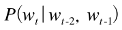

# CHAPTER5 : 순환 신경망(RNN)

단순 피드포워드 신경망에서는 시계열 데이터의 성질(패턴)을 충분히 학습할 수 없다. 그래서 순환 신경망(Recurrent Neural Network)이 등장한다.

## 5.1 확률과 언어 모델

### 5.1.1  word2vec을 확률 관점에서 바라보다

CBOW 모델은 맥락으로부터 타깃을 추측하는 일을 수행한다.

 

맥락이 주어졌을 때 타깃이 w_t가 될 확률 수식: 

CBOW 모델은 위 수식의 사후 확률을 모델링 한다. 이 사후 확률은 "`w_(t-1)`과 `w_(t+1)`이 주어졌을 때 w_t가 일어날 확률"을 뜻한다.

이번에는 맥락을 왼쪽 윈도우만으로 한정해보자.

 

수식은 이렇게 바뀐다 : 

손실 함수 : 

CBOW 모델의 학습은 말뭉치 전체의 손실함수의 총합을 최소화 하는 가중치 매개변수를 찾는 것이다. 이러한 가중치 매개변수가 발견되면 CBOW 모델은 맥락으로부터 타깃을 더 정확하게 추측할 수 있게 된다. 단어의 분산 표현은 부산물이다.

### 5.1.2 언어 모델

언어 모델은 단어 나열에 확률을 부여한다. 특정한 단어의 시퀀스에 대해서, 그 시퀀스가 일어날 가능성이 어느 정도인지를 확률로 평가한다.

음성 인식 시스템의 경우, 사람의 음성으로부터 몇 개의 문장을 후보로 생성하고 언어 모델을 사용하여 후보 문장이 '문장으로써 자연스러운지'를 기준으로 순서를 매긴다.

새로운 문장을 생성하는 용도로도 이용할 수 있다. 언어 모델은 단어 순서의 자연스러움을 확률적으로 평가할 수 있으므로, 그 확률분포에 따라 다음으로 적합한 단어를 샘플링할 수 있다.

언어 모델을 수식으로 설명:

- w_1 ~ w_m 으로 이루어진 문장(m개의 단어).

- P(w_1, ..., w_m) : 단어가 w_1 ~ w_m 순서로 출현할 확률 ( 이 확률은 여러 사건이 동시에 일어날 확률이므로 동시 확률이라고 함 )

- 이 동시 확률은 사후 확률의 총곱으로 나타낼 수 있다.

   

- 이 결과는 확률의 곱셈정리에서 유도된다. ( m개 단어의 동시 확률을 사후 확률로 나타낼 수 있다. )
  -  
  - A와 B가 모두 일어날 확률 P(A, B)는 B가 일어날 확률 P(B)와 B가 일어난 후 A가 일어날 확률 P(A|B)를 곱한 값과 같다.
  - 반대 순서로도 가능하다.
- 식 변형 순서
  -  
    - w_1 ~ w_(m-1) 을 하나로 모아 기호 A로 나타낸다.
  -  
  - 이처럼 단어 시퀀스를 하나씩 줄여가며 매번 사후 확률로 분해해간다. 이 과정을 반복하여 
  -  
  - 가 나온다. 
  - 주목할 점은 이 사후 확률은 타깃단어보다 왼쪽에 있는 모든 단어를 맥락(조건)으로 했을 떄의 확률이라는 것이다.
  -  

정리하면, 우리의 목표는  이며 이 확률을 계산할 수 있다면 언어 모델의 동시 확률 을 구할 수 있다.

### 5.1.3 CBOW 모델을 언어 모델로?

word2vec의 CBOW 모델을 언어 모델에 적용하려면 맥락의 크기를 특정 값으로 한정하여 근사적으로 나타낼 수 있다.

 

CBOW 모델의 사후 확률에 따라 근사적으로 나타낼 수 있다. 맥락의 크기는 임의로 설정할 수 있어도 결국 특정 길이로 고정된다. 그 맥락보다 더 왼쪽에 있는 단어의 정보는 무시된다. 

이 문제에서 정답을 구하려면 예문의 "?"로부터 18번째나 앞에 나오는 "Tom"을 기억해야 한다. 만약 CBOW 모델의 맥락이 10개까지였다면 이 문제에 제대로 답할 수 없다. 또한 CBOW 모델에서는 맥락 안의 단어 순서가 무시된다는 한계가 있다. ( 은닉층에서 단어 벡터들이 더해지므로 맥락의 단어 순서는 무시된다 )

오른쪽 처럼 맥락의 단어 벡터를 은닉층에서 연결하는 방식을 생각할 수도 있다. 그러나 연결하는 방식을 취하면 맥락의 크기에 비례해 가중치 매개변수도 늘어난다.

RNN은 맥락이 아무리 길더라도 그 맥락의 정보를 기억하는 메커니즘을 갖추고 있다.

## 5.2 RNN이란

