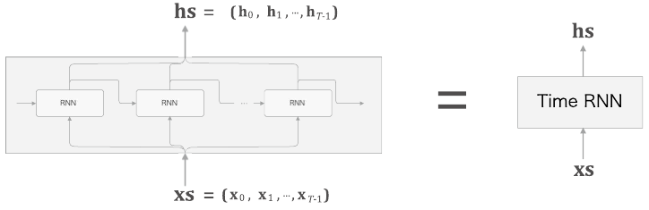
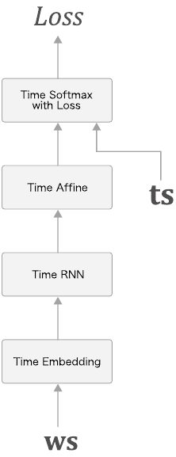

# CHAPTER5 : 순환 신경망(RNN)

단순 피드포워드 신경망에서는 시계열 데이터의 성질(패턴)을 충분히 학습할 수 없다. 그래서 순환 신경망(Recurrent Neural Network)이 등장한다.


## 5.1 확률과 언어 모델


### 5.1.1  word2vec을 확률 관점에서 바라보다

CBOW 모델은 맥락으로부터 타깃을 추측하는 일을 수행한다.

 

맥락이 주어졌을 때 타깃이 w_t가 될 확률 수식: 

CBOW 모델은 위 수식의 사후 확률을 모델링 한다. 이 사후 확률은 "`w_(t-1)`과 `w_(t+1)`이 주어졌을 때 w_t가 일어날 확률"을 뜻한다.


이번에는 맥락을 왼쪽 윈도우만으로 한정해보자.

 

수식은 이렇게 바뀐다 : 

손실 함수 : 

CBOW 모델의 학습은 말뭉치 전체의 손실함수의 총합을 최소화 하는 가중치 매개변수를 찾는 것이다. 이러한 가중치 매개변수가 발견되면 CBOW 모델은 맥락으로부터 타깃을 더 정확하게 추측할 수 있게 된다. 단어의 분산 표현은 부산물이다.


### 5.1.2 언어 모델

언어 모델은 단어 나열에 확률을 부여한다. 특정한 단어의 시퀀스에 대해서, 그 시퀀스가 일어날 가능성이 어느 정도인지를 확률로 평가한다.

음성 인식 시스템의 경우, 사람의 음성으로부터 몇 개의 문장을 후보로 생성하고 언어 모델을 사용하여 후보 문장이 '문장으로써 자연스러운지'를 기준으로 순서를 매긴다.

새로운 문장을 생성하는 용도로도 이용할 수 있다. 언어 모델은 단어 순서의 자연스러움을 확률적으로 평가할 수 있으므로, 그 확률분포에 따라 다음으로 적합한 단어를 샘플링할 수 있다.


언어 모델을 수식으로 설명:

- w_1 ~ w_m 으로 이루어진 문장(m개의 단어).

- P(w_1, ..., w_m) : 단어가 w_1 ~ w_m 순서로 출현할 확률 ( 이 확률은 여러 사건이 동시에 일어날 확률이므로 동시 확률이라고 함 )

- 이 동시 확률은 사후 확률의 총곱으로 나타낼 수 있다.

   

- 이 결과는 확률의 곱셈정리에서 유도된다. ( m개 단어의 동시 확률을 사후 확률로 나타낼 수 있다. )
  -  
  - A와 B가 모두 일어날 확률 P(A, B)는 B가 일어날 확률 P(B)와 B가 일어난 후 A가 일어날 확률 P(A|B)를 곱한 값과 같다.
  - 반대 순서로도 가능하다.
- 식 변형 순서
  -  
    - w_1 ~ w_(m-1) 을 하나로 모아 기호 A로 나타낸다.
  -  
  - 이처럼 단어 시퀀스를 하나씩 줄여가며 매번 사후 확률로 분해해간다. 이 과정을 반복하여 
  -  
  - 가 나온다. 
  - 주목할 점은 이 사후 확률은 타깃단어보다 왼쪽에 있는 모든 단어를 맥락(조건)으로 했을 떄의 확률이라는 것이다.
  -  


정리하면, 우리의 목표는  이며 이 확률을 계산할 수 있다면 언어 모델의 동시 확률 을 구할 수 있다.


### 5.1.3 CBOW 모델을 언어 모델로?

word2vec의 CBOW 모델을 언어 모델에 적용하려면 맥락의 크기를 특정 값으로 한정하여 근사적으로 나타낼 수 있다.

 

CBOW 모델의 사후 확률에 따라 근사적으로 나타낼 수 있다. 맥락의 크기는 임의로 설정할 수 있어도 결국 특정 길이로 고정된다. 그 맥락보다 더 왼쪽에 있는 단어의 정보는 무시된다. 

이 문제에서 정답을 구하려면 예문의 "?"로부터 18번째나 앞에 나오는 "Tom"을 기억해야 한다. 만약 CBOW 모델의 맥락이 10개까지였다면 이 문제에 제대로 답할 수 없다. 또한 CBOW 모델에서는 맥락 안의 단어 순서가 무시된다는 한계가 있다. ( 은닉층에서 단어 벡터들이 더해지므로 맥락의 단어 순서는 무시된다 )


오른쪽 처럼 맥락의 단어 벡터를 은닉층에서 연결하는 방식을 생각할 수도 있다. 그러나 연결하는 방식을 취하면 맥락의 크기에 비례해 가중치 매개변수도 늘어난다.

RNN은 맥락이 아무리 길더라도 그 맥락의 정보를 기억하는 메커니즘을 갖추고 있다.


## 5.2 RNN이란

## 5.2.1 순환하는 신경망

'닫힌 경로' 혹은 '순환하는 경로'가 존재해야 데이터가 같은 장로를 반복해 왕래(순환)할 수 있다. 데이터가 순환하면서 정보가 끊임없이 갱신되게 된다.

RNN 계층은 순환하는 경로를 포함한다. 

 

x_t 는 입력이고 t는 시각이다. 각 시각에 입력되는 x_t는 벡터라고 가정한다. 문장(단어 순서)을 다루는 경우를 예로 든다면 각 단어의 분산 표현(단어 벡터)이 x_t가 되며, 이 분산 표현이 순서대로 하나씩 RNN계층에 입력되는 것이다.


### 5.2.2 순환 구조 펼치기

분기된 출력 중 하나가 자기 자신에 입력된다.


각 시각의 RNN 계층은 그 계층으로의 입력과 1개 전의 RNN 계층으로부터의 출력을 받는다. 이 두 정보를 바탕으로 현 시각의 출력을 계산한다. 이 때 수행하는 계산의 수식은 다음과 같다

 

RNN에는 가중치가 2개 있다. x를 h로 변환하기 위한 가중치 w_x이고, 다른 하나는 1개의 RNN 출력을 다음 시각의 출력으로 변환하기 위한 가중치 w_h이다. 편향 b도 있다. ( h_(t-1)과 x_t 는 행 벡터이다. ) 계산 후 그 합을 tanh 함수를 이용해 변환한 결과가 시각 t의 출력 h_t가 된다.

현재의 출력 h_t는 한 시각 이전의 출력 h_(t-1)에 기초해 계산된다. 

다른 관점으로 보면 RNN은 h라는 '상태'를 가지고 있으며, 위의 식의 형태로 갱신된다. 그래서 RNN계층을 '상태를 가지는 계층' 혹은 '메모리(기억력)가 있는 계층'이라고 한다.

출력 h_t를 은닉상태(은닉 상태 벡터)라고 한다.


### 5.2.3 BPTT

RNN 계층은 가로로 펼친 신경망으로 간주할 수 있어서 학습 역시 보통의 신경망과 같은 순서로 진행할 수 있다. 순환 구조를 펼친 후의 RNN에는 오차역전파법을 적용할 수 있다. 여기서의 오차역전파법은 '시간 방향으로 펼친 신경망의 오차역전파법'(BPTT: Backpropagation Through Time)이라고 한다. 

하지만 긴 시계열 데이터를 학습할 때는 시계열 데이터의 시간 크기가 커지는 것에 비례하여 BPTT가 소비하는 컴퓨팅 자원이 증가하며, 시간 크기가 커지면 역전파 시의 기울기가 불안정해지는 것이 문제이다.


### 5.2.4 Truncated BPTT

Truncated BPTT: 

큰 시계열 데이터를 취급할 때 시간축 방향으로 너무 길어진 신경망을 적당한 지점에서 잘라내어 작은 신경망 여러개로 만들어 오차역전파법을 수행한다.

순전파의 흐름은 끊어지지 않고 전파되고, 역전파의 연결은 적당한 길이로 잘라내, 그 잘라낸 신경망 단위로 학습을 수행한다.

또한 RNN에서 Truncated BPTT를 수행할 때는 미니배치학습시에 데이터를 무작위로 선택해 입력하지 않고, 데이터를 순서대로 입력해야 한다.

ex) 길이가 1000인 시계열 데이터(단어1000개짜리 말뭉치)를 다루면서 RNN 계층을 펼치면 계층이 가로로 1000개나 늘어선 신경망이 된다. 계산량이 크고 계층이 길어짐에 따라 신경망을 하나 통과할 때마다 기울기 값이 조금씩 작아져서 이전 시각 t까지 역전파 되기 전에 0이 되어 소멸할 수도 있다.


이런식으로 순전파의 연결을 유지하면서 블록 단위로 오차역전파법을 적용할 수 있다.


### 5.2.5 Truncated BPTT의 미니배치 학습

위 그림처럼 데이터를 주는 시작 위치를 각 미니배치의 시작 위치로 옮겨줘야 한다. 


길이가 1000인 시계열 데이터에 대해서 시각의 길이를 10개 단위로 잘라 Truncated BPTT로 학습하는 경우를 예로 들자.

이 때 미니배치의 수를 2개로 구성해 학습하려면 RNN 계층의 입력 데이터로, 첫 번째 미니 배치(샘플 데이터) 때는 500번째의 데이터를 시작 위치로 정하고, 그 위치부터 다시 순서대로 데이터를 제공하는 것이다. ( 시작 위치를 500만큼 옮겨준다.)

또한 데이터를 순서대로 입력하다가 끝에 도달하면 다시 처음부터 입력한다.


## 5.3 RNN 구현

길이가 T인 시계열 데이터를 받아 각 시각의 은닉상태(h)를 T개 출력한다.


Time RNN 계층 : 순환 구조를 펼친 후의 계층들을 하나의 계층으로 간주한다.



xs를 입력하면 hs를 출력하는 단일 계층으로 볼 수 있다. Time RNN 계층 내에서 한 단계의 작업을 수행하는 계층을 RNN 계층이라고 한다. T개 단계분의 작업을 한꺼번에 처리하는 계층을 Time RNN 계층이라 한다.


### 5.3.1 RNN 계층 구현

RNN 처리를 한 단계만 수행하는 RNN 클래스부터 구현해보자.

 

데이터를 미니배치로 모아 처리해보자. 따라서 x_t와 h_t에는 각 샘플 데이터를 행 방향에 저장한다.

행렬의 형상 확인을 해보자. N: 미니배치의 크기, D: 입력 벡터의 차원 수, H: 은닉 상태 벡터의 차원 수

 

RNN 클래스 구현

```python
class RNN:
    def __init__(self, Wx, Wh, b):
        self.params = [Wx, Wh, b]
        self.grads = [np.zeros_like(Wx), np.zeros_like(Wh), np.zeros_like(b)]
        self.cache = None

    def forward(self, x, h_prev): # X: 아래로부터의 입력 X, 왼쪽으로부터의 입력 h_prev
        Wx, Wh, b = self.params
        t = np.dot(h_prev, Wh) + np.dot(x, Wx) + b
        h_next = np.tanh(t)

        self.cache = (x, h_prev, h_next)
        return h_next # 다음 시각 계층으로의 입력
```

forward는 를 그대로 코드로 옮겼을 뿐이다.

RNN 계층의 순전파를 계산그래프


RNN의 역전파를 구현해보자.


```python
    def backward(self, dh_next):
        Wx, Wh, b = self.params
        x, h_prev, h_next = self.cache

        dt = dh_next * (1 - h_next ** 2)
        db = np.sum(dt, axis=0)
        dWh = np.dot(h_prev.T, dt)
        dh_prev = np.dot(dt, Wh.T)
        dWx = np.dot(x.T, dt)
        dx = np.dot(dt, Wx.T)

        self.grads[0][...] = dWx
        self.grads[1][...] = dWh
        self.grads[2][...] = db

        return dx, dh_prev
```


### 5.3.2 Time RNN 계층 구현

Time RNN 계층은 T개의 RNN 계층으로 구성된다.

 

Time RNN 계층은 은닉 상태를 인스턴스 변수 h로 보관하여 다음 블록에 인계한다.

Time RNN 계층 구현

```python
class TimeRNN:
    def __init__(self, Wx, Wh, b, stateful=False): # stateful: 은닉 상태를 인계받을지 말지
        self.params = [Wx, Wh, b]
        self.grads = [np.zeros_like(Wx), np.zeros_like(Wh), np.zeros_like(b)]
        self.layers = None # 다수의 RNN 계층을 리스트로 저장

        self.h, self.dh = None, None # dh: backward()시 하나 앞 블록의 은닉상태의 기울기를 저장
        self.stateful = stateful

    def set_state(self, h):
        self.h = h

    def reset_state(self):
        self.h = None
```

stateful이 True : Time RNN 계층은 '상태가 있다'. 은닉 상태를 계속 유지한다 ( 아무리 긴 시계열 이라도 순전파를 끊지 않고 전파한다)

stateful이 False : Time RNN 계층은 '무상태'. 은닉 상태를 영행렬로 초기화한다.


순전파의 구현

```python
    def forward(self, xs): # xs : T개 분량의 시계열 데이터를 하나로 모은 것. 형상: (N(미니배치크기), T(시계열 데이터 분량),D(입력 벡터의 차원 수))
        Wx, Wh, b = self.params
        N, T, D = xs.shape
        D, H = Wx.shape

        self.layers = []
        hs = np.empty((N, T, H), dtype='f')

        if not self.stateful or self.h is None:
            self.h = np.zeros((N, H), dtype='f') # 처음호출시, stateful이 false일 때

        for t in range(T):
            layer = RNN(*self.params) # RNN 계층을 생성하여
            self.h = layer.forward(xs[:, t, :], self.h)
            hs[:, t, :] = self.h
            self.layers.append(layer) # layers 변수에 추가

        return hs
```


Time RNN 계층의 역전파 구현


---

t번째 RNN 계층에 주목하면

 

t번째 RNN 계층에서는 위로부터의 기울기 dh_t와 '한 시각 뒤(미래) 계층'으로부터의 기울기 dh_next 가 전해진다. 주의점은 RNN 계층의 순전파에서는 출력이 2개로 분기된다는 것이다. 그 역전파에서는 각 기울기가 합산되어 전해진다. 따라서 역전파 시 RNN 계층에는 합산된 기울기 (dh_t + dh_next)가 입력된다. 

```python
    def backward(self, dhs): # dhs : 상류(출력 쪽 층)에서 전해지는 기울기
        Wx, Wh, b = self.params
        N, T, H = dhs.shape
        D, H = Wx.shape

        dxs = np.empty((N, T, D), dtype='f') # dxs: 하류(입력 방향 층)로 내보내는 기울기
        dh = 0
        grads = [0, 0, 0]
        for t in reversed(range(T)):
            layer = self.layers[t]
            dx, dh = layer.backward(dhs[:, t, :] + dh)
            dxs[:, t, :] = dx

            for i, grad in enumerate(layer.grads):
                grads[i] += grad

        for i, grad in enumerate(grads):
            self.grads[i][...] = grad
        self.dh = dh # 추후 seq2seq를 위해 은닉 상태 기울기 저장

        return dxs
```

Time RNN 계층의 최종 가중치의 기울기는 각 RNN 계층의 가중치 기울기를 모두 더한게 된다.


## 5.4 시계열 데이터 처리 계층 구현

RNNLM : RNN Language Model. 언어모델을 구현해보자.


### 5.4.1 RNNLM의 전체 그림

왼쪽은 RNNLM의 계층 구성이고, 오른쪽에는 이를 시간축으로 펼친 신경망이다.

 

Embedding 계층은 단어 ID를 단어의 분산 표현(단어 벡터)으로 변환한다. 그리고 그 분산 표현이 RNN 계층으로 입력되고, RNN 계층은 은닉 상태를 다음 층으로(위쪽) 출력함과 동시에, 다음 시각의 RNN계층으로(오른쪽) 출력한다. 그리고 RNN 계층이 위로 출력한 은닉 상태는 Affine 계층을 거쳐 Softmax 계층으로 전해진다.

"You say goodbye and i say hello."로 예시를 들어보자.

 

say를 입력하는 부분을 보면 Softmax 계층의 출력은 goodbye와 hello 두 곳에서 높게 나왔다. 'you say goodbye'와 you say hello는 모두 자연스러운 문장이다. 

여기서 주목할점은 RNN 계층은 'you say'라는 맥락을 응집된 은닉 상태 벡터로 저장하여 '기억'하고 있다.

RNN 계층이 과거에서 현재로 데이터를 계속 흘려보내줌으로써 과거의 정보를 인코딩해 저장(기억)할 수 있는 것이다.

 

### 5.4.2 Time 계층 구현

시계열 데이터를 한꺼번에 처리하는 계층을 Time Embedding, Time Affine 으로 구현해보자.

 

T개분의 시계열 데이터를 한꺼번에 처리하는 계층을 'Time XX 계층' 이라 부른다.


Time 계층은 간단하게 구현할 수 있다. Time Affine 계층은 Affine 계층을 T개 준비해서, 각 시각의 데이터를 개별적으로 처리하면 된다.


Time Embedding 계층 역시 순전파 시에 T개의 Embedding 계층을 준비하고 각 Embedding 계층이 각 시각의 데이터를 처리한다.


이제 시계열 버전의 Softmax를 구현해보자.


x들은 아래층에서부터 전해지는 '점수'(확률로 정규화되기 전의 값)를 나타낸다. t들은 정답 레이블이다.

T개의 Softmax with Loss 계층이 각각 손실을 산출하고, 그 손실들을 합산해 평균한 값이 최종 손실이 된다.


## 5.5 RNNLM 학습과 평가

RNNLM에서 사용하는 신경망을 'SimpleRnnlm' 라는 이름의 클래스로 구현해보자.

 


4개의 Time 계층을 쌓은 신경망이다.

```python
import numpy as np
from common.time_layers import *

class SimpleRnnlm:
    def __init__(self, vocab_size, wordvec_size, hidden_size): # 각 계층에서 사용하는 매개변수(가중치와 편향)를 초기화하고 필요한 계층을 생성한다.
        V, D, H = vocab_size, wordvec_size, hidden_size
        rn = np.random.randn

        # 가중치 초기화 with Xavier 초깃값 (표준편차 = 1/sqrt(이전 계층의 노드갯수)로  초기화 )
        embed_W = (rn(V, D) / 100).astype('f')
        rnn_Wx = (rn(D, H) / np.sqrt(D)).astype('f')
        rnn_Wh = (rn(H, H) / np.sqrt(H)).astype('f')
        rnn_b = np.zeros(H).astype('f')
        affine_W = (rn(H, V) / np.sqrt(H)).astype('f')
        affine_b = np.zeros(V).astype('f')

        # 계층 생성
        self.layers = [
            TimeEmbedding(embed_W),
            TimeRNN(rnn_Wx, rnn_Wh, rnn_b, stateful=True),
            TimeAffine(affine_W, affine_b)
        ] # Truncated BPTT로 학습한다고 가정(stateful=True) = 은닉상태 계승됨
        self.loss_layer = TimeSoftmaxWithLoss()
        self.rnn_layer = self.layers[1]

        # 모든 가중치와 기울기를 리스트에 모은다.
        self.params, self.grads = [], []
        for layer in self.layers:
            self.params += layer.params
            self.grads += layer.grads
```


forward, backward, reset_state 메서드 구현

```python
#layers = [TimeEmbedding(embed_W), TimeRNN(rnn_Wx, rnn_Wh, rnn_b, stateful=True), TimeAffine(affine_W, affine_b)]
	def forward(self, xs, ts):
        for layer in self.layers:
            xs = layer.forward(xs)
        loss = self.loss_layer.forward(xs, ts) # loss_layer = TimeSoftmaxWithLoss()
        return loss

    def backward(self, dout=1):
        dout = self.loss_layer.backward(dout)
        for layer in reversed(self.layers):
            dout = layer.backward(dout)
        return dout

    def reset_state(self): # 신경망의 상태를 초기화
        self.rnn_layer.reset_state()
```


### 5.5.2 언어 모델의 평가

언어 모델은 주어진 과거 단어(정보)로부터 다음에 출현할 단어의 확률분포를 출력한다. 이 때 언어 모델의 예측 성능을 평가하는 척도로 퍼플렉서티(perplexity, 혼란도)를 자주 이용한다.

퍼플렉서티는 간단히 말하면 '확률의 역수'이다.

"you say goodbye and i say hello." 말뭉치로 예를 들자면, 

'모델 1'의 언어 모델에 'you'라는 단어를 주니 다음과 같은 확률분포를 출력했다고 해보자. 그리고 정답이 'say'라면, 맞출 확률은 0.8이다. 퍼플렉서티는 1/0.8 = 1.25이다.

 

'모델 2'의 언어 모델에 'you'라는 단어를 주니 다음과 같은 확률분포를 출력했다고 해보자. 그리고 정답이 'say'라면, 맞출 확률은 0.2이다. 퍼플렉서티는 1/0.2 = 1.25이다. 즉 퍼플렉서티는 작을수록 좋다는 것을 알 수 있다.

 


1.25나 5.0이라는 값은 '분기 수'로 해석할 수 있다. 

- 분기 수 : 다음에 취할 수 있는 선택사항의 수(다음에 출현할 수 있는 단어의 후보 수)
  - 앞의 예에서 좋은 모델이 예측한 '분기 수'가 1.25라는 것은 다음에 출현할 수 있는 단어의 후보를 1개 정도로 좁혔다는 뜻이 된다.


입력 데이터가 여러 개일 때는 다음 공식에 따른다.

 

N : 데이터의 총 갯수

t_n : 원핫 벡터로 나타낸 정답 레이블

t_nk : n개째 데이터의 k번째 값

y_nk : 확률 분포 ( Softmax의 출력 )


L은 신경망의 손실을 뜻하며, 사실 교차 엔트로피 오차 식과 완전히 같은 식이다. 이 L을 사용해 e^L 을 계산한 값이 퍼플렉서티이다.

식에는 퍼플렉서티가 작아질수록 분기 수가 줄어 좋은 모델이 된다는 개념이 들어가 있다.


### 5.5.3 RNNLM의 학습 코드

PTB데이터 셋 전부를 대상으로 학습하면 좋은 결과를 낼 수 없기 때문에, 처음 1000개 단어만 이용해서 학습해본다. 

```python
# coding: utf-8
import sys
sys.path.append('..')
import matplotlib.pyplot as plt
import numpy as np
from common.optimizer import SGD
from dataset import ptb
from simple_rnnlm import SimpleRnnlm


# 하이퍼파라미터 설정
batch_size = 10
wordvec_size = 100
hidden_size = 100 # RNN의 은닉 상태 벡터의 원소 수
time_size = 5     # Truncated BPTT가 한 번에 펼치는 시간 크기
lr = 0.1
max_epoch = 100

# 학습 데이터 읽기(전체 중 1000개만)
corpus, word_to_id, id_to_word = ptb.load_data('train')
corpus_size = 1000
corpus = corpus[:corpus_size]
vocab_size = int(max(corpus) + 1)

xs = corpus[:-1]  # 입력
ts = corpus[1:]   # 출력(정답 레이블)
data_size = len(xs)
print('말뭉치 크기: %d, 어휘 수: %d' % (corpus_size, vocab_size))

# 학습 시 사용하는 변수
max_iters = data_size // (batch_size * time_size)
time_idx = 0
total_loss = 0
loss_count = 0
ppl_list = []

# 모델 생성
model = SimpleRnnlm(vocab_size, wordvec_size, hidden_size)
optimizer = SGD(lr)

# 1. 미니배치의 각 샘플의 읽기 시작 위치를 계산
jump = (corpus_size - 1) // batch_size
offsets = [i * jump for i in range(batch_size)]

for epoch in range(max_epoch):
    for iter in range(max_iters):
        # 2. 미니배치 취득
        batch_x = np.empty((batch_size, time_size), dtype='i')
        batch_t = np.empty((batch_size, time_size), dtype='i')
        for t in range(time_size):
            for i, offset in enumerate(offsets):
                batch_x[i, t] = xs[(offset + time_idx) % data_size]
                batch_t[i, t] = ts[(offset + time_idx) % data_size]
            time_idx += 1

        # 기울기를 구하여 매개변수 갱신
        loss = model.forward(batch_x, batch_t)
        model.backward()
        optimizer.update(model.params, model.grads)
        total_loss += loss
        loss_count += 1

    # 3. 에폭마다 퍼플렉서티 평가
    ppl = np.exp(total_loss / loss_count)
    print('| 에폭 %d | 퍼플렉서티 %.2f'
          % (epoch+1, ppl))
    ppl_list.append(float(ppl))
    total_loss, loss_count = 0, 0
```

지금까지의 학습코드와 2가지 다른 점이 있다. 

- 데이터 제공 방법:
  - Truncated BPTT 방식으로 학습을 수행한다.
    - 따라서 데이터는 순차적으로 주고 각각의 미니배치에서 데이터를 읽는 시작 위치를 조정해야 한다.
    - `코드 1. 미니배치의 각 샘플의 읽기 시작 위치를 계산`에서는 각 미니배치가 데이터를 읽기 시작하는 위치를 계산해 offsets에 저장한다. ( offsets의 각 원소에 데이터를 읽는 시작 위치(offset)가 담기게 된다. )
    - `코드 2. 미니배치 취득 `에서는 데이터를 순차적으로 읽는다. 변수 time_idx를 1씩 늘리면서 말뭉치에서 time_idx위치의 데이터를 얻는다. 여기서 `1`에서 계산한 offsets를 이용하여 각 미니배치에서 오프셋을 추가한다. 또한 말뭉치를 읽는 위치가 말뭉치 크기를 넘어설 경우 말뭉치의 처음으로 돌아와야 하는데, 이를 위해 말뭉치의 크기로 나눈 나머지를 인덱스로 사용한다.
- 퍼플렉서티 계산:
  - 에폭마다의 퍼플렉서티를 구하기 위해 에폭마다 손실의 평균을 구하고, 그 값을 사용해 퍼플렉서티를 구한다.


에폭별 퍼플렉서티 결과를 저장한 perplexity_list를 플롯해보자


```python
# 그래프 그리기
x = np.arange(len(ppl_list))
plt.plot(x, ppl_list, label='train')
plt.xlabel('epochs')
plt.ylabel('perplexity')
plt.show()
```


학습을 진행할수록 퍼플렉서티가 순조롭게 낮아진다. 

다만 이번에는 크기가 작은 말뭉치로 실험하였고, 실제로 지금 만든 모델로는 큰 말뭉치에 전혀 대응할 수 없다.


### 5.5.4 RNNLM의 Trainer 클래스

RnnlmTrainer 클래스는 방금 수행한 RNNLM 학습을 클래스 안으로 숨겨준다.

```python
from common.optimizer import SGD
from common.trainer import RnnlmTrainer
from dataset import ptb
from simple_rnnlm import SimpleRnnlm

# 하이퍼파라미터 설정
batch_size = 10
wordvec_size = 100
hidden_size = 100  # RNN의 은닉 상태 벡터의 원소 수
time_size = 5  # RNN을 펼치는 크기
lr = 0.1
max_epoch = 100

# 학습 데이터 읽기
corpus, word_to_id, id_to_word = ptb.load_data('train')
corpus_size = 1000  # 테스트 데이터셋을 작게 설정
corpus = corpus[:corpus_size]
vocab_size = int(max(corpus) + 1)
xs = corpus[:-1]  # 입력
ts = corpus[1:]  # 출력（정답 레이블）

# 모델 생성
model = SimpleRnnlm(vocab_size, wordvec_size, hidden_size)
optimizer = SGD(lr)
trainer = RnnlmTrainer(model, optimizer)

trainer.fit(xs, ts, max_epoch, batch_size, time_size)
trainer.plot()
```

RnnlmTrainer 클래스에 model과 optimizer를 주어 초기화한다. 그 다음 fit() 메서드를 호출해 학습을 수행한다. 

내부에서 수행되는 일련의 작업:

1. 미니배치를 '순차적'으로 만들어
2. 모델의 순전파와 역전파 호출
3. 옵티마이저로 가중치를 갱신
4. 퍼플렉서티 계산


## 5.6 정리

- RNN은 순환하는 경로가 있고, 이를 통해 내부에 '은닉 상태'를 기억할 수 있다.
- RNN의 순환 경로를 펼침으로써 다수의 RNN 계층이 연결된 신경망으로 해석할 수 있으며, 보통의 오차역전파법으로 학습할 수 있다(=BPTT)
- 긴 시계열 데이터를 학습할 때는 데이터를 적당한 길이씩 모으고('블록'이라 한다) 블록 단위로 BPTT에 의한 학습을 수행한다(=Truncated BPTT)
- Truncated BPTT에서는 역전파의 연결만 끊는다.
- Truncated BPTT에서는 순전파의 연결을 유지하기 위해 데이터를 '순차적'으로 입력해야 한다.
- 언어 모델은 단어 시퀀스를 확률로 해석한다.
- RNN 계층을 이용한 조건부 언어 모델은 (이론적으로는) 그때까지 등장한 모든 단어의 정보를 기억할 수 있다.


