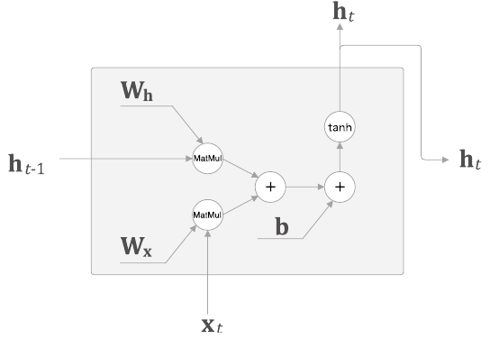

# CHAPTER6_게이트가 추가된 RNN

5장의 RNN은 시계열에서 시간적으로 멀리 떨어진 장기 의존 관계를 잘 학습할 수 없었다.

요즘은 LSTM이나 GRU라는 계층이 주로 쓰인다.

LSTM이나 GRU에는 게이트라는 구조가 더해져 있는데, 이 게이트 덕분에 시계열 데이터의 장기 의존 관계를 학습할 수 있다.

## 6.1 RNN의 문제점

BPTT에서 기울기 소실 혹은 기울기 폭발이 일어나기 때문에 RNN은 시계열 데이터의 장기 의존 관계를 학습하기 어렵다.

### 6.1.1 RNN 복습

RNN 계층은 순환 경로를 갖고 있다.

시계열 데이터인 x_t를 입력하면 h_t를 출력한다. 이 h_t는 RNN 계층의 은닉 상태라고 하여, 과거 정보를 저장한다.

RNN의 특징은 이전 시각의 은닉 상태를 이용해 과거의 정보를 계승할 수 있다는 점이다.

RNN 계층의 순전파에서 수행하는 계산은 행렬의 곱과 합, 그리고 활성화 함수인 tanh 함수에 의한 변환으로 구성된다.

### 6.1.2 기울기 소실 또는 기울기 폭발

(어느 정도의)  장기 기억이 필요한 문제의 예:

`Tom was watching TV in his room. Mary came into the room. Mary said hi to ~~~`

`~~~`에 들어가는 단어는 `Tom` 이다. RNNLM이 이 문제에 올바르게 답하려면, 현재 맥락에서 "Tom이 방에서 TV를 보고 있음"과 "그 방에 Mary가 들어옴"이란 정보를 기억해둬야 한다.(RNN 계층의 은닉 상태에 인코딩해 보관해둬야 한다)

정답 레이블 "Tom"이 주어진 시점으로부터 과거 방향으로 기울기를 전달하게 된다. RNN 계층이 과거 방향으로 '의미있는 기울기'를 전달함으로써 시간 방향의 의존관계를 학습할 수 있다. 하지만 현재의 단순한 RNN 계층에서는 시간을 거슬러 올라갈수록 기울기가 작아지거나 커질 수 있다.

### 6.1.3 기울기 소실과 기울기 폭발의 원인

기울기 소실(혹은 폭발)이 일어나는 원인을 살펴보자.

RNN 계층에서의 시간 방향 기울기 전파에 주목해보자.

길이가 T인 시계열 데이터를 가정하여 T번째 정답 레이블로부터 전해지는 기울기가 어떻게 변하는지 보면, 앞의 문제에 대입하면 T번째 정답 레이블이 "Tom"인 경우에 해당한다. 이 때 시간 방향 기울기에 주목하면 역전파로 전해지는 기울기는 차례로 'tanh', '+', 'MatMul(행렬곱)' 연산을 통과한다는 것을 알 수 있다.

'+'는 역전파 상류에서 전해지는 기울기를 그대로 하류에 흘려보내기 때문에 기울기는 변하지 않는다.

'tanh'의 값과 그 미분 값의 그래프를 보면

미분의 값은 1.0 이하이고, x가 0으로 멀어질수록 작아진다. 즉, 역전파에서는 기울기가 tanh 노드를 지날 때마다 값은 계속 작아진다는 뜻이다.

상류층에서 dh라는 기울기가 흘러온다고 가정하면 'MatMul'노드에서의 역전파는 라는 행렬 곱으로 기울기를 계산한다. 그리고 같은 계산을 시계열 데이터의 시간 크기만큼 반복한다. 이 행렬 곱셈에서는 매번 똑같은 가중치인 W_h가 사용된다.

그 결과, 기울기의 크기는 시간에 비례해 지수적으로 증가한다. 이러한 기울기 폭발이 일어나면 오버플로로 인해 결국 NaN같은 값을 발생시킨다. (신경망 학습 수행 불가)

위에서는 Wh를 난수로 초기화하였다. 이번에는 난수 * 0.5로 초기화해보자.

이번에는 기울기가 지수적으로 감소한다. 기울기 소실이 일어나면 기울기가 매우 빠르게 작아지며 일정 수준 이하로 작아지면 가중치 매개변수가 더 이상 갱신되지 않고, 장기 의존 관계를 학습할 수 없게 된다.

행렬 W_h를 T번 반복해서 곱했기 때문에 이러한 지수증가, 지수감소가 일어난다. 만약 W_h가 스칼라라면 1보다 크면 지수증가, 1보다 작으면 지수감소이다.

하지만 지금처럼 W_h가 행렬이라면 '행렬의 특잇값'이 척도가 된다. 행렬의 특잇값이란, 간단히 말하면 데이터가 얼마나 퍼져있는지를 나타내는 것이다. 이 특잇값의 값(여러 특잇값 중 최댓값)이 1보다 큰지 여부를 보면 기울기 크기가 어떻게 변할지 예측이 가능하다.

### 6.1.4 기울기 폭발 대책

- 기울기 클리핑
  - 기울기 클리핑 알고리즘의 의사 코드
    -  
    - 신경망에서 사용되는 모든 매개변수에 대한 기울기를 하나로 처리한다고 가정하고 기호 ^g로 표기한다.
      - 예를들어 두 개의 가중치 W1과 W2 매개변수를 사용하는 모델이 있다면, 이 두 매개변수에 대한 기울기 dW1과 dW2를 결합한 것을 ^g 라고 한다.
    - threshold를 임계값(문턱값)으로 설정한다.
    - 이때 기울기의 L2 노름(||^g||)이 threshold를 초과하면 두 번째 줄의 수식과 같이 기울기를 수정한다.

## 6.2 기울기 소실과 LSTM

### 6.2.1 LSTM의 인터페이스

앞으로 계산을 tanh라는 직사각형 노드 하나로 그린다. ( h_(t-1)과 x_t 는 행벡터 )

LSTM 계층의 인터페이스에는 c라는 경로가 있다.

c를 "기억셀" 이라 하며 LSTM 전용의 기억 메커니즘이다. 기억 셀의 특징은 데이터를 자기 자신으로만 (LSTM 계층 내에서만) 주고 받는다는 것이다. (다른 계층으로는 출력하지 않는다).

### 6.2.2 LSTM 계층 조립하기

기억 셀 c_t에는 시각 t에서의 LSTM의 기억이 저장돼 있는데, 과거로부터 시각 t까지에 필요한 모든 정보가 저장되도록 학습을 수행한다. 이 기억을 바탕으로, 외부 계층에(그리고 다음 시각의 LSTM에) 은닉 상태 h_t를 출력한다. 이때 출력하는 h_t는 기억 셀의 값을 tanh 함수로 변환한 값이다.

현재의 기억 셀 c_t는 3개의 입력(`c_(t-1)`, `h_(t-1)`, `x_t`) 으로부터 계산을 수행하여 구할 수 있다.

핵심은 갱신된 `c_t`를 사용해 은닉 상태 `h_t`를 계산한다는 것이다. 또한 이 계산은 `h_t = tanh(c_t)`인데, 이는 c_t의 각 요소에 tanh 함수를 적용한다는 뜻이다. (기억 셀 `c_t`의 원소 수와 은닉 상태 `h_t`의 원소 수는 같다.)

LSTM에서 사용하는 게이트는 0~1 사이의 실수로 게이트의 열림 상태를 제어한다. "게이트를 얼마나 열까"라는 것도 데이터로부터 **자동으로 학습**한다.

### 6.2.3 output 게이트

`tanh(c_t)`의 각 원소에 대해 '그것이 다음 시각의 은닉 상태에 얼마나 중요한가'를 조정한다. 이 게이트를 output게이트 (출력 게이트)라고 한다. (다음 은닉 상태 `h_t`의 출력을 담당하는 게이트이므로)

output 게이트의 열림 상태(몇 %만 흘려보낼까)는 입력 `x_t`와 이전 상태 `h_(t-1)`로부터 구한다. 

 

식에서 사용하는 가중치 매개변수와 편향에는 output의 첫 글자인 "o"를 첨자로 추가했다. 시그모이드 함수는 σ로 표기한다.

입력 `x_t`에는 가중치 `W_x(o)`가 붙어있고, 이전 시각의 은닉 상태 `h_(t-1)`에는 가중치 `W_h(o)`가 붙어있다. 그리고 이 행렬들의 곱과 편향 `b(o)`를 모두 더한다음 시그모이드 함수를 거쳐 출력 게이트의 출력 o를 구한다. 마지막으로 이 o와 `tanh(c_t)`의 원소별 곱을 `h_t`로 출력한다.

 

σ의 출력을 `o`라고 하면 `h_t`는 `o`와 `tanh(c_t)`의 원소별 곱(아다마르 곱, ⨀)으로 계산된다. 

### 6.2.4 forget 게이트

기억 셀에 '무엇을 잊을까'를 명확하게 지시하자.

`c_(t-1)`의 기억 중에서 불필요한 기억을 잊게 해주는 forget 게이트(망각 게이트)를 추가해보자.

forget 게이트가 수행하는 일련의 계산을 σ노드로 표기했다. 식은 다음과 같다.

 

σ안에는 forget 게이트 전용의 가중치 매개변수가 있으며, 위의 식을 실행하면 forget 게이트의 출력 `f`가 구해진다. 

이 `f`와 이전 기억 셀인 `c_(t-1)`과의 원소별 곱을 계산하여 `c_t`를 구한다.

### 6.2.5 새로운 기억 셀

현재 상태에서는 기억 셀이 잊는 것 밖에 하지 못한다. 그래서 새로 기억해야 할 정보를 기억 셀에 추가해야 한다.

 

tanh 노드가 계산한 결과가 이전 시각의 기억 셀 `c_(t-1)`에 더해진다. 기억 셀에 새로운 '정보'가 추가된 것이다. 이 tanh 노드는 '게이트'가 아니며, 새로운 '정보'를 기억 셀에 추가하는 것이 목적이다. 따라서 활성화 함수로는 시그모이드 함수가 아닌 tanh 함수가 사용된다. 

 

기억 셀에 추가하는 새로운 기억을 g로 표기하였다. 이 g가 이전 시각의 기억 셀인 `c_(t-1)`에 더해짐으로써 새로운 기억이 생겨난다.

### 6.2.6 input 게이트

위에서 기억 셀에 추가한 새로운 기억 g에다가 게이트를 하나 추가한다. input 게이트를 추가하면 계산 그래프가

 

input 게이트는 g의 각 원소가 새로 추가되는 정보로써의 가치가 얼마나 큰지를 판단한다.

