# CHAPTER7_RNN을 사용한 문장 생성

언어모델을 사용해 '문장 생성'을 수행해보자.

우선 말뭉치를 사용해 학습한 언어 모델을 이용하여 새로운 문장을 만들어낸다. 또한 seq2seq라는 새로운 구조의 신경망도 다룬다. sequence to sequence(시계열에서 시계열로)를 뜻하는 말로, 한 시계열 데이터를 다른 시계열 데이터로 변환하는 걸 말한다. RNN 2개를 연결하는 아주 간단한 방법으로 seq2seq를 구현해보자.


## 7.1 언어 모델을 사용한 문장 생성

### 7.1.1 RNN을 사용한 문장 생성의 순서

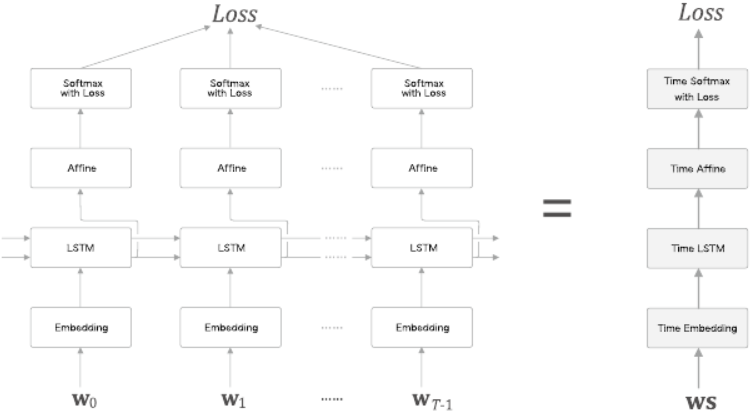

앞 장의 LSTM 계층을 이용하여 언어모델을 구현한 신경망의 구성이다.

시계열 데이터를 (T개분 만큼) 모아 처리하는 Time LSTM과 Time Affine 계층 등을 만들었다.

언어 모델에게 문장을 생성시키는 순서

- 학습된 언어 모델에 단어를 입력으로 준다.
  -  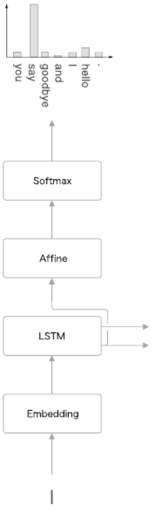
  - 언어 모델은 지금까지 주어진 단어들에서 다음에 출현하는 단어의 확률분포를 출력한다.
- 다음 단어를 새로 생성하려면 어떻게 해야 할까?
  - 확률이 가장 높은 단어를 선택
    - 단순히 확률이 가장 높은 단어를 선택
    - 또는 각 후보 단어의 확률에 맞게 샘플링함
- 후자를 선택하여 단어를 샘플링하고 두 번째 단어를 샘플링한다.
  - 원하는 만큼 반복한다 `<eos>`같은 종결 기호가 나타날 때까지 반복한다.


이렇게 생성한 문장은 훈련 데이터에 존재하지 않는 말이다. 언어 모델이 훈련 데이터를 암기한 것이 아니라, 훈련 데이터에서 사용된 단어의 정렬 패턴을 학습한 것이기 때문이다.

만약 언어 모델이 말뭉치로부터 단어의 출현 패턴을 올바르게 학습할 수 있다면, 생성하는 문장은 인간에게도 자연스럽고 의미가 통하는 문장일 것으로 기대할 수 있다.


### 7.1.2 문장 생성 구현

Rnnlm클래스를 상속하여 RnnlmGen 클래스 구현

```python
import sys
sys.path.append('..')
import numpy as np
from common.functions import softmax
from ch06.rnnlm import Rnnlm
from ch06.better_rnnlm import BetterRnnlm


class RnnlmGen(Rnnlm):
    def generate(self, start_id, skip_ids=None, sample_size=100):
        word_ids = [start_id]

        x = start_id
        while len(word_ids) < sample_size:
            x = np.array(x).reshape(1, 1)
            score = self.predict(x)
            p = softmax(score.flatten())

            sampled = np.random.choice(len(p), size=1, p=p)
            if (skip_ids is None) or (sampled not in skip_ids):
                x = sampled
                word_ids.append(int(x))

        return word_ids

    def get_state(self):
        return self.lstm_layer.h, self.lstm_layer.c

    def set_state(self, state):
        self.lstm_layer.set_state(*state)
```

generate(start_id, skip_ids, sample_size) 메서드를 통해 문장 생성을 수행한다. start_id는 최초로 주는 단어의 ID, sample_size는 샘플링하는 단어의 수, skip_ids는 단어 ID의 리스트인데 이 리스트에 속하는 단어 ID는 샘플링 되지 않도록 해준다. 이 인수는 PTB 데이터셋에 있는 `<unk>`나 N 등, 전처리된 단어를 샘플링하지 않게 하는 용도로 사용한다.

generate()메서드는 가장 먼저 model.predict(x)를 호출해 각 단어의 점수를 출력한다. (점수는 정규화 되기 전의 값) 그리고 p - softmax(score) 코드에서 소프트맥스 함수를 이용해 정규화하여 확률분포 p를 얻고, p로부터 다음 단어를 샘플링한다. (np.random.choice())

앞 장에서 학습을 끝낸 가중치를 이용해 문장을 생성해보자. 

```python
import sys
sys.path.append('..')
from rnnlm_gen import RnnlmGen
from dataset import ptb


corpus, word_to_id, id_to_word = ptb.load_data('train')
vocab_size = len(word_to_id)
corpus_size = len(corpus)

model = RnnlmGen()
model.load_params('../ch06/Rnnlm.pkl')

# start 문자와 skip 문자 설정
start_word = 'you'
start_id = word_to_id[start_word]
skip_words = ['N', '<unk>', '$']
skip_ids = [word_to_id[w] for w in skip_words]
# 문장 생성
word_ids = model.generate(start_id, skip_ids)
txt = ' '.join([id_to_word[i] for i in word_ids])
txt = txt.replace(' <eos>', '.\n')
print(txt)
```

문법적으로 이상하거나 의미가 통하지 않는 문장도 있지만, 그럴듯한 문장도 있다. 어느 정도 올바른 문장이지만 완벽한 문장이 존재하지 않으므로 더 나은 언어 모델을 사용해야 한다.


### 7.1.3 더 좋은 문장으로

앞 장에서 구현한 BetterRnnlm 클래스를 상속한 후 문장 생성 기능을 추가해보자.

```python
# coding: utf-8
import sys
sys.path.append('..')
from common.np import *
from rnnlm_gen import BetterRnnlmGen
from dataset import ptb

corpus, word_to_id, id_to_word = ptb.load_data('train')
vocab_size = len(word_to_id)
corpus_size = len(corpus)

model = BetterRnnlmGen()
model.load_params('../ch06/BetterRnnlm.pkl')

# start 문자와 skip 문자 설정
start_word = 'you'
start_id = word_to_id[start_word]
skip_words = ['N', '<unk>', '$']
skip_ids = [word_to_id[w] for w in skip_words]
# 문장 생성
word_ids = model.generate(start_id, skip_ids)
txt = ' '.join([id_to_word[i] for i in word_ids])
txt = txt.replace(' <eos>', '.\n')

print(txt)


model.reset_state()

start_words = 'the meaning of life is'
start_ids = [word_to_id[w] for w in start_words.split(' ')]

for x in start_ids[:-1]:
    x = np.array(x).reshape(1, 1)
    model.predict(x)

word_ids = model.generate(start_ids[-1], skip_ids)
word_ids = start_ids[:-1] + word_ids
txt = ' '.join([id_to_word[i] for i in word_ids])
txt = txt.replace(' <eos>', '.\n')
print('-' * 50)
print(txt)
```

저번보다 자연스러운 문장이 만들어진다. 주어, 동사, 목적어를 올바르게 사용하며, "and"의 사용법도 잘 학습했다.

의미적인 측면에서는 문제가 많지만 어느정도 자연스러운 문장을 생성해냈다.

"the meaning of like is"라는 글을 주고 말을 생성해보라고 하면 (모델에 ['the', 'meaning', 'of', 'life'] 단어를 차례로 주어 순전파를 수행하면 LSTM계층에 그 단어열 정보가 유지되고), "is"를 첫 단어로 입력해 문장 생성을 시작시키면 'the meaning of like is'에 이어지는 문장을 생성할 수 있다.


 ## 7.2 seq2seq

입력과 출력이 시계열 데이터인 문제를 해결하기 위해 시계열 데이터를 다른 시계열 데이터로 변환하는 모델을 생각해보자.

2개의 RNN을 이용하는 seq2seq 방법을 쓰면 된다.

### 7.2.1 seq2seq의 원리

seq2seq를 Encoder-Decoder 모델이라고도 한다. Encoder는 입력 데이터를 인코딩(부호화)하고, Decoder는 인코딩된 데이터를 디코딩(복호화)한다.

Encoder와 Decoder가 협력하여 시계열 데이터를 다른 시계열 데이터로 변환하는 것이다. 그리고 Encoder와 Decoder로는 RNN을 사용할 수 있다.

Encoder의 계층은 다음과 같이 이뤄진다.

 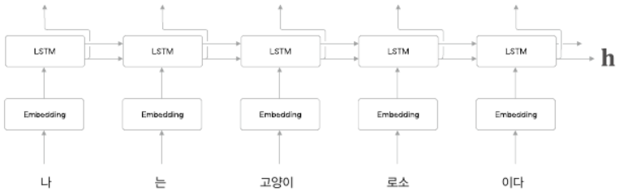


Encoder는 RNN을 이용해 시계열 데이터를 h라는 은닉 상태 벡터로 변환한다. RNN으로써 LSTM을 이용했고, 우리말 문장을 단어 단위로 쪼개 입력한다고 가정한다.

Encoder가 출력하는 벡터 h는 **LSTM 계층의 마지막 은닉 상태**이다. 이 마지막 은닉 상태 h에 입력 문장(출발어)을 번역하는 데 필요한 정보가 인코딩된다. 여기서 중요한 점은 LSTM의 은닉 상태 h는 고정 길이 벡터라는 사실이다. 그래서 인코딩한다라함은 결국 임의 길이의 문장을 고정 길이 벡터로 변환하는 작업이 된다. 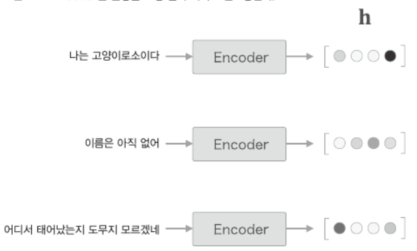

Encoder를 통해 나온 고정길이 벡터를 Decoder가 입력으로 받는다. 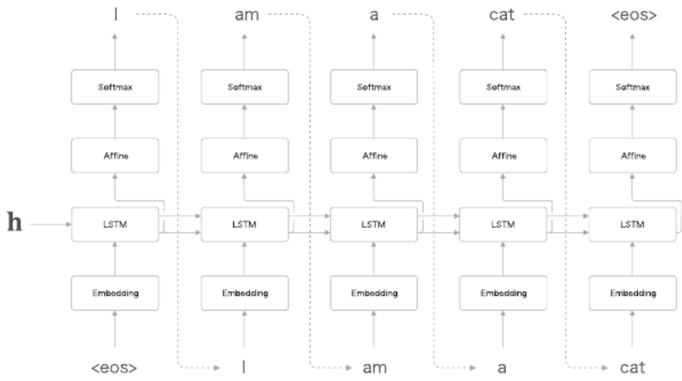

Decoder는 LSTM 계층이 벡터 h를 입력받는다는 점을 제외하고는 앞 절의 신경망과 완전히 같은 구성이다. ( 앞 절의 언어 모델에서는 LSTM 계층이 은닉 상태로 영벡터를 받았다 )


Decoder와 Encoder를 연결한 계층 구성을 보자 ( seq2sseq의 전체 계층 구성 )

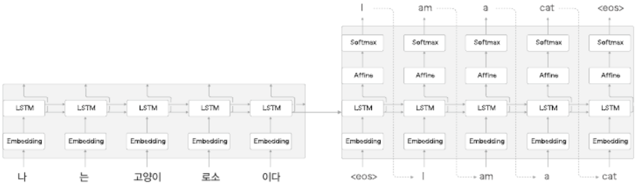

LSTM 계층의 은닉 상태(h)가 Encoder와 Decoder를 이어주는 "다리"가 되며, 순전파 때는 Encoder에서 인코딩 된 정보가 LSTM 계층의 은닉 상태를 통해 Decoder에 전해지고, 역전파 때는 이 "다리"를 통해 기울기가 Decoder로부터 Encoder로 전해진다.


### 7.2.2 시계열 데이터 변환용 장난감 문제

머신러닝을 평가하고자 만든 간단한 문제를 '장난감 문제'라고 한다.

'더하기'를 해보자. 

 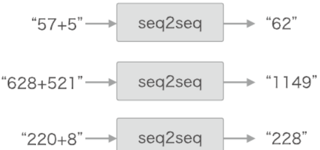

seq2seq는 덧셈의 예시로부터 사용되는 문자의 패턴을 학습한다. 과연 이런 식으로 해서 덧셈의 규칙을 올바르게 학습할 수 있는지가 관건이다.

이번 문제에서는 '단어'단위로 분할하지 않고, '문자'단위로 분할해보자.

ex) "57+5" 를 ['5', '7', '+', '5']로 처리한다.


### 7.2.3 가변 길이 시계열 데이터

'덧셈'을 문자의 리스트로써 다루기로 했지만 덧셈 문장이나 그 대답의 문자 수가 문제마다 다르다는 점을 주의해야 한다.

샘플마다 데이터의 시간 방향 크기가 다르다. 즉, '가변 길이 시계열 데이터'를 다뤄야 한다. 신경망 학습 시 '미니배치 처리'를 하려면 추가 처리가 필요하다.

가변길이 시계열 데이터를 미니배치로 학습하기 위한 방법:

- 패딩
  - 원래 데이터에 의미 없는 데이터를 채워 모든 데이터의 길이를 균일하게 맞추는 기법
  - 공백 문자를 통해 패딩한다면
    - 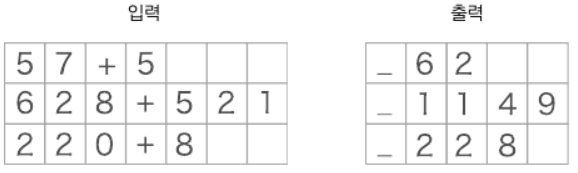
  - 입력, 정답 데이터에 패딩을 수행해 모든 샘플 데이터의 길이를 통일하고, 질문과 정답을 구분하기 위해 출력 앞에 구분자로 밑줄(`_`)을 붙인다. ( 구분자는 Decoder에 문자열을 생성하라고 알리는신호로 사용된다. )
  - 마스크
    - 원래 존재하지 않던 패딩용 문자까지 seq2seq가 처리하게 되므로 정확하지 않다. 따라서 seq2seq에 패딩 전용 처리를 추가해야 한다. ( Decoder에 입력된 데이터가 패딩이라면 손실의 결과에 반영하지 않도록 한다. Softmax with Loss 계층에 '마스크'기능을 추가해 해결할 수 있다. )
    - 또한 Encoder에 입력된 데이터가 패딩이라면 LSTM 계층이 이전 시각의 입력을 그대로 출력하게 한다. 그렇게 하면 LSTM 계층은 마치 처음부터 패딩이 존재하지 않았던 것처럼 인코딩할 수 있다.


### 7.2.4 덧셈 데이터셋

덧셈 데이터셋 텍스트 파일에는 덧셈 예가 총 50000개가 들어있고, '덧셈' 학습 데이터의 공백 문자는 회색 가운뎃점으로 표기한다.

이 책에서는 이와 같은 seq2seq용 학습 데이터(텍스트 파일)를 파이썬에서 쉽게 처리할 수 있도록 전용 모듈을 제공한다.

텍스트 파일을 파이썬에서 쉽게 처리할 수 있도록 전용 모듈(dataset/sequence.py)에는 load_data()와 get_vocab()이라는 2개의 메서드가 정의되어 있다. 

load_data(file_name, seed)는 file_name으로 지정한 텍스트 파일을 읽어 텍스트를 문자 ID로 변환하고, 이를 훈련 데이터와 테스트 데이터로 나눠 반환한다. 이 메서드는 훈련 데이터와 테스트 데이터로 나누기 전에 전체 데이터를 섞는다.

get_vocab() 메서드는 문자와 문자 ID의 대응 관계를 담은 딕셔너리를 반환한다. (char_to_id, id_to_char)

```python
import sys
sys.path.append('..')
from dataset import sequence

(x_train, t_train), (x_test, t_test) = \
    sequence.load_data('addition.txt', seed=1984)
char_to_id, id_to_char = sequence.get_vocab()

print(x_train.shape, t_train.shape)
print(x_test.shape, t_test.shape)
# (45000, 7) (45000, 5)
# (5000, 7) (5000, 5)

print(x_train[0])
print(t_train[0])
# [ 3  0  2  0  0 11  5]
# [ 6  0 11  7  5]

print(''.join([id_to_char[c] for c in x_train[0]]))
print(''.join([id_to_char[c] for c in t_train[0]]))
# 71+118
# _189
```

x_train과 t_train에는 "문자 ID"가 저장되어 있다. 또한 문자 ID와 문자의 대응 관계는 char_to_id와 id_to_char를 이용해 상호 변환이 가능하다.


## 7.3 seq2seq 구현

먼저 두 RNN을 Encoder 클래스와 Decoder 클래스로 각각 구현한 후 두 클래스를 연결하는 Seq2seq 클래스를 구현하는 흐름으로 진행한다.


### 7.3.1 Encoder 클래스

문자열을 받아 벡터 h로 변환하는 클래스.

 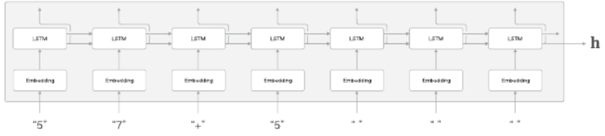

"57+5"를 문자 벡터로 변환하고 변환된 문자 벡터가 LSTM 계층으로 입력 된다.

LSTM 계층은 오른쪽(시간 방향)으로는 은닉 상태와 셀을 출력하고 위 쪽으로는 은닉 상태만 출력한다. 이 구성에서 더 위에는 다른 계층이 없으니 LSTM 계층의 위쪽 출력은 폐기된다. Encoder에서는 마지막 문자를 처리한 후 LSTM 계층의 은닉 상태 h를 출력하여 Decoder로 전달한다.

시간방향을 한꺼번에 처리하는 계층을 Time LSTM 계층이나 Time Embedding 계층으로 구현했다.

 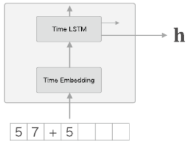

Encoder 클래스 코드 :

```python
class Encoder:
    def __init__(self, vocab_size, wordvec_size, hidden_size):
        V, D, H = vocab_size, wordvec_size, hidden_size
        rn = np.random.randn

        embed_W = (rn(V, D) / 100).astype('f')
        lstm_Wx = (rn(D, 4 * H) / np.sqrt(D)).astype('f')
        lstm_Wh = (rn(H, 4 * H) / np.sqrt(H)).astype('f')
        lstm_b = np.zeros(4 * H).astype('f')

        self.embed = TimeEmbedding(embed_W)
        self.lstm = TimeLSTM(lstm_Wx, lstm_Wh, lstm_b, stateful=False)

        self.params = self.embed.params + self.lstm.params
        self.grads = self.embed.grads + self.lstm.grads
        self.hs = None
```

- 초기화 메서드:
  - 인수
    - vocab_size : 어휘 수(문자의 종류)
    - wordvec_size : 문자 벡터의 차원 수
    - hidden_size : LSTM 계층의 은닉 상태 벡터의 차원 수
  - 역할
    - 가중치 매개변수 초기화
    - 필요한 계층 생성
    - 가중치 매개변수와 기울기를 인스턴스 변수 params와 grads 리스트에 각각 보관함
    - Time LSTM 계층이 상태를 유지하지 않기 때문에 stateful=False로 설정
      - 5장, 6장의 언어 모델은 '긴 시계열 데이터'가 하나뿐인 문제였기 때문에 은닉 상태를 유지한 채로 긴 시계열 데이터를 처리했다.
      - 이번에는 "짧은 시계열 데이터"가 여러 개인 문제이므로 문제마다 LSTM의 은닉 상태를 다시 초기화한 상태(영벡터)로 설정한다.


```python
    def forward(self, xs):
        xs = self.embed.forward(xs)
        hs = self.lstm.forward(xs)
        self.hs = hs
        return hs[:, -1, :]

    def backward(self, dh):
        dhs = np.zeros_like(self.hs)
        dhs[:, -1, :] = dh

        dout = self.lstm.backward(dhs)
        dout = self.embed.backward(dout)
        return dout
```

Encoder의 순전파에서는 Time Embedding 계층과 Time LSTM 계층의 forward() 메서드를 호출한다. 그리고 Time LSTM 계층의 마지막 시각의 은닉 상태만을 추출해, 그 값을 Encoder의 forward()메서드의 출력으로 반환한다.

Encoder의 역전파에서는 LSTM 계층의 마지막 은닉 상태에 대한 기울기가 dh 인수로 전해진다. 이 dh는 Decoder가 전해주는 기울기이다. 역전파 구현에서는 원소가 모두 0인 텐서 dhs를 생성하고 dh를 dhs의 해당 위치에 할당한다. 그 다음 Time LSTM 계층과 Time Embedding 계층의 backward() 메서드를 호출한다. 


### 7.3.2 Decoder 클래스

### 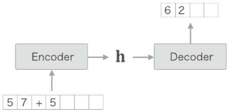

Decoder 클래스는 Encoder 클래스가 출력한 h를 받아 목적으로 하는 다른 문자열을 출력한다. 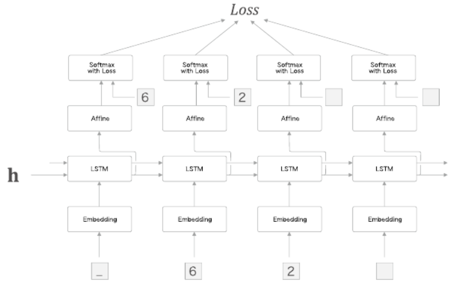

Decoder의 학습 시 정답 데이터는 `_62`이지만, 입력 데이터를 ['_', '6', '2', '']로 주고, 이에 대응하는 출력은 ['6', '2', '', '']이 되도록 학습시킨다.

또한 이번문제는 '덧셈'이므로 '결정적'인 답을 생성하고자 한다. 따라서 점수가 가장 높은 문자 하나만 고른다.

Decoder가 문자열을 생성시키는 흐름: argmax 노드는 Affine 계층의 출력 중 값이 가장 큰 원소의 인덱스(문자 ID)를 반환한다.

 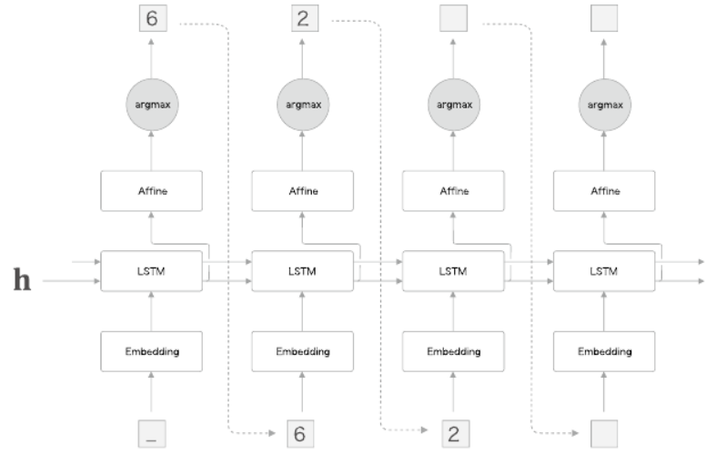

'argmax' 노드는 최댓값을 가진 원소의 인덱스(문자 ID)를 선택하는 노드이다. Afiine 계층이 출력하는 점수가 가장 큰 문자 ID를 선택한다.


Decoder에서는 학습 시와 생성 시에 Softmax 계층을 다르게 취급한다. 그러니 Softmax with Loss 계층은 이후에 구현하는 Seq2seq 클래스에서 처리하기로 하고, Decoder 클래스는 Time Softmax with Loss 계층의 앞까지만 담당하기로 한다.

 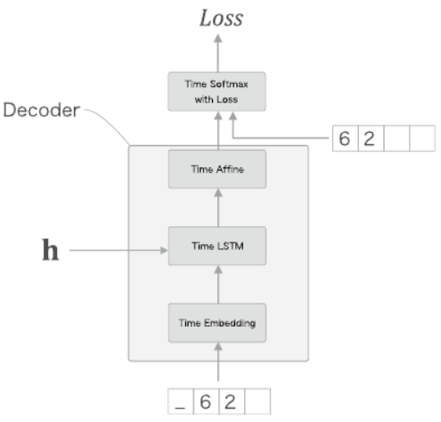

Time Embedding, Time LSTM, Time Affine의 3가지 계층으로 이뤄져있는 Decoder 클래스를 구현해보자.

```python
class Decoder:
    def __init__(self, vocab_size, wordvec_size, hidden_size):
        V, D, H = vocab_size, wordvec_size, hidden_size
        rn = np.random.randn

        embed_W = (rn(V, D) / 100).astype('f')
        lstm_Wx = (rn(D, 4 * H) / np.sqrt(D)).astype('f')
        lstm_Wh = (rn(H, 4 * H) / np.sqrt(H)).astype('f')
        lstm_b = np.zeros(4 * H).astype('f')
        affine_W = (rn(H, V) / np.sqrt(H)).astype('f')
        affine_b = np.zeros(V).astype('f')

        self.embed = TimeEmbedding(embed_W)
        self.lstm = TimeLSTM(lstm_Wx, lstm_Wh, lstm_b, stateful=True)
        self.affine = TimeAffine(affine_W, affine_b)

        self.params, self.grads = [], []
        for layer in (self.embed, self.lstm, self.affine):
            self.params += layer.params
            self.grads += layer.grads

    def forward(self, xs, h):
        self.lstm.set_state(h)

        out = self.embed.forward(xs)
        out = self.lstm.forward(out)
        score = self.affine.forward(out)
        return score

    def backward(self, dscore):
        dout = self.affine.backward(dscore)
        dout = self.lstm.backward(dout)
        dout = self.embed.backward(dout)
        dh = self.lstm.dh
        return dh
```


backward() 메서드는 위쪽의 Softmax with Loss 계층으로부터 기울기 dscore를 받아 Time Affine 계층, Time LSTM 계층, Time Embedding 계층 순서로 전파시킨다. 이 때 Time LSTM 계층의 시간 방향으로의 기울기는 TimeLSTM 클래스의 인스턴스 변수 dh에 저장되어 있다. 그래서 이 시간방향의 기울기 dh를 꺼내서 Decoder 클래스의 backward()의 출력으로 반환한다.


Decoder 클래스는 학습 시와 문장 생성 시의 동작이 다르다. 앞을 forward() 메서드는 학습할 때 사용된다고 가정했다. 다음으로는 Decoder 클래스에 문장 생성을 담당하는 generate() 메서드를 구현한다.

```python
    def generate(self, h, start_id, sample_size):
        sampled = []
        sample_id = start_id
        self.lstm.set_state(h)

        for _ in range(sample_size):
            x = np.array(sample_id).reshape((1, 1))
            out = self.embed.forward(x)
            out = self.lstm.forward(out)
            score = self.affine.forward(out)

            sample_id = np.argmax(score.flatten())
            sampled.append(int(sample_id))

        return sampled
```

generate() 메서드의 인수:

- h : Encoder로부터 받는 은닉 상태
- start_id : 최초로 주어지는 문자 ID
- sample_size : 생성하는 문자 수


### 7.3.3 Seq2seq 클래스

Encoder 클래스와 Decoder 클래스를 연결하고 Time Softmax with Loss 계층을 이용해 손실을 계산하는 Seq2seq 클래스를 구현해보자.

```python
class Seq2seq(BaseModel):
    def __init__(self, vocab_size, wordvec_size, hidden_size):
        V, D, H = vocab_size, wordvec_size, hidden_size
        self.encoder = Encoder(V, D, H)
        self.decoder = Decoder(V, D, H)
        self.softmax = TimeSoftmaxWithLoss()

        self.params = self.encoder.params + self.decoder.params
        self.grads = self.encoder.grads + self.decoder.grads

    def forward(self, xs, ts):
        decoder_xs, decoder_ts = ts[:, :-1], ts[:, 1:]

        h = self.encoder.forward(xs)
        score = self.decoder.forward(decoder_xs, h)
        loss = self.softmax.forward(score, decoder_ts)
        return loss

    def backward(self, dout=1):
        dout = self.softmax.backward(dout)
        dh = self.decoder.backward(dout)
        dout = self.encoder.backward(dh)
        return dout

    def generate(self, xs, start_id, sample_size):
        h = self.encoder.forward(xs)
        sampled = self.decoder.generate(h, start_id, sample_size)
        return sampled
```


### 7.3.4 seq2seq 평가

seq2seq의 학습은 기본적인 신경망의 학습과 같은 흐름으로 이뤄진다.

1. 학습 데이터에서 미니배치를 선택하고
2. 미니배치로부터 기울기를 계산하고
3. 기울기를 사용하여 매개변수를 갱신한다.

또한 매 에폭마다 seq2seq가 테스트 데이터를 풀게하여(문자열 생성을 수행하여) 학습 중간중간 정답률을 측정한다.

```python
import sys
sys.path.append('..')
import numpy as np
import matplotlib.pyplot as plt
from dataset import sequence
from common.optimizer import Adam
from common.trainer import Trainer
from common.util import eval_seq2seq
from seq2seq import Seq2seq
from peeky_seq2seq import PeekySeq2seq


# 데이터셋 읽기
(x_train, t_train), (x_test, t_test) = sequence.load_data('addition.txt')
char_to_id, id_to_char = sequence.get_vocab()

# 입력 반전 여부 설정 =============================================
is_reverse = False  # True
if is_reverse:
    x_train, x_test = x_train[:, ::-1], x_test[:, ::-1]
# ================================================================

# 하이퍼파라미터 설정
vocab_size = len(char_to_id)
wordvec_size = 16
hideen_size = 128
batch_size = 128
max_epoch = 25
max_grad = 5.0

# 일반=====================================
model = Seq2seq(vocab_size, wordvec_size, hideen_size)

optimizer = Adam()
trainer = Trainer(model, optimizer)

acc_list = []
for epoch in range(max_epoch):
    trainer.fit(x_train, t_train, max_epoch=1,
                batch_size=batch_size, max_grad=max_grad)

    correct_num = 0
    for i in range(len(x_test)):
        question, correct = x_test[[i]], t_test[[i]]
        verbose = i < 10
        correct_num += eval_seq2seq(model, question, correct,
                                    id_to_char, verbose, is_reverse)

    acc = float(correct_num) / len(x_test)
    acc_list.append(acc)
    print('검증 정확도 %.3f%%' % (acc * 100))

# 그래프 그리기
x = np.arange(len(acc_list))
plt.plot(x, acc_list, marker='o')
plt.xlabel('에폭')
plt.ylabel('정확도')
plt.ylim(0, 1.0)
plt.show()
```

평가 척도로 매 애폭마다 테스트 데이터의 문제 중 몇개를 풀게하여 올바르게 답했는지를 채점했다(정답률을 사용)


학습을 진행하면서 결과가 어떻게 변화해가는지 살펴보자

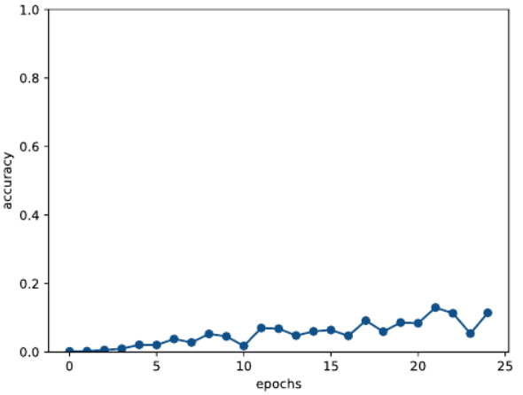

에폭을 거듭함에 따라 정답률이 착실하게 상승하는 것을 알 수 있다. 25에폭의 정답률은 10%이며, 그래프의 성장을 보면 학습을 거듭하면 더 정확해질 것 같다. 


## 7.4 seq2sseq 개선

같은 문제(덧셈 문제)를 더 잘학습할 수 있도록 seq2seq를 개선해보자.

### 7.4.1 입력 데이터 반전(Reverse)

입력 데이터의 순서를 반전시킨다.

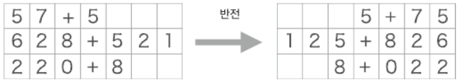

입력 데이터를 반전시키는 트릭은 많은 경우 학습 진행이 빨라져서, 결과적으로 최종 정확도도 좋아진다고 한다.

```python
(x_train, t_train), (x_text, t_test) = sequence.load_data('addition.txt')
x_train, x_text = x_train[:,::-1], x_test[:, ::-1]
```

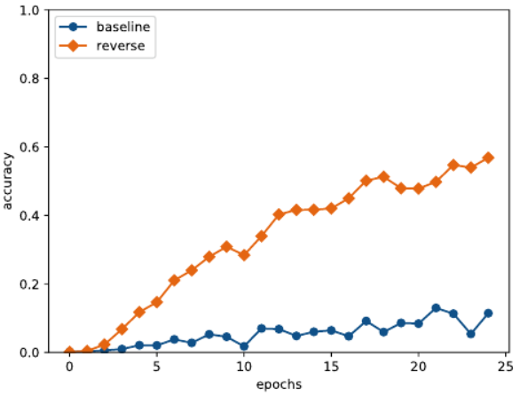

25 에폭에 이르자 정답률은 50% 정도까지 올랐다.

입력 데이터를 반전시키는 효과는 어떤 문제를 다루느냐에 따라 다르지만, 대부분 더 좋은 결과로 이어진다. (직관적으로 생각했을 때 그 이유는 기울기 전파가 원활해지기 때문이다.)

다만 입력 데이터를 반전해도 단어 사이의 '평균'적인 거리는 그대로이다.


### 7.4.2 엿보기(Peeky)

Encoder는 입력 문장(문제 문장)을 고정 길이 벡터 h로 변환한다. 이 때 h 안에는 decoder에게 필요한 정보가 모두 담겨있다. 즉 h가 decoder에 있어서는 유일한 정보이다. 그러나 현재의 seq2seq는 최초 시각의 LSTM 계층만이 벡터 h를 이용하고 있다.

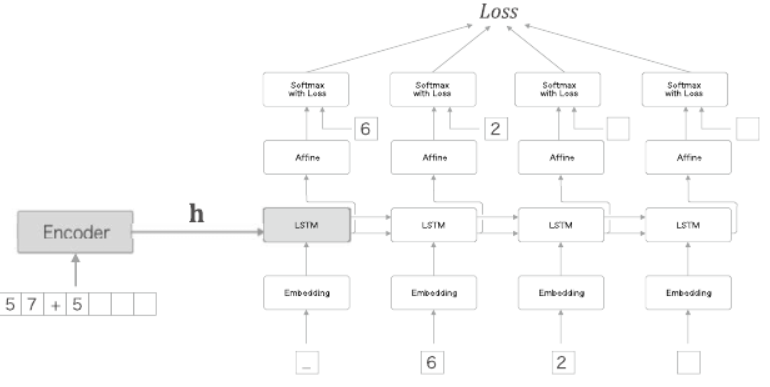

중요한 정보가 담긴 Encoder의 출력 h를 Decoder의 다른 계층에게도 전해주는 것이다. 

모든 시각의 Affine 계층과 LSTM 계층에 Encoder의 출력 h를 전해준다. 기존에는 하나의 LSTM 만이 소유하던 중요 정보 h를 여러 계층이 공유한다. 집단지성에 비유할 수 있다.

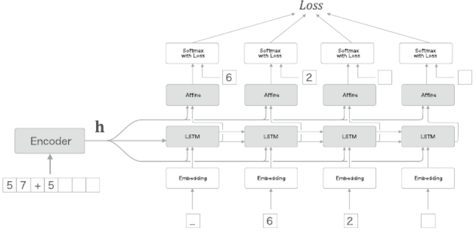

이제는 LSTM 계층과 Affine 계층에 입력되는 벡터가 2개씩이 되었고 이는 실제로 두 벡터가 연결된 것을 의미한다.

두 벡터를 연결시키는 concat 노드를 이용해 계산 그래프를 그리는 것이 정확하다.

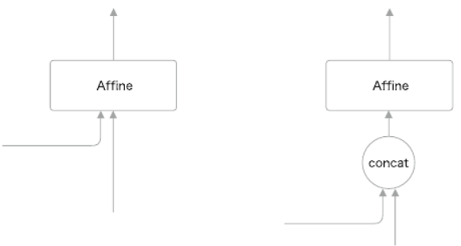

Peeky Decoder 클래스를 구현해보자. 

```python
class PeekyDecoder:
    def __init__(self, vocab_size, wordvec_size, hidden_size):
        V, D, H = vocab_size, wordvec_size, hidden_size
        rn = np.random.randn

        embed_W = (rn(V, D) / 100).astype('f')
        lstm_Wx = (rn(H + D, 4 * H) / np.sqrt(H + D)).astype('f')
        lstm_Wh = (rn(H, 4 * H) / np.sqrt(H)).astype('f')
        lstm_b = np.zeros(4 * H).astype('f')
        affine_W = (rn(H + H, V) / np.sqrt(H + H)).astype('f')
        affine_b = np.zeros(V).astype('f')

        self.embed = TimeEmbedding(embed_W)
        self.lstm = TimeLSTM(lstm_Wx, lstm_Wh, lstm_b, stateful=True)
        self.affine = TimeAffine(affine_W, affine_b)

        self.params, self.grads = [], []
        for layer in (self.embed, self.lstm, self.affine):
            self.params += layer.params
            self.grads += layer.grads
        self.cache = None

    def forward(self, xs, h):
        N, T = xs.shape
        N, H = h.shape

        self.lstm.set_state(h)

        out = self.embed.forward(xs) # embedding 계층 출력
        hs = np.repeat(h, T, axis=0).reshape(N, T, H) # hs
        out = np.concatenate((hs, out), axis=2) # hs와 embedding 계층 출력 연결

        out = self.lstm.forward(out)  # lstm에 연결
        out = np.concatenate((hs, out), axis=2) # hs와 LSTM 계층 출력을 연결

        score = self.affine.forward(out)
        self.cache = H
        return score
```

초기화 메서드는 LSTM 계층의 가중치와 Affine 계층의 가중치의 형상 말고는 앞절의 Decoder와 같다. 

forward 구현에서는 h를 np.repeat()로 시계열만큼 복제해 hs에 저장한다. np.concatenate()를 이용해 hs와 Embedding계층의 출력을 연결하고 이를 LSTM 계층에 입력한다.

마찬가지로 hs와 LSTM 계층의 출력을 연결한 것을 Affine 계층에 입력한다.


PeekySeq2seq를 구현해보자. 앞절의 Seq2seq클래스를 계승받아 Decoder 클래스를 PeekyDecoder로 바꾼다. 

```python
class PeekySeq2seq(Seq2seq):
    def __init__(self, vocab_size, wordvec_size, hidden_size):
        V, D, H = vocab_size, wordvec_size, hidden_size
        self.encoder = Encoder(V, D, H)
        self.decoder = PeekyDecoder(V, D, H)
        self.softmax = TimeSoftmaxWithLoss()

        self.params = self.encoder.params + self.decoder.params
        self.grads = self.encoder.grads + self.decoder.grads
```

모델을 변경하여 학습해보자.

```python
#엿보기(Peeky) 설정 =====================================
# model = Seq2seq(vocab_size, wordvec_size, hideen_size)
model = PeekySeq2seq(vocab_size, wordvec_size, hideen_size)
```

추가적으로 Reverse(입력 반전)도 적용하여 수행 결과:

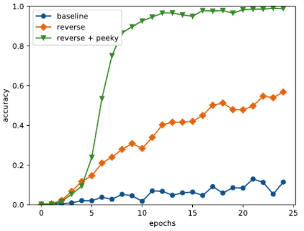

10에폭을 넘으면서 정답률이 이미 90%이며 최종적으로는 100%에 가까워 진다.

이처럼 실험 결과에서 Reverse와 Peeky가 함께 효과적으로 작동하는 것을 볼 수 있다.

Peeky를 이용하게 되면 신경망의 가중치 매개변수가 커져서 계산량도 늘어난다. 또한 seq2seq의 정확도는 하이퍼파라미터에 영향을 크게 받는다.


## 7.5 seq2seq를 이용하는 애플리케이션

seq2seq는 '한 시계열 데이터'를 '다른 시계열 데이터'로 변환한다. 이 시계열 데이터를 변환하는 프레임워크는 다양한 문제에 적용할 수 있다.

- 기계 번역 : '한 언어의 문장'을 '다른 언어의 문장'으로 변환
- 자동 요약 : '긴 문장'을 '짧게 요약된 문장'으로 변환
- 질의응답 : '질문'을 '응답'으로 변환
- 메일 자동 응답 : '받은 메일의 문장'을 '답변 글'로 변환

게다가 seq2seq가 적용될 수 없을 것 같은 문제라도 입력/출력 데이터를 전처리하면 seq2seq를 적용할 수 있는 경우도 있다.


### 7.5.1 챗봇

'상대의 말'을 '자신의 말'로 변환하는 문제로 볼 수있다.

IT 헬프데스크를 대상으로 seq2seq 기반 챗봇을 실험하여, 고객의 VPN 연결 문제를 해결한 사례가 있다.

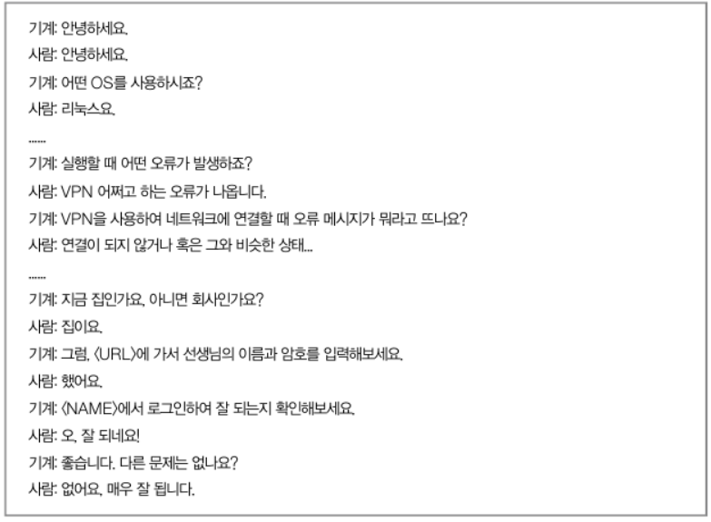

챗봇은 VPN 연결이 되지 않는 사람을 그 문제를 해결할 수 있는 URL 링크로 안내했다.


### 7.5.2 알고리즘 학습

원리적으로는 '덧셈'과 같은 간단한 문제가 아닌 더 고차원적인 문제도 처리할 수 있다. 파이썬 코드를 처리할 수도 있다.

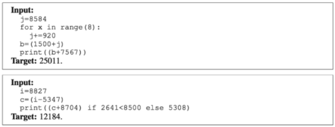

소스 코드도 문자로 쓰여진 시계열 데이터이다. 몇 줄에 걸친 코드라도 하나의 문장으로 처리할 수도 있다. (줄바꿈은 개행 코드로 처리할 수 있다). 

for문이나 if문이 포함된 문제는 일반적으로 잘 풀리지 않을 것이다. 그러나 이런 문제라도 seq2seq의 틀에서 처리할 수 있다. 그리고 seq2seq의 구조를 개선한다면 이런 문제도 결국 풀어낼 것이다.


### 7.5.3 이미지 캡셔닝

seq2seq는 텍스트 외에도, 이미지나 음성 등 다양한 데이터를 처리할 수 있다.

이미지 캡셔닝은 '이미지'를 '문장'으로 변환한다.

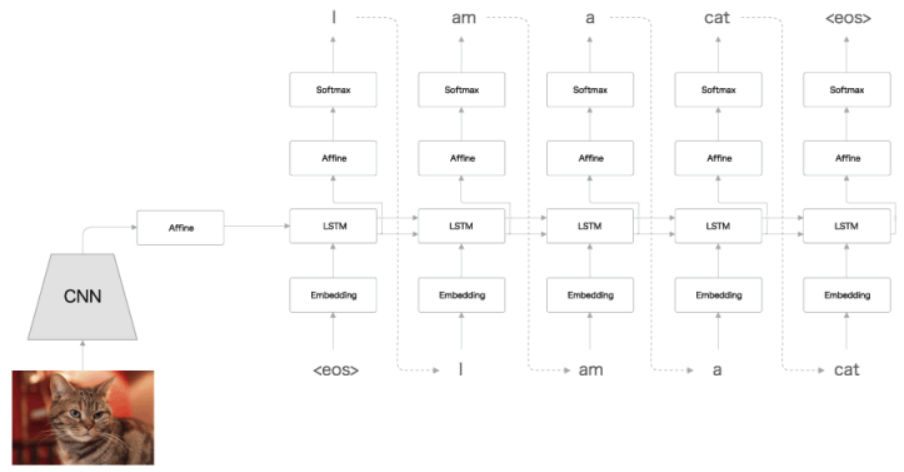

 Encoder가 LSTM이 아닌 CNN으로 바뀌었다. 이것으로 seq2seq는 이미지도 처리할 수 있게 된다.

이 예에서는 이미지의 인코딩을 CNN이 수행한다. 이 때 CNN의 최종 출력은 특징 맵이다. 특징 맵은 3차원(높이,폭,채널)이므로 이를 Decoder의 LSTM이 처리할 수 있도록 수정해야한다. 그래서 CNN의 특징 맵을 1차원으로 평탄화(flattening)한 후 완전연결인 Affine 계층에서 변환한다. 그 다음 변환된 데이터를 Decoder에 전달하면 지금까지와 같은 문장 생성을 수행할 수 있다. ( CNN에는 VGG나 ResNet 등의 입증된 신경망을 사용하고, 가중치로는 다른 이미지 데이터셋(ImageNet 등)으로 학습을 끝낸 것을 이용한다.)

im2txt라는 텐서플로 코드로 생성된 예시

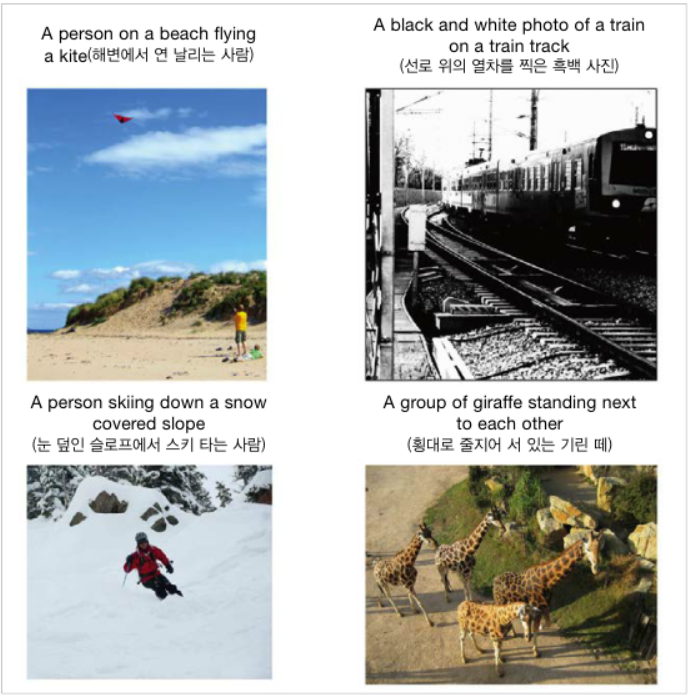


## 7.6 정리

- RNN을 이용한 언어 모델은 새로운 문장을 생성할 수 있다.
- 문장을 생성할 때는 하나의 단어(혹은 문자)를 주고 모델의 출력(확률분포)에서 샘플링하는 과정을 반복한다.
- RNN을 2개 조합함으로써 시계열 데이터를 다른 시계열 데이터로 변환할 수 있다.
- seq2seq는 Encoder가 출발어 입력문을 인코딩하고, 인코딩된 정보를 Decoder가 받아 디코딩하여 도착어 출력문을 얻는다.
- 입력문을 반전시키는 기법(Reverse), 또는 인코딩된 정보를 Decoder의 여러 계층에 전달하는 기법(Peeky)은 seq2seq의 정확도 향상에 효과적이다.
- 기계 번역, 챗봇, 이미지 캡셔닝 등 seq2seq는 다양한 애플리케이션에 이용할 수 있다.

