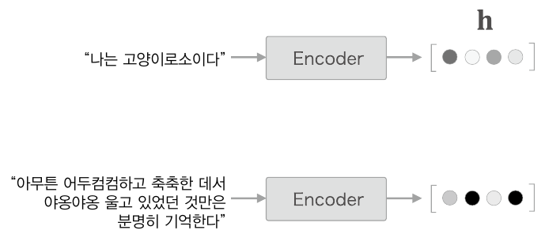
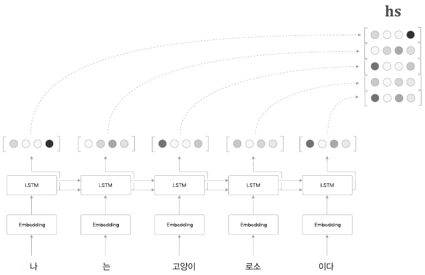
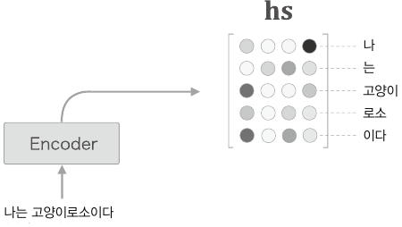

# CHAPTER8_어텐션

## 8.1 어텐션의 구조

### 8.1.1 seq2seq의 문제점

seq2seq에서는 Encoder가 시계열 데이터를 인코딩하고, 그 인코딩된 정보를 Decoder로 전달한다. 이 때 Encoder의 출력은 '고정 길이 벡터'였다. 

하지만 '고정 길이'벡터는 입력 문장의 길이에 관계없이(아무리 길어도), 항상 같은 길이의 벡터로 변환한다는 뜻이다. 즉, 아무리 긴 문장이 입력되더라도 항상 똑같은 길이의 벡터에 밀어넣어야 한다. 그래서 이 '고정 길이 벡터'라는 점이 문제가 된다.

 

### 8.1.2 Encoder 개선

Encoder 출력의 길이를 입력 문장의 길이에 따라 바꿔주자.

각 시각(각 단어)의 은닉 상태 벡터를 모두 이용하면 입력된 단어와 같은 수의 벡터를 얻을 수 있다. 이것으로 Encoder는 '하나의 고정 길이 벡터'라는 제약을 해제한다.

여기서 주목할 점으로는 LSTM 계층의 은닉 상태의 '내용'이다. 시각별 LSTM 계층의 은닉 상태에는 직전에 입력된 단어에 대한 정보가 많이 포함되어있다. 그래서 Encoder가 출력하는 hs 행렬은 각 단어에 해당하는 벡터들의 집합이라고 볼 수 있다.

단지 Encoder의 은닉 상태를 모든 시각만큼 꺼냈을 뿐이지만 이 작은 개선 덕분에 Encoder는 입력 문장의 길이에 비례한 정보를 인코딩할 수 있게 된다.

### 8.1.3 Decoder 개선 1

