# CHAPTER8_어텐션


## 8.1 어텐션의 구조


### 8.1.1 seq2seq의 문제점

seq2seq에서는 Encoder가 시계열 데이터를 인코딩하고, 그 인코딩된 정보를 Decoder로 전달한다. 이 때 Encoder의 출력은 '고정 길이 벡터'였다. 

하지만 '고정 길이'벡터는 입력 문장의 길이에 관계없이(아무리 길어도), 항상 같은 길이의 벡터로 변환한다는 뜻이다. 즉, 아무리 긴 문장이 입력되더라도 항상 똑같은 길이의 벡터에 밀어넣어야 한다. 그래서 이 '고정 길이 벡터'라는 점이 문제가 된다.

 


### 8.1.2 Encoder 개선

Encoder 출력의 길이를 입력 문장의 길이에 따라 바꿔주자.


각 시각(각 단어)의 은닉 상태 벡터를 모두 이용하면 입력된 단어와 같은 수의 벡터를 얻을 수 있다. 이것으로 Encoder는 '하나의 고정 길이 벡터'라는 제약을 해제한다.


여기서 주목할 점으로는 LSTM 계층의 은닉 상태의 '내용'이다. 시각별 LSTM 계층의 은닉 상태에는 직전에 입력된 단어에 대한 정보가 많이 포함되어있다. 그래서 Encoder가 출력하는 hs 행렬은 각 단어에 해당하는 벡터들의 집합이라고 볼 수 있다.


단지 Encoder의 은닉 상태를 모든 시각만큼 꺼냈을 뿐이지만 이 작은 개선 덕분에 Encoder는 입력 문장의 길이에 비례한 정보를 인코딩할 수 있게 된다.


### 8.1.3 Decoder 개선 1

Encoder는 각 단어에 대응하는 LSTM 계층의 은닉 상태 벡터를 hs로 모아 출력한다. 이 hs가 Decoder에 전달되어 시게열 변환이 이뤄진다.

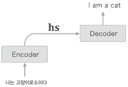

앞 장에서는 Encoder가 hs에서 마지막 줄만 빼내어 Decoder에 전달하였다.

이번에는 이 hs 전부를 활용할 수 있도록 Decoder를 개선해보자.


인간은 '어떤 단어(혹은 단어의 집합)'에 주목하여 그 단어의 변환을 수시로 한다. 그렇다면 seq2seq에서는 '입력과 출력의 여러 단어 중 어떤 단어끼리 서로 관련되어 있는가' 라는 대응 관계를 seq2seq에게 학습시켜보자.

목표는 '도착어 단어'와 대응 관계에 있는 '출발어 단어'의 정보를 골라내는 것. 그리고 그 정보를 이용하여 번역을 수행하는 것이다. 

즉, 필요한 정보에만 주목하여 그 정보로부터 시게열 변환을 수행하는 것이 목표이다.

이 구조를 어텐션이라고 부른다.


어텐션의 전체 틀

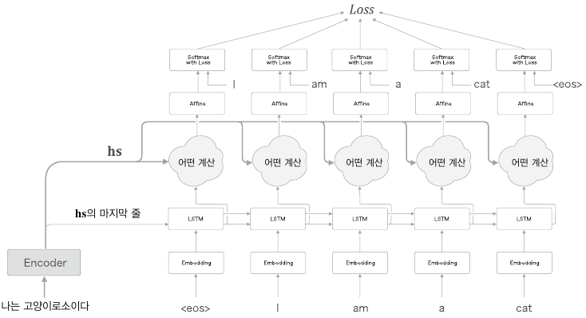

새롭에 '어떤 계산'을 수행하는 계층을 추가한다. 현재까지는 Encoder의 마지막 은닉 상태 벡터는 Decoder의 첫 번째 LSTM 계층에 전달한다.

- '어떤 계산'의 입력:
  - Encoder로부터 받는 hs
  - 시각별 LSTM 계층의 은닉 상태
- '어떤 계산'이 하는 일:
  - 필요한 정보만 골라 위쪽의 Affine 계층으로 출력


그러나 신경망으로 하고 싶은 일은 단어들의 얼라인먼트 추출이다. 각 시각에서 Decoder에 입력된 단어와 대응 관계인 단어의 벡터를 hs에서 골라내겠다는 뜻이다.

- 얼라인먼트 : 단어(혹은 문구)의 대응 관계를 나타내는 정보. 지금까지는 주로 사람이 수작업으로 만들었다. 어텐션 기술은 얼라인먼트라는 아이디어를 seq2seq에 자동으로 도입하는데 성공했다.

예를 들면 Decoder가 "I"를 출력할 때, hs에서 "나"에 대응하는 벡터를 선택하면 된다. 그리고 이러한 '선택' 작업을 '어떤 계산'으로 하려한다. 하지만 선택하는 작업 (여러 대상으로부터 몇 개를 선택하는 작업)은 미분할 수 없다는 문제가 생긴다.

'하나를 선택'하는 게 아니라, '모든 것을 선택'한다는 아이디어로 '선택한다'라는 작업을 미분 가능한 연산으로 대체할 수 있다. 또한 각 단어의 중요도(기여도)를 나타내는 '가중치'를 별도로 계산하도록 한다.

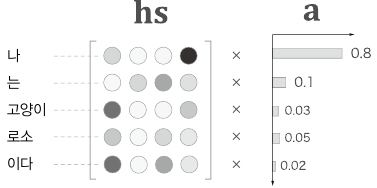

위 그림에서 보듯, 여기에서는 각 단어의 중요도를 나타내는 '가중치'(기호 a)를 이용한다. a는 확률분포처럼 각 원소가 0~1 사이의 스칼라이며, 모든 원소의 총합은 1이 된다. 각 단어의 중요도를 나타내는 가중치 a와 각 단어의 벡터 hs로부터 가중치합을 구하여 우리가 원하는 벡터를 얻는다.

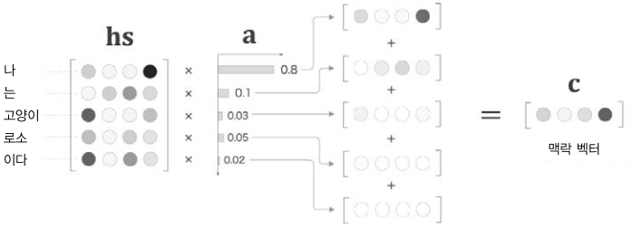

단어 벡터의 가중합을 계산한다. 이 결과를 '맥락 벡터'(기호 c)라고 부른다.

'나'에 대응하는 가중치가 0.8이다. 이것은 맥락 벡터 c에는 '나' 벡터의 성분이 많이 포함되어있다는 것을 의미한다. 즉, '나' 벡터를 '선택'하는 작업을 이 가중합으로 대체하고 있다.


Encoder가 출력하는 hs와 각 단어의 가중치a를 적당하게 작성하고, 그 가중합을 구하는 구현

```python
import numpy as np
T, H = 5, 4
hs = np.random.rand(T, H)
a = np.array([0.8, 0.1, 0.03, 0.05, 0.02])

ar = a.reshape(5,1).repeat(4, axis=1)
print(ar.shape)

t = hs * ar
print(t.shape)

c = np.sum(t, axis=0)
print(c.shape)
```

시계열의 길이 T=5, 은닉 상태 벡터의 원소 수 H=4 로 하여 가중합을 구하는 과정을 보여준다. 

ar = a.reshape(5,1).repeat(4, axis=1) 코드 설명:

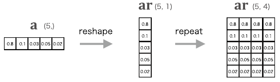

이 코드는 ar = hs * a.reshape(5,1) 와 같다. ( = 넘파이의 브로드캐스트 )

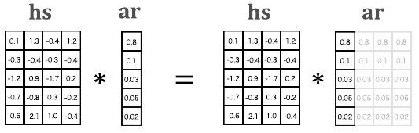

구현 효율은 넘파이의 브로드캐스트가 더 좋다.

계산 그래프로는 Repeat 노드에 해당한다.

따라서 역전파 때는 Repeat 노드의 역전파를 수행해야 한다.


원소별 곱 계산 이후에는 `c = np.sum(hs * ar, axis=0)` 코드로 합을 구한다. ( (X, Y, Z) 형상을 가진 x의 np.sum(x, axis=1)의 결과는 (X, Z) 이다. 1번째 축(Y)이 사라진다. )


다음으로는 미니배치 처리용 가중합을 구현한다.

```python
N, T, H = 10, 5, 4
hs = np.random.randn(N, T, H) # 일단 무작위 생성
a = np.random.randn(N, T) # 일단 무작위 생성
ar = a.reshape(N, T, 1).repeat(H, axis=2)
# ar = a.reshape(N, T, 1) # 브로드캐스트를 사용하는 경우

t = hs * ar
print(t.shape)
# (10, 5, 4)

c = np.sum(t, axis=1)
print(c.shape)
# (10, 4)
```

미니배치 처리는 이전 구현과 거의 같다.


가중합 계산을 '계산 그래프'로 그려보자.

 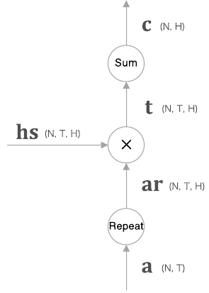

`Repeat` 노드를 사용해 a를 복제하고, `x` 노드로 원소별 곱을 계산한 다음, `sum` 노드로 합을 구한다. 

위의 "맥락 벡터를 구하는 Weight Sum 계층" 의 구현 :

```python
class WeightSum:
    def __init__(self):
        self.params, self.grads = [], []
        self.cache = None
        
    def forward(self, hs, a):
        N, T, H = hs.shape
        
        ar = a.reshape(N, T, 1).repeat(H, axis=2)
        t = hs * ar
        c = np.sum(t, axis=1)
        
        self.cache = (hs, ar)
        return c
    
    def backward(self, dc):
        hs, ar = self.cache
        N, T, H = hs.shape
        
        dt = dc.reshape(N, 1, H).repeat(T, axis=1) # sum의 역전파
        dar = dt * hs
        dhs = dt * ar
        da = np.sum(dar, axis=2) # repeat의 역전파
        
        return dhs, da
```


### 8.1.4 Decoder 개선_2

각 단어의 중요도( 가중치 a )의 가중합을 이용해 '맥락 벡터'를 얻을 수 있다는 것을 알았다. 이 가중치 a는 어떻게 구해야 할까? ㅡ> 데이터로부터 자동으로 학습할 수 있도록 해보자.


우선 Decoder의 첫 번째 LSTM 계층이 은닉 상태 벡터를 출력할 때까지의 처리를 알아봐야 한다.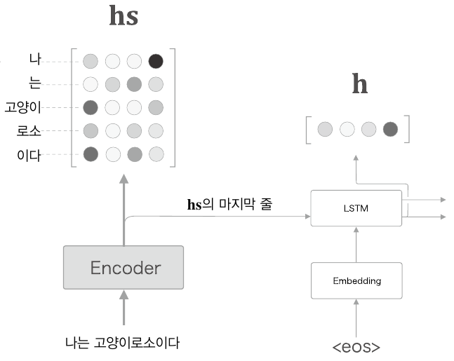

Decoder의 LSTM 계층의 은닉 상태 벡터를 h가 hs의 각 단어 벡터와 얼마나 비슷한가를 수치로 나타내는 것이 목표이다. 여러 가지 방법 중 가장 단순한 방법인 "벡터의 내적"을 이용해보자. 내적의 직관적인 의미는 "두 벡터가 얼마나 같은 방향을 향하고 있는가"이다. 따라서 두 벡터의 '유사도'를 표현하는 척도로 내적을 이용할 수 있다.


결과로 나온 "h와 hs의 각 단어 벡터와의 유사도"(s)는 정규화하기 전의 값이며, '점수'라고도 한다.

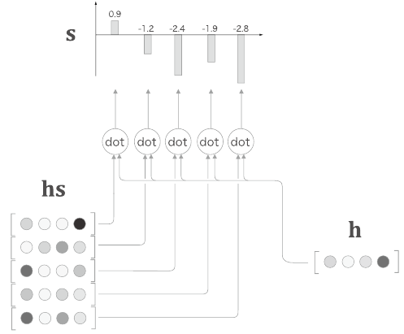


이후 이 s에 소프트맥스 함수를 적용하여 정규화를 한다.

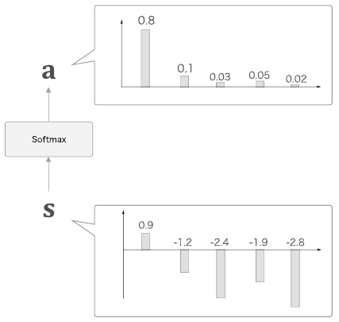


지금까지의 과정을 구현( 미니배치 처리를 수행 ) :

```python
from common.layers import Softmax
import numpy as np

N, T, H = 10, 5, 4
hs = np.random.randn(N, T, H)
h = np.random.randn(N, H)
hr = h.reshape(N, 1, H).repeat(T, axis=1)
# hr = h.reshape(N, 1, H) # 브로드캐스트를 사용하는 경우

t = hs * hr
print(t.shape)
# (10, 5, 4)

s = np.sum(t, axis=2)
print(s.shape)
# (10, 5)

softmax = Softmax()
a = softmax.forward(s)
print(a.shape)
# (10, 5)
```


각 단어의 가중치 a를 구하는 과정의 계산 그래프

 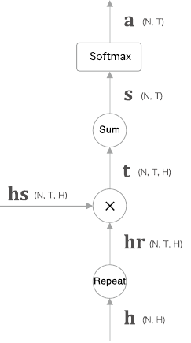

계산 그래프는 `Repeat`노드, 원소별 곱을 뜻하는 `x` 노드, `Sum` 노드, `Softmax`계층으로 구성된다. ( AttentionWeight 클래스로 구현 )

```python
# ch08/attention_layer.py
```


### 8.1.5 Decoder 개선_3

개선안 두 가지 (Attention Weight 계층, Weight Sum 계층)을 하나로 결합해보자.


맥락 벡터를 구하는 계산 그래프의 전체 모습:

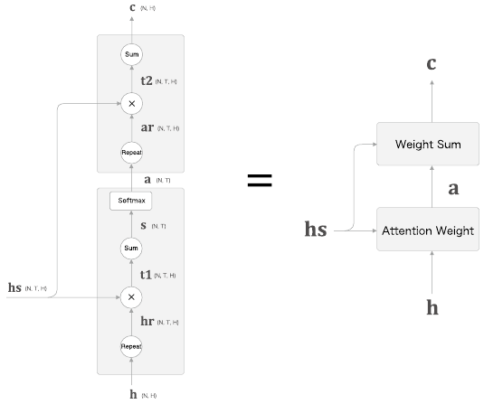

Attention Weight 계층은 Encoder가 출력하는 각 단어의 벡터 hs에 주목하여 해당 단어의 가중치 a를 구한다. 이어서 Weight Sum 계층이 a와 hs의 가중합을 구하고, 그 결과를 맥락 벡터 c로 출력한다. 이 일련의 계싼을 수행하는 계층을 Attention 계층이라고 부른다.

결국 핵심은 Encoder가 건네주는 정보 hs에서 중요한 원소에 주목하여, 그것을 바탕으로 맥락 벡터를 구해 위쪽 계층으로 전파한다는 것이다.

```python
# ch08/attention_layer.py
```

각 단어의 가중치를 나중에 참조할 수 있도록 attention_weight 라는 인스턴스 변수에 저장한다. 이제 이 Attention 계층을 LSTM 계층과 Affine 계층 사이에 삽입하면 된다.

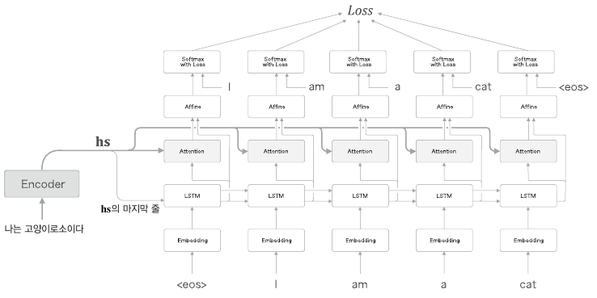

각 시각의 Attention 계층에는 Encoder의 출력인 hs가 입력된다. 또 여기에서는 LSTM 계층의 은닉 상태 벡터를 Affine 계층에 입력한다. 이는 앞 장에서 본 Decoder의 개선으로부터 자연스럽게 확장된 것으로 볼 수 있다. 밑의 그림 처럼 앞 장의 Decoder에 어텐션 정보를 '추가'할 수 있기 때문이다.

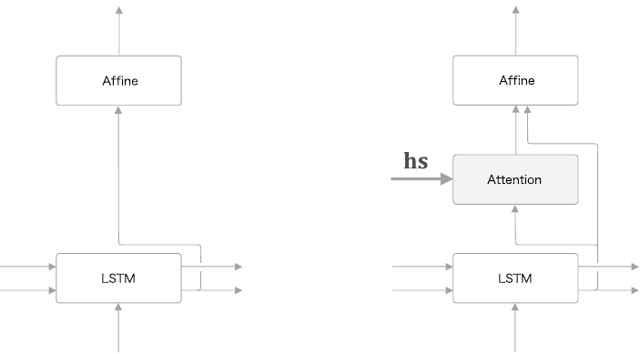

앞 장의 Decoder에 Attention 계층이 구한 맥락 벡터 정보를 '추가'한 것으로 생각할 수 있다. Affine 계층에는 기존과 마찬가지로 LSTM 계층의 은닉 상태 벡터를 주고, 여기에 더해 Attention 계층의 맥락 벡터까지 입력하는 것이다.


시계열 방향으로 펼쳐진 다수의 Attention 계층을 Time Attention 계층으로 모아 구현하자.

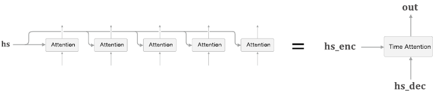

Time Attention 계층은 다수의 Attention 계층을 모았을 뿐이다.

```python
# ch08/attention_layer.py
```


Attention 계층을 필요한 수 만큼 만들고 (코드에서는 T개), 각각이 순전파와 역전파를 수행한다. 각 Attention 계층의 각 단어의 가중치를 attention_weights 리스트에서 보관한다.


## 8.2 어텐션을 갖춘 seq2seq 구현

어텐션을 갖춘 seq2seq를 구현해보자.


### 8.2.1 Encoder 구현

```python
# ch08/attention_seq2seq.py
```


### 8.2.2 Decoder 구현

어탠션을 이용한 Decoder의 계층 구성

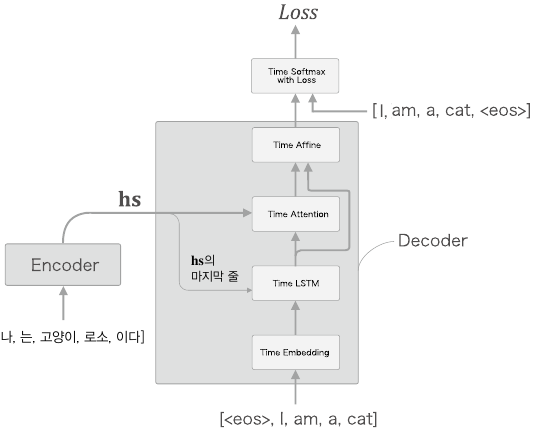

Time Softmax with Loss 계층의 앞까지를 Decoder로 구현해보자.

순전파, 역전파 메서드 뿐만 아니라 새로운 단어열을 생성하는 generate() 메서드도 추가한다.

```python
# ch08/attention_seq2seq.py
```

forward() 메서드에서 Time Attention 계층의 출력과 LSTM 계층의 출력을 연결한다는 점만 주의하자. 두 출력을 연결할 때는 np.concatenate() 메서드를 사용한다.


### 8.2.3 seq2seq 구현

AttentionSeq2seq 클래스의 구현.

앞 장의 Seq2seq와의 차이점은 Encoder 대신 AttentionEncoder클래스, Decoder 대신 AttentionDecoder 클래스를 사용하는 것이다. 따라서 앞 장의 Seq2seq 클래스를 상속 후 초기화 메서드를 수정한다.

```python
from ch07.seq2seq import Encoder, Seq2seq

class AttentionSeq2seq(Seq2seq):
    def __init__(self, vocab_size, wordvec_size, hidden_size):
        args = vocab_size, wordvec_size, hidden_size
        self.encoder = AttentionEncoder(*args)
        self.decoder = AttentionDecoder(*args)
        self.softmax = TimeSoftmaxWithLoss()
        
        self.params = self.encoder.params + self.decoder.params
        self.grads = self.encoder.grads + self.decoder.grads
```


## 8.3 어텐션 평가

AttentionSeq2seq 클래스를 사용해 현실적인 문제에 도전해보자.

'날짜 형식'을 변경하는 문제(데이터 크기가 작고, 어느 쪽인가를 맞추는 인위적인 문제)로 어텐션을 갖춘 seq2seq의 효과를 확인해보자.


### 8.3.1 날짜 형식 변환 문제

영어권에서 사용되는 다양한 날짜 형식을 표준 형식으로 변환하는 것이 목표이다.

ex) "september 27, 1994" ㅡ> "1994-09-27" 같은 표준 형식으로 변환


날짜 형식 변환 문제를 채용한 데는 두 가지 이유가 있다.

- 겉보기만큼 간단하지 않다. 입력되는 날짜 데이터에는 다양한 변형이 존재하여 변환 규칙이 복잡해진다.
- 문제의 입력(질문)과 출력(답변) 사이에 알기 쉬운 대응 관계가 있다. ( 연, 월, 일의 대응 관계가 존재 ) 따라서 어텐션이 각각의 원소에 올바르게 주목하고 있는지를 확인할 수 있다.

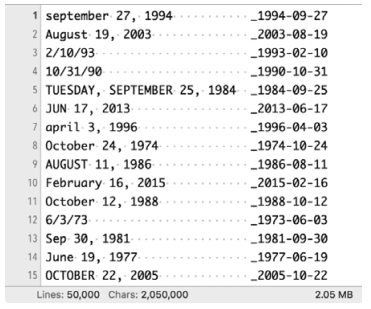

데이터셋(dataset/date.txt)은 입력 문장의 길이를 통일하기 위해 공백 문자로 패딩해뒀고, 입력과 출력의 구분 문자로는 `_`(밑줄)을 사용하였다. 출력의 문자 수는 일정하기 때문에 출력의 끝을 알리는 구분 문자는 따로 사용하지 않는다.


### 8.3.2 어텐션을 갖춘 seq2seq의 학습

날짜 변환용 데이터셋으로 AttentionSeq2seq를 학습시켜보자.

```python
# ch08/train.py
```


입력 문장을 반전시키는 기법( Reverse )도 적용했다.