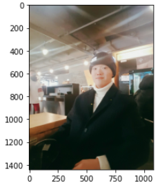

# 밑바닥부터 시작하는 딥러닝 1권

## CHAPTER 1: 헬로 파이썬

### 1.4 파이썬 스크립트 파일

#### 1.4.2 클래스:

개발자가 직접 클래스를 정의하면 독자적인 자료형을 만들 수 있다. 또한 클래스에는 그 클래스만의 전용 함수(메서드)와 속성을 정의할 수도 있다.

```python
class 클래스 이름:
    def __init__(self, 인수, ...):   #생성자
        # 코드
    def 메서드 이름1(self, 인수, ...):   # 메서드 1
        # 코드
    def 메서드 이름2(self, 인수, ...):   # 메서드 2
```

클래스의 정의에는 `__init__`라는 특별한 메서드가 있는데, 클래스를 초기화하는 방법을 정의한다. 이 초기화용 메서드를 생성자(constructor)라고 하며, 클래스의 인스턴스가 만들어질 때 한번만 불린다. 특히 파이썬에서는 메서드의 첫 번째 인수로 자기 자신(자신의 인스턴스)을 나타내는 self를 명시적으로 쓰는 것이 특징이다.

ex)

```python
class Man:
    def __init__(self, name):
        self.name = name
        print("Initialized!")
        
    def hello(self):
        print("Hello " + self.name + "!")
        
    def goodbye(self):
        print("Good-bye " + self.name + "!")
        
m = Man("David")
m.hello()
m.goodbye()

# 결과:
# Initialized!
# Hello David!
# Good-bye David!
```

Man 이라는 새로운 클래스를 정의했다. 그리고 Man 클래스에서 m이라는 인스턴스(객체)를 생성한다. Man의 생성자(초기화 메서드)는 name이라는 인수를 받고, 그 인수로 인스턴스 변수인 self.name을 초기화한다. `인스턴스 변수`는 인스턴스별로 저장되는 변수이다. 파이썬에서는 self.name 처럼 self 다음에 속성 이름을 써서 인스턴스 변수를 작성하거나 접근할 수 있다.


### 1.5 넘파이

#### 1.5.2 넘파이 배열 생성하기

넘파이 배열 생성하기: np.array()

```python
import numpy as np
x = np.array([1.0, 2.0, 3.0])
print(x, type(x))
# 결과:
# [1. 2. 3.] <class 'numpy.ndarray'>
```


#### 1.5.3 넘파이의 산술 연산

- 넘파이 배열 산술 연산 예시

```python
x = np.array([1.0, 2.0, 3.0])
y = np.array([4.0, 5.0, 6.0])
print(x+y)
print(x-y)
print(x*y)
print(x/y)

# 결과:
# [5. 7. 9.]
# [-3. -3. -3.]
# [ 4. 10. 18.]
# [0.25 0.4  0.5 ]
```

배열 x와 y의 원소수가 같다. 즉, 원소별(element-wise) 연산이다. 원소 수가 다르면 오류가 발생한다.

```python
x = np.array([1.0, 2.0, 3.0, 4.0])
y = np.array([4.0, 5.0, 6.0])
print(x+y)

# 결과:
# ValueError: operands could not be broadcast together with shapes (4,) (3,)
```


#### 1.5.4 넘파이의 N차원 배열

```python
A = np.array([[1, 2], [3, 4]])
print(A)
# 결과:
# [[1 2]
#  [3 4]]

print(A.shape)  # 행렬의 형상 확인
# (2, 2)

print(A.dtype)  # 행렬에 담긴 원소의 자료형 확인
# int32

B = np.array([[3, 0], [0, 6]])
A + B
# 형상이 같은 행렬끼리면 행렬의 산술 연산도 대응하는 원소별로 계산됨.
# array([[ 4,  2],
#        [ 3, 10]])

A * B
# [[ 3  0]
#  [ 0 24]]
```

#### 1.5.5 브로드캐스트

원소별 연산 뿐만 아니라 넘파이 배열이나 수치 하나(스칼라값)의 조합으로 된 산술 연산도 할 수 있다. 이 경우 스칼라값과의 계산이 넘파이 배열의 원소별로 한 번씩 수행된다. 이 기능을 `브로드캐스트`라고 한다. `브로드캐스트` 기능을 활용하면 형상이 다른 배열끼리의 연산을 스마트하게 할 수 있다.

- 행렬에 스칼라값을 연산하기

```python
#브로드캐스트
A = np.array([[1, 2], [3, 4]])
A * 10
# array([[10, 20],
#        [30, 40]])
```

형상이 다른 배열끼리도 계산할 수 있다.

```python
A = np.array([[1,2], [3,4]])
B = np.array([10, 20])
A * B
# 결과:
# array([[10, 40],
#        [30, 80]])

# B가 np.array([10, 20], [10, 20]) 로 변형된 후 원소별 연산이 이루어짐
```


#### 1.5.6 원소 접근

- 인덱스 접근 방법: (원소의 인덱스는 0부터 시작한다.)

```python
X = np.array([[51, 55], [14, 19], [0, 4]])
print(X)
# 결과: 
# [[51 55]
#  [14 19]
#  [ 0  4]]

X[0]
# array([51, 55])

X[0][1]
# 55

# < for문 활용한 원소접근 >
for row in X:
    print(row)
    
#결과:
# [51 55]
# [14 19]
# [0 4]
```

- 인덱스를 배열로 지정해 한 번에 여러 원소에 접근하는 방법:

```python
X = X.flatten()
print(X)
# 결과: 
# [51 55 14 19  0  4]

X[np.array([0,2,4])]
# 결과: 
# array([51, 14,  0])
```

- 특정 조건을 만족하는 원소만 접근

```python
X > 15
# 결과: bool 배열
# array([ True,  True, False,  True, False, False])

X[X>15]
# 결과: bool 배열을 사용하여 배열 X의 원소 꺼냄
# array([51, 55, 19])
```

### 1.6 matplotlib

`matplotlib`은 그래프 시각화 라이브러리이다.

#### 1.6.1 단순한 그래프 그리기

- pyplot 활용

```python
import numpy as np
import matplotlib.pyplot as plt

# sin 함수 데이터 준비
x = np.arange(0, 6, 0.1)  # 0부터 6까지 0.1 간격으로 생성
y = np.sin(x)         # sin 함수

# sin 함수 그래프 그리기
plt.plot(x,y)   # 그래프를 그린다.
plt.show()      # 그래프를 화면에 출력한다.
```


#### 1.6.2 pyplot의 기능

```python
# sin, cos 함수 데이터 준비
x = np.arange(0, 6, 0.1)
y1 = np.sin(x)
y2 = np.cos(x)

# sin, cos 함수 그래프 그리기
plt.plot(x, y1, label = "sin")
plt.plot(x, y2, label = "cos", linestyle = "--") # 점선으로 그리기
plt.xlabel("x")    # x축 이름
plt.ylabel("y")    # y축 이름
plt.title('sin & cos')   # 제목
plt.legend()     # plt.plot에서 인자로 사용했던 label(범주) 표시
plt.show()
```


#### 1.6.3 이미지 표시하기

pyplot의 `imread()`, `imshow()` 메서드를 이용하여 이미지를 읽어오고 표시한다.

```python
import matplotlib.pyplot as plt
from matplotlib.image import imread

img = imread('seunghwan_2017.jpeg')  # 군인시절 전승환

plt.imshow(img)
plt.show()

# 결과:
```

 

