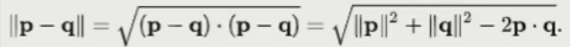
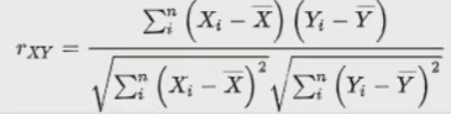
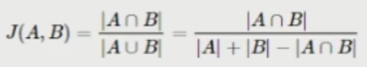

# 컨텐츠 기반 추천

컨텐츠 기반 추천시스템은 사용자가 이전에 구매한 상품 중에서 좋아하는 상품들과 유사한 상품들을 추천하는 방법이다.


유사한 상품을 찾아야 한다. -> 아이템을 벡터형태로 표현하여 유사한 벡터를 찾아서 추천해줘야 한다. 도메인에 따라 다른 방법이 적용된다.

벡터들간의 유사도를 계산하여 벡터 1부터 N까지 자신과 유사한 벡터를 추출한다.


## 유사도 함수

1. 유클리디안 유사도

   - 문서간의 유사도를 계산
   - 유클리디안 유사도 = 1 / (유클리디안 거리 + 1e-05)
   - 유클리디안 거리 =
   - 장점
     - 계산하기가 쉬움
   - 단점
     - p와 q의 분포가 다르거나 범위가 다른 경우에 상관성을 놓침

2. 코사인 유사도

   - 문서간의 유사도를 계산
   - 코사인 유사도 = cos(세타) = (A * B) / (||A|| ||B||)
   - A와 B의 크기와 A와 B의 내적값을 통해서 계산할 수 있다.
   - 코사인 세타(두 벡터의 각도)를 계산한다고 보면 됨. 문서 1과 문서 2의 벡터가 얼마나 비슷한 방향을 갖고있는지를 본다.
   - 세타(각도) = 0으로 동일한 방향을 갖고 있다면 similarity가 1
   - 세타(각도) = 180으로 다른 방향을 갖고 있다면 similarity가 -1

   - 세타(각도) = 90으로 직각 방향을 갖고 있다면 similarity가 0
   - 장점
     - 벡터의 크기가 중요하지 않은 경우에 거리를 측정하기 위한 메트릭으로 사용 ( 예: 문서내에서 단어의 빈도수 - 문서들의 길이가 고르지 않더라도 문서내에서 얼마나 나왔는지라는 비율을 확인하기 때문에 상관없음.)
   - 단점
     - 벡터의 크기가 중요한 경우에 대해서 잘 작동하지 않음

3. 피어슨 유사도

   - 문서간의 유사도를 계산
   - 
   - 주로 상관관계를 볼 때 사용함

4. 자카드 유사도

   - 얼만큼의 결합된 부분이 있는지로 계산한다.
   - 

5. 그 외

   - Sorensen 유사도 : 많이 씀
   - Soergel 유사도
   - Lorentzian 유사도
   - Canberra 유사도
   - WaveHedges 유사도
   - Motyka 유사도
   - Kulczynski 유사도
   - Ruzicka 유사도
   - Dice 유사도 : 많이 씀
   - hellinger 유사도
   - Sq-chord 유사도
   - Sq-kal 유사도
   - Divergence 유사도 : 분포 유사도에 많이 씀
   - Clark 유사도
   - Topsoe 유사도
   - Jenson-Diff 유사도


상황에 적절하게 맞게 여러가지 평가지표(유사도)를 설정하여 여러가지 추천시스템에 대해 적용 후 (가중치를 두고) 조합을 한다.

고객 집단에 따라서 다른 추천시스템을 적용할 수도 있다. 도메인에 따라서 다르게 함.

cold-start나 구매를 적게한 사람한테는 다른 모델을 쓰고, 구매를 많이한 사람한테는 또 다른 모델을 쓰고, 상황에 따라서 가중치도 조금씩 다르게 한다.


## TF-IDF

자연어 처리 알고리즘.

특정 문서 내에 특정 단어가 얼마나 자주 등장하는지를 의미하는 단어 빈도(TF)와 전체 문서에서 특정 단어가 얼마나 자주 등장하는지를 의미하는 역문서 빈도(DF)를 통해서 "다른 문서에서는 등장하지 않지만 특정 문서에서만 자주 등장하는 단어"를 찾아서 문서 내 가중치를 계산하는 방법이다.

문서의 핵심어를 추출, 문서들 사이의 유사도를 계산, 검색 결과의 중요도를 정하는 작업 등에 활용할 수 있다.


- TF(d, t) : 특정 문서 d에서의 특정 단어 t의 등장 횟수
- DF(t) : 특정 단어 t가 등장한 문서의 수
- IDF(d, t): DF(t)에 반비례하는 수
  - idf(d, t) = log( n / (1 + df(t)) )
- TF-IDF(d, t) = TF(d,t) * IDF(d, t)


#### TF_IDF를 사용하는 이유

1. Item이라는 컨텐츠를 벡터로 "Feature Extract" 과정을 수행해준다.
2. 빈도수를 기반으로 많이 나오는 중요한 단어들을 잡아준다. 이러한 방법을 Counter Vectorizer라고 한다.
3. 하지만, Counter Vectorizer는 단순 빈도만을 계산하기 때문에 조사, 관사 처럼 의미는 없지만 문장에 많이 등장하는 단어들도 높게 쳐주는 한계가 있다. 이러한 단어들에는 패널티를 줘서 적절하게 중요한 단어만을 잡아내는게 TF-IDF기법이다.


#### 알고리즘

1. 문서 내 단어의 TF(특정 문서 d에서의 특정 단어t 의 등장 횟수)값 계산
   - row : 문서
   - column : 단어
2. 단어의 DF(특정 단어 t가 등장한 문서의 수) 값 계산
   - row : 총합(단일 row)
   - column : 단어
3. 문서 내 단어의 IDF 값 계산
   - row : 단어
   - column : 단어, IDF(역 문서 빈도)
4. 문서 내 단어의 TF * IDF 값 계산
   - row : 문서
   - column : 단어
5. 문서 간의 유사도를 계산
   - row : 문서
   - column : 문서


#### 장점

- 직관적인 해석이 가능함

#### 단점

- 대규모 말뭉치를 다룰 때 메모리 상의 문제가 발생
  - 높은 차원을 가짐
  - 매우 sparse한 형태의 데이터 ( 0이 많은 데이터 )


#### 코드:

```python
docs = [
    '먹고 싶은 사과', 
    '먹고 싶은 바나나',
    '길고 노란 바나나 바나나',
    '저는 과일이 좋아요'
]

from sklearn.feature_extraction.text import Countvectorizer
vect = CountVectorizer()

# 문장을 Counter vectorizer 형태로 변경
countvect = vect.fit_transform(docs) # 4x9 : 4개의 문서에 9개의 단어

# toarray()를 통해서 문장 vector 형태 값을 얻을 수 있음 (sparse matrix 타입-> numpy.array 타입)
# 하지만, 각 index와 column이 무엇을 의미하는지에 대해서는 알 수 없다.
import pandas as pd
countvect_df = pd.DataFrame(countvect.toarray(), columns = sorted(vect.vocabulary_)) # # 순서가 뒤죽박죽이어서 sorted를 해야함

# 위의 Data Frame의 유사도를 계산
from sklearn.metrics.pairwise import cosine_similarity
cosine_similarity(countvect_df, countvect_df)

# CountVectorizer -> TfidVectorizer로 바꿔서 실행해보자
# TF-IDF를 수행
from sklearn.feature_extraction.text import TfidfVectorizer
vect = TfidfVectorizer()
tfvect = vect.fit(docs)

tfidv_df = pd.DataFrame(tfvect.transform(docs).toarray(), columns = sorted(vect.vocabulary_))
tfidv_df.index = ['문서1','문서2','문서3','문서4']

from sklearn.metrics.pairwise import cosine_similarity
cosine_similarity(tfidv_df, tfidv_df)

from sklearn.feature_extraction.text import TfidVectorizer
vect = TfidfVectorizer(max_features=4)
tfvect = vect.fit(docs)

tfidv_df = pd.DataFrame(tfvect.transform(docs).toarray(), columns = sorted(vect.vocabulary_))
tfidv_df.index = ['문서1','문서2','문서3','문서4']
```


예제

```python
# data 불러온 후

data = data[data['overview'].notnull()].reset_index(drop=True)

tfidf = TfidfVectorizer(stop_words='english') # 불용어 : 유의미하지 않은 단어 토큰 제거

# overview에 대해서 tf-idf 수행
tfidf_matrix = tfidf.fit_transform(data['overview'])
print(tfidf_matrix.shape)

from sklearn.metrics.pairwise import cosine_similarity
cosine_matrix = cosine_similarity(tfidf_matrix, tfidf_matrix)

movie2id = {}
# enumerate : i는 index, c는 데이터
for i, c in enumerate(data['title']):
    movie2id[i] = c
    
id2movie = {}
for i, c in movie2id.items() : 
    id2movie[c] = i

idx = id2movie['Toy Story']
sim_scores = [(i, c) for i, c in enumerate(cosine_matrix[idx]) if i != idx] # 자기 자신을 제외한 영화들의 유사도 및 인덱스를 추출

sim_scores = sorted(sim_scores, key = lambda x: x[1], reverse=True) # 유사도가 높은 순서대로 정렬
sim_scores[0:10] # 상위 10개의 인덱스와 유사도를 추출

sim_scores = [(movie2id[i], score) for i, score in sim_scores[0:10]]

sim_scores # Toy Story와 유사한 영화들이 나옴
```


## Word2Vec

통계기반의 방법 단점

- 대규모 말뭉치를 다룰 때 메모리 상의 문제가 발생
  - 높은 차원을 가짐
  - 매우 sparse한 형태의 데이터
- 한번에 학습 데이터 전체를 진행함
  - 큰 작업을 처리하기 어려움
  - GPU와 같은 병렬처리를 기대하기 힘듬
- 학습을 통해서 개선하기가 어려움


이러한 통계기반의 방법의 단점을 해결하기 위하여 Word2Vec이 고안되었다.


#### 정의

Word2Vec은 단어간 유사도를 반영하여 단어를 벡터로 바꿔주는 임베딩 방법론이다.

one-hot 벡터 형태의 sparse matrix가 가지는 단점을 해소하고자 저차원의 공간에 벡터로 매핑하는 것이 특징이다.

Word2Vec은 "비슷한 위치에 등장하는 단어들은 비슷한 의미를 가진다"라는 가정을 통해서 학습을 진행한다.

저차원에 학습된 단어의 의미를 분산하여 표현하기에 단어 간 유사도를 계산할 수 있다.

추천시스템에서는 단어를 구매 상품으로 바꿔서 구매한 패턴에 Word2Vec을 적용해서 비슷한 상품을 찾을 수 있다.


#### 추론 기반의 방법

추론: 주변 단어(맥락)이 주어졌을 때 빈칸에 무슨 단어(중심단어)가 들어가는지를 추측하는 작업

잘못 예측한 경우에는 학습을 통해서 점점 모델을 개선할 수 있다.


#### 알고리즘

#### 알고리즘 첫번째 방법: CBOW

CBOW는 주변에 있는 단어들을 가지고, 중간에 있는 단어들을 예측하는 방법이다.

1. One-hot 벡터 형태의 입력 값을 받는다.
   - 윈도우 크기: 주변을 몇 칸까지 볼 지에 대한 크기
2. One-hot 벡터 형태의 입력값을 Weight_input과 곱한다.
3. Hidden state의 값을 Weight_output과 곱해서 Score를 추출한다.
4. Score에 Softmax를 취해서 각 단어가 나올 확률을 계산한다.
5. 정답과 예측(확률)의 Cross Entropy Loss를 계산한다.
6. Loss를 가지고 Backpropagation 과정을 통해서 Weight를 업데이트한다.
7. 위의 과정을 다른 문맥에 대해서도 수행
   - 입력: You, goodbye -> 출력: say (6까지의 스탭)
   - 입력: say, and -> 출력: goodbye
   - 입력: goodbye, I-> 출력: and
   - 입력: and, say-> 출력: I
   - 입력: I, hello -> 출력: Say


#### 알고리즘 두번째 방법: Skip-Gram

Skip-Gram은 중간에 있는 단어로 주변 단어들을 예측하는 방법이다.

input은 하나를 받고 output이 2개이다.

윈도우의 크기에 따라 데이터셋 생성

you say goodbye and i say hello

1. One Hot 벡터 형태의 입력값을 받는다.
   - say -> [you] 예측
   - say -> [goodbye] 예측
2. One hot 벡터 형태의 입력값을 Weight_input과 곱한다
3. Hidden state 의 값을 Weight_output과 곱해서 Score 를 추출한다.
4. Score에 Softmax를 취해서 각 단어가 나올 확률을 구한다
5. 정답과 Cross Entropy Loss를 계산
6. 5에서 계산한 Loss를 가지고 Backpropagation 과정을 통해서 Weight를 업데이트
   - Weight_in 에 대해 역전파값을 계산
7. 위의 과정을 다른 문맥에 대해서도 수행
   - 입력: say -> 출력: You, goodbye(6까지의 스탭)
   - 입력: goodbye -> 출력: say, and
   - 입력: and -> 출력: goodbye, I
   - 입력: I -> 출력: and, say
   - 입력: say -> 출력: I, hello


CBOW보다 Skip-Gram가 성능이 더 좋은 이유:

Skip-Gram이 더 어려운 task이며, 딥러닝이 더 어려운 task를 수행하면서 똑똑하게 학습하기 떄문.


```python
## gensim 패키지의 Word2Vec을 이용
import numpy as np
import pandas as pd
from sklearn.feature_extraction.text import TfidfVectorizer
import gensim # WORD2VEC의 알고리즘을 호출해주는 패키지
movie = pd.read_csv("../input/t-academy-recommendation2/movies/ratings.csv", low_memory=False)

movie = movie.sort_values(by='timestamp', ascending=True).reset_index(drop=True)

# 영화의 Metadata를 불러와서 movieID에 맞는 TITLE을 구해준다.
meta = pd.read_csv(path + "movies_metadata.csv", low_memory=False)

meta = meta.rename(columns = {'id':'movieId'})
movie['movieId'] = movie['movieId'].astype(str)
meta['movieId'] = meta['movieId'].astype(str)
movie = pd.merge(movie, meta[['movieId','original_title']], how='left', on='movieId') # 조인을 해줌

movie = movie[movie['original_title'].notnull()].reset_index(drop=True)  # original_title에서 NaN 값은 제거
agg = movie.groupby(['userId'])['original_title'].agg({'unique'})  # original title의 유저마다 어떤 영화를 봤는지를 계산하기 위해서 유니크 부분만 따로 뽑는다. (영화를 봤는 순서)
# 이 영화 제목을 단어 하나하나로 보고 
# int형식은 Word2vec에서 학습이 되지 않으므로  String으로 변경해준다
sentence = []
for user_sentence in agg['unique'].values:
    sentence.append(list(map(str, user_sentence)))

# Word2vec의 학습 진행
from gensim.models import Word2Vec
embedding_model = Word2Vec(sentence, size=20, window = 5,
                          min_count = 1, workers = 4, iter = 200, sg = 1)  # size: weight의 크기를 얼마나 할지, window: 양옆단어 몇개볼지, workers: cpu 자원 몇개 참여할지, sg: 0일경우 CBOW, 1일 경우 skip-gram

embedding_model.wv.most_similar(positive=['Spider-Man 2'], topn = 10)
# 추천 모델은 상황에 따라서 성능이 안나오기도 한다. 여러 추천모델을 비교해보자
# 메타데이터가 구축이 잘 안되었다면 컨텐츠 기반 추천은 성능이 잘 안나온다.
```


#### 장점

- 협업필터링은 다른 사용자들의 평점이 필요한 반면에, 자신의 평점만을 가지고 추천시스템을 만들 수 있다.
- item의 feature를 통해서 추천을 하기에 추천이 된 이유를 설명하기 용이함
- 사용자가 평점을 매기지 않은 새로운 item이 들어올 경우에도 추천이 가능함. (cold-start에서도 용이함)

#### 단점

- item의 feature을 추출해야 하고 이를 통해서 추천하기 때문에 제대로 feature를 추출하지 못하면 정확도가 낮음. 그렇기에 Domain Knowleghe가 분석 시에 필요할 수 있음
- 기존의 item과 유사한 item 위주로만 추천하기에 새로운 장르의 item을 추천하기 어려움
- 새로운 사용자에 대해서 충분판 평점이 쌓이기 전까지는 추천하기 힘듬

