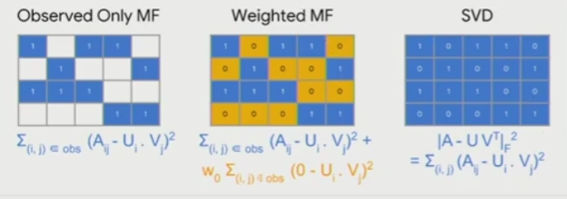

# 협업필터링 모델

협업 필터링은 사용자의 구매 패턴이나 평점을 가지고 다른 사람들의 구매 패턴, 평점을 통해서 추천을 하는 방법이다.

추가적인 사용자의 개인 정보나 아이템의 정보가 없이도 추천할 수 있는게 큰 장점이다.

#### 종류

1. 최근접 이웃기반
2. 잠재 요인기반

## 최근접 이웃 기반 추천

Neighborhood based Collaborative Filtering은 메모리 기반 알고리즘이다.

#### 알고리즘

1. User-based collaborative filtering
   - 사용자의 구매 패턴(평점)과 유사한 사용자를 찾아서 추천 리스트 생성
2. Item-based collaborative filtering
   - 특정 사용자가 준 점수간의 유사한 상품을 찾아서 추천 리스트 생성

#### K Nearest Neighbors

가장 근접한 K명의 Neighbors를 통해 예측하는 방법

#### 데이터 (Explicit Feedback)

implicit은 구매한 것은 알지만 선호도는 모른다고 했다.

하지만 Explicit은 선호도를 알 수 있다.

#### User-based Collaborative Filtering

유저가 자신의 선호도를 직접적으로 표현한 데이터

- row : 사용자들
- column : 아이템들

사용자들 간의 유사도를 계산한다.

Cosine 유사도와 Pearson 유사도를 계산한다.

평균이 높은 사용자들을 바이어스텀을 제거하여 평준화한다.

#### Item-based Collaborative Filtering

유저가 자신의 선호도를 직접적으로 표현한 데이터

- row : 사용자들
- column : 아이템들

아이템 컬럼들 간의 유사도를 계산한다.

AdjustedCosine

#### Neighborhood based method의 장점

- 간단하고 직관적인 접근 방식 때문에 구현 및 디버그가 쉬움
- 특정 Item을 추천하는 이유를 정당화하기 쉽고 Item 기반 방법의 해석 가능성이 두드러짐
- 추천 리스트에 새로운 item과 user가 추가되어도 상대적으로 안정적

#### 단점

- User 기반 방법의 시간, 속도, 메모리가 많이 필요
- 희소성 때문에 제한된 범위가 있음
  - John의 Top-K에만 관심이 있음
  - John과 비슷한 이웃 중에서 아무도 해리포터를 평가하지 않으면 John의 해리포터에 대한 등급 예측을 제공할 수가 없음

## 잠재요인기반 추천

잠재 요인 협업 필터링은 Rating Matrix에서 빈 공간을 채우기 위해서 사용자와 상품을 잘 표현하는 차원(Latent Factor)을 찾는 방법이다. 

잘 알려진 행렬 분해는 추천 시스템에서 사용되는 협업 필터링 알고리즘의 한 종류이다. 행렬 분해 알고리즘은 사용자-아이템 상호 작용 행렬을 두 개의 저차원 직사각형 행렬의 곱으로 분해하여 작동한다.

#### 원리

사용자의 잠재요인과 아이템의 잠재요인을 내적해서 평점 매트릭스를 계산 ( 방식: Observed Only MF, Weighted MF, SVD)

#### SVD

고유값 분해 (eigen value Decomposition)와 같은 행렬을 대각화 하는 방법

한계:

- 데이터에 결측치가 없어야 함
- 대부분의 현업 데이터는 Sparse한 데이터

#### SGD

고유값 분해와 같은 행렬을 대각화 하는 방법

Regularization으로 weight가 폭발하는 것을 방지해줘야 한다.

예시:

Expliocit Feedback된 형태의 4명의 유저에 대한 3개의 아이템에 대한 평점 matrix

- row : 유저

- column : 아이템
- User Latent ( U ) : 차원(유저명수, 임의값)
- Item Latent ( V ) : 차원(임의값, 아이템갯수)
- U와 V를 np.dot 하면 유저명수X아이템갯수의 matrix가 나옴
- 이 matrix와 기존 데이터와의 loss값을 계산하여 gradient descent를 진행한다. ( null값을 가진 데이터에 대해서는 pass 한다. ) 
  - 사용자, 아이템 latent space의 값이 계속 바뀐다.

장점

- 매우 유연한 모델로 다른 Loss function을 사용할 수 있다
- parallelized가 가능하다

단점

- 수렴까지 속도가 느림

#### ALS

기존의 SGD가 두개의 행렬 (User Latent, Item Latent)을 동시에 최적화하는 방법이라면, 

ALS는 두 행렬 중 하나를 고정시키고 다른 하나의 행렬을 순차적으로 반복하면서 최적화 하는 방법이다.

이렇게 하면, 기존의 최적화 문제가 convex 형태로 바뀌기에 수렴된 행렬을 찾을 수 있는 장점이 있다.

알고리즘

1. 초기 아이템, 사용자 행렬을 초기화
2. 아이템 행렬을 고정하고 사용자 행렬을 최적화
3. 사용자 행렬을 고정하고 아이템 행렬을 최적화
4. 위의 2, 3 과정을 반복

## 협업필터링 특징

#### 장점

- 도메인 지식이 필요하지 않음
- 사용자의 새로운 흥미를 발견하기 좋음
- 시작단계의 모델로 선택하기 좋음 (추가적인 문맥정보 등의 필요가 없음)

#### 단점

- 새로운 아이템에 대해서 다루기가 힘듬
- side features (고객의 개인 정보, 아이템의 추가 정보)를 포함시키기 어려움

