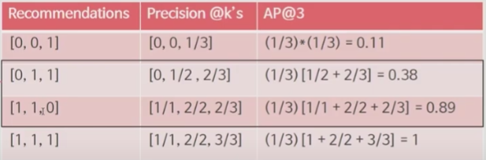
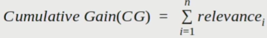
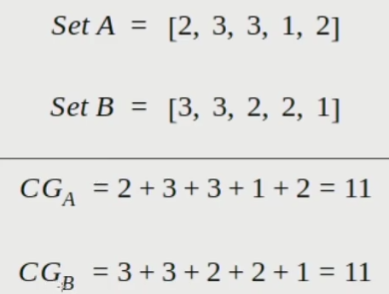
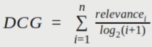
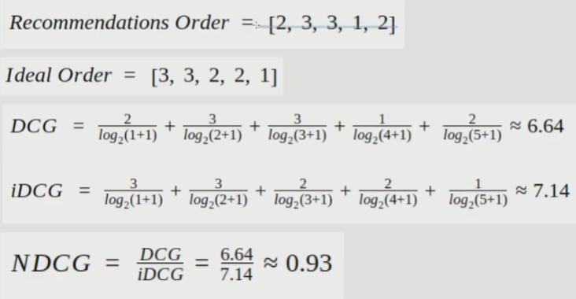
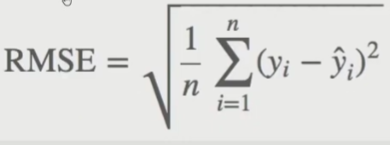

# 평가함수

평가함수는 추천시스템의 모델을 생성하고 해당 모델이 얼마나 잘 추천하고 있는지에 대해서 평가를 도와주는 함수이다.

도메인이나 목적에 따라서 다른 평가함수를 도입하여 얼마나 잘 추천이 되는지 평가하는게 중요하다.

ex) 영화평점

- 내가 추천해준 영화를 고객이 봤는지? ( 단순히 보기만 하면 추천에 성공했다고 생각. 실제 고객의 만족도는 낮을 수도 있다. )
- 내가 추천해준 영화를 고객이 높은 점수로 평점을 줬는지? ( 고객의 만족도까지 고려해서 평가한 것 )

## Accuracy

내가 추천해준 영화를 고객이 봤는지? 안봤는지?

내가 추천해주는 영화를 많이 볼수록 추천하지 않은 영화를 보지 않을수록 정확도는 상승

하지만, 추천하지 않은 영화의 수는 추천한 영화의 수에 비하여 굉장히 많으므로 편향된 결과를 얻을 수 있다. (imbalanced data )

그래서, 추천해준 영화 중 본 영화로만 평가를 매겨줘야한다. 

- 하지만 이렇게 했을 때에도 모든 상품을 추천해주면 정확도는 무조건 1이 나오므로, 상위 n개의 상품만 추천한다고 했을 때 어느정도의 정확도를 얻는지 판단하는게 제일 정확한 값을 얻을 수 있다.

## MAP

Precision = True Positive / ( True Positive + False Positive )

Recommendations : 추천을 했는데 맞은 경우 1, 틀리면 0

AP : Precision @k's를 평균낸 값 ( 추천한 K개의 영화의 Precision을 평균 )

MAP@n : n명의 사용자의 AP를 평균낸 값 ( Precision을 평균낸 AP를 n명의 사용자에 대해 평균 )

#### NDCG

Normalized Discounted Cumulative Gain : 검색 알고리즘에서 성과를 측정하는 평가 메트릭이다.

추천엔진은 user와 연관있는 documnets의 집합을 추천해주기 때문에, 단순히 문서 검색 작업을 수행한다고 생각할 수 있다. (검색과 관련있는 문서들을 추천) 따라서 NDCG를 사용하여 추천엔진을 평가할 수 있다.

NDCG를 이해하기 위해서는 Cumulative Gain과 Discounted Cumulative Gain을 이해할 필요가 있다.

CG ( Cumulative Gain ) : 얼마만큼이 추천했을 때 맞은 순서를 더해준 것. 추천했을 때의 순서가 얼만큼 반영이 되는지를 본다.

B보다 A가 나은 추천결과지만 CG의 관점에서는 둘이 같다. 문서의 위치에 따른 가중치를 반영해줄 필요가 있다.

DCG ( Discounted Cumulative Gain ) : 앞에서 맞을 수록 분모값이 작아져서 가중치를 준다.

NDCG ( Normalized DCG ) : DCG는 추천결과의 위치를 고려할 때 좋은 척도로 보이지만 완벽하지는 않다. 그 이유는 다양한 요인에 따라 권장 사항 수가 사용자마다 다를 수 있는데, DCG는 권장 사항의 수에 따라 결과가 달라지기 때문이다. 그에 따라 상한과 하한이 적절한 점수가 필요하므로 모든 추천 점수를 평균하여 최종 점수를 보고 정규화할 필요가 있다.

- 사람마다 추천해주는 개수가 다를 수 있으니 이를 반영해줘야 한다.
- DCG에 Normalize를 수행

이외에도

- F1 Score : Precision의 역수와 Reacll의 역수의 평균이다.
  - Precision은 실제 본 영화의 수 대비 추천했는데 본 영화의 수를 의미한다.
  - Recall은 실제 추천한 영화의 수 대비 추천했는데 본 영화의 수를 의미한다.

- RMSE : 
  - 
  - 추천한 평점이 얼마나 다를지를 본다. ( 영화추천의 경우 사용자가 5를 평가하는 경우를 얼마나 잘 맞출지 )
  - Accuracy와 RMSE의 차이점:
    - Accuracy의 경우 단순하게 볼지 안볼지에 대한 평가
    - RMSE의 경우 사용자의 반응에 대해서 평가

