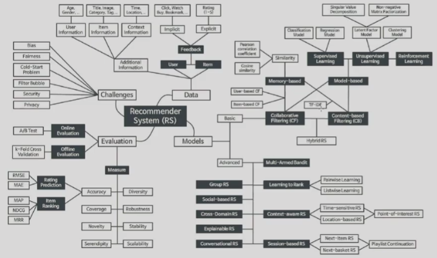

# 딥러닝

유튜브는 스케일이 너무 커서 단순한 방법으로는 추천하기 힘들다. 이러한 것을 고려하여 만든 것: Variational Autoencoders for Collaborative Filtering

Factorization Machine: 정보들간의 상호작용

-> DeepFM : A Factorization-Machine based Neural Network for CTR Prediction

강화학습: DRN : A Deep Reinforcement Learning Framework for News Recommandation

그 외 : 

https://www.facebook.com/groups/2611614312273351/