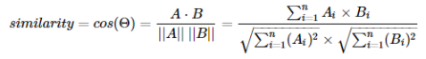

# 협업필터링

## 유저기반 협업필터링

고객들의 아이템 선호도를 분석하여 추천 대상 고객과 유사한 성향의 고객을 찾은 다음, 공통적으로 선호하는 아이템을 추천하는 방식으로, 고객별 정확한 추천이 가능하다.

유저 수 x 유저 수 크기의 유저간 유사도 데이터프레임을 생성한다.

가장 유사도가 높은 유저가 감상한 영화를 추천한다.

## 아이템기반 협업필터링

고객들의 선호도를 바탕으로 아이템 간의 유사도를 계산하고, 특정 사용자가 어떤 아이템을 구매하거나 좋다고 평가하면 그와 유사한 아이템을 추천해주는 방식이다.

실제 데이터에서 유저 수가 적거나 겹치는 아이템이 적어 유효한 데이터를 뽑아내기 힘들 때 아이템기반 협업필터링을 사용하여 아이템을 기반으로 유사도를 구하기도 한다.

### 유사도

#### Cosine Similarity ( 코사인 유사도 )

두 벡터 사이의 각도를 구해서 유사도로 사용하는 것이다.

코사인 유사도는 -1 ~ 1 사이의 값을 갖는다.

- 1 = 두 벡터의 방향이 동일한 경우 (유사도가 높음)
- 0 = 두 벡터가 90도의 각인 경우
- -1 : 두 벡터의 방향이 반대인 경우 (유사도가 낮음)

아이템A - 각각의 아이템의 코사인 유사도를 구하여, 어떠한 사용자가 아이템A를 구매한 후 재방문하면, 유사도 점수가 가장 높은 아이템부터 추천한다.

예시 ) 구매한/조회한 아이템 혹은 검색한 아이템을 중심으로 추천한다.

- 특정 기사를 본 사람들이 본 뉴스
- 이 책을 구매하신 사람들이 함께 구매한 상품입니다.

