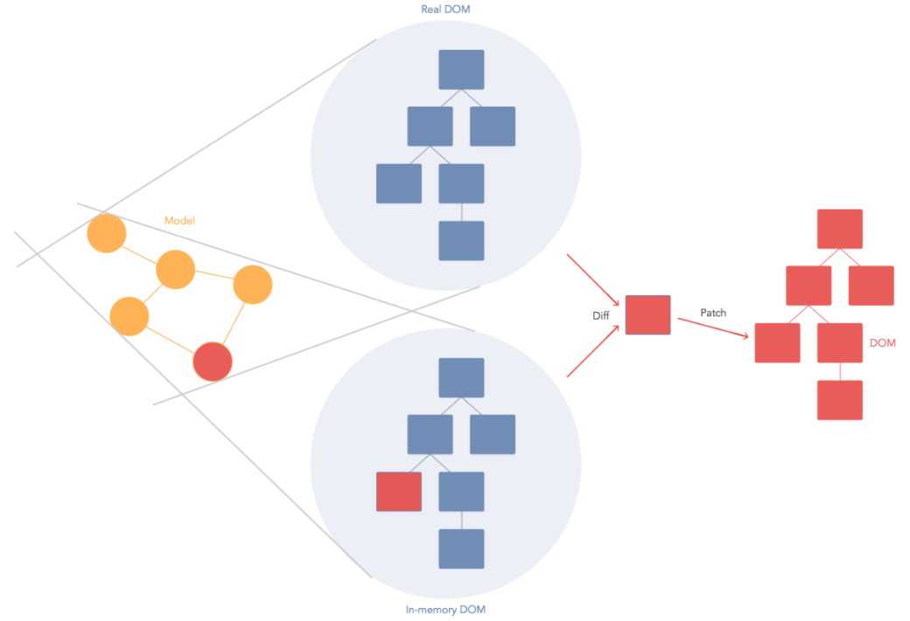

# React

## 1. 리액트가 만들어진 계기

JavaScript를 사용하여 HTML로 구성된 UI를 제어할 때, DOM을 변형시키기 위해서는 브라우저의 DOM Selector API를 사용해서 특정 DOM을 선택한 뒤, 특정 이벤트가 발생하면 변화를 주도록 설정해야한다.


HTML/JS 로 만들어진 Counter 예시

html:

```html
<h2 id="number">0</h2>
<div>
  <button id="increase">+1</button>
  <button id="decrease">-1</button>
</div>
```

javascript:

```javascript
const number = document.getElementById('number');
const increase = document.getElementById('increase');
const decrease = document.getElementById('decrease');

increase.onclick = () => {
  const current = parseInt(number.innerText, 10);
  number.innerText = current + 1;
};

decrease.onclick = () => {
  const current = parseInt(number.innerText, 10);
  number.innerText = current - 1;
};
```

id 를 사용하여 각 DOM을 선택한 뒤, 원하는 이벤트가 발생하면 DOM의 특정 속성을 바꿔줘야 한다.

위 코드에서는 `+1 버튼이 눌리면, number라는 id를 가진 DOM을 선택해서 innerText 속성을 1씩 더해라` 라는 규칙이 있다. 

사용자와의 인터랙션이 자주 발생하고, 동적으로 UI를 표현해야한다면, 규칙들이 늘어날 것이고, 관리하기도 힘들어진다. 또한 대부분의 경우 웹 어플리케이션의 규모가 커지면 DOM을 직접 건드리면서 작업을 하면 코드가 난잡해지기 쉽다.


처리해야 할 이벤트도 다양하지고, 관리할 상태값도 다양해지고, DOM도 다양해지게 된다면, 이에 따라 업데이트를 하는 규칙도 많이 복잡해진다.

그래서 Ember, Backbone, AngularJS 등의 프레임워크가 만들어졌다. 이 프레임워크들은 작동 방식이 각각 다르지만, javascript의 특정 값이 바뀌면 특정 DOm의 속성이 바뀌도록 연결을 해주어서, 업데이트 하는 작업을 간소화해 주는 방식으로 웹 개발의 어려움을 해결해준다.

React의 경우에는 조금 다른데, 어떠한 상태가 바뀌었을 때, 그 상태에 따라 DOM을 어떻게 업데이트 할 지 규칙을 정하는 것이 아니라, 아예 다 날려버리고 처음부터 새로 만들어서 보여준다는 아이디어에서 개발이 시작됐다. 이렇게 되면 업데이트를 어떻게 할지에 대한 고민을 전혀 안해도 되기 때문에 개발이 쉬워진다.

하지만 동적인 UI를 보여주기 위해서 모든걸 다 날려버리고 새로 만들게 된다면 속도가 느릴 것이다. 그렇다면 규모가 큰 웹어플리케이션에서는 불가능한 것인가? React에서는 Virtual DOM 이라는 것을 사용해서 가능하게 만들었다.



Virtual DOM은 가상의 DOM이다. 브라우저에 실제로 보여지는 DOM이 아닌, 메모리에 가상으로 존재하는 DOM으로서 그냥 javascript 객체이기 때문에 작동 성능이 실제로 브라우저에서 DOM을 보여주는 것보다 속도가 훨씬 빠르다. 리액트는 상태가 업데이트가 되면, 업데이트가 필요한 곳의 UI를 Virtual DOM을 통해서 렌더링한다. 그리고나서 매우 효율적인 비교 알고리즘을 통하여 실제 브라우저에 보여지고 있는 DOM과 비교를 한 후, 차이가 있는 곳을 감지하여 이를 실제 DOM에 패치시켜준다. 

이러한 방식을 통하여 업데이트를 어떻게 할 지에 대한 고민을 하지 않으면서, 빠른 성능도 지켜낼 수 있게 된다.


`본 문서는 벨로퍼트님의 강의를 보고 정리한 것입니다.`